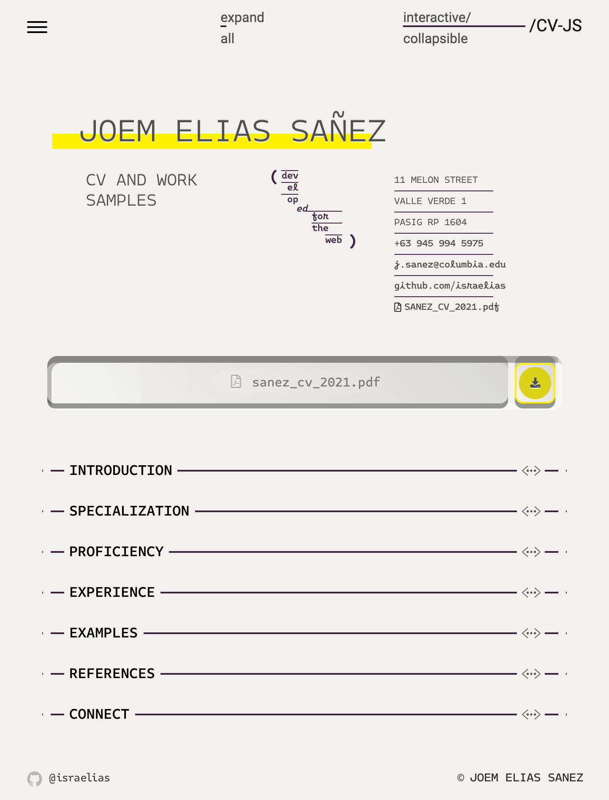
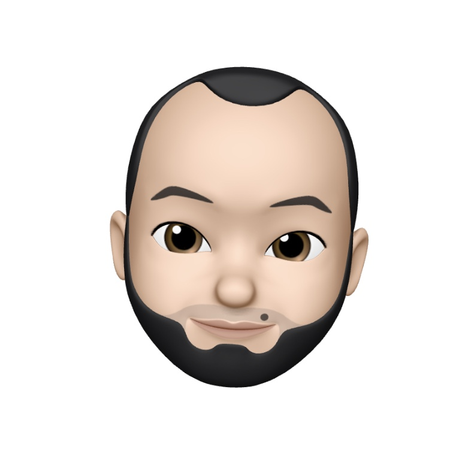

___
# Resume Re: UX
___




Resume Re: UX is a comprehensive and systematic means for navigating and featuring content in a curriculum vitae. The project is an *interactive collapsible* "stack" of content sections that can be toggled to fully expand in *static mode* with at-a-glance document outline visualization in a responsive dashboard side menu. The project is developed as part of the user-centric front-end coursework (MS1) at [Code Institute](https://codeinstitute.net).

> *Note: The project name refers to Resume RedUX or "Resume Revived," in addition to the expanded "Resume Re: User Experience"*

[Please view the live website here.](https://israelias.github.io/resume-redux/)

[TOC levels=1-3]: #

# Table of Contents
- [Resume Re: UX](#resume-re-ux)
  - [UX](#ux)
    - [1.0 Strategy](#10-strategy)
    - [2.0 Scope](#20-scope)
    - [3.0 Structure](#30-structure)
    - [4.0 Skeleton](#40-skeleton)
    - [5.0 Surface](#50-surface)
  - [Features](#features)
    - [Existing Features](#existing-features)
    - [Features Left to Implement](#features-left-to-implement)
  - [Technologies](#technologies)
    - [Languages](#languages)
    - [Frameworks and Libraries](#frameworks-and-libraries)
    - [Plugins](#plugins)
    - [Programs and Software](#programs-and-software)
  - [Testing](#testing)
    - [User Testing](#user-testing)
    - [Notable Methods](#notable-methods)
    - [Documentation Notes](#documentation-notes)
    - [Code Testing](#code-testing)
    - [Accessibility Testing](#accessibility-testing)
    - [Browser Testing](#browser-testing)
    - [Known Bugs](#known-bugs)
  - [Deployment](#deployment)
  - [Credits](#credits)
    - [Code](#code)
    - [Content and Media](#content-and-media)
    - [Acknowledgements](#acknowledgements)

___
## UX


 This project's process and development carefully follows Jesse James Garrett's *Five Planes of UX* to distribute content and feature development across five activity planes, and to document a methodology for taking a product from conception to release.

___
___
### 1.0 Strategy
___

The high-level objective of the project is __to stand out__. The web resume is for a junior developer breaking into tech, and the project is itself an exercise to showcase his candidacy as a fastidious, proficient and unique developer.

- Supporting Goals:
  - To establish a personal and professional brand for the owner.
  - Attract and retain a following in the developer community.
  - Be up to a standard that is competitive with UX professional responsive web resumes.
  - Stand out to [Code Institute](https://codeinstitute.org/)'s qualification partners and potential employers.
- The website is built for:
  - A young professional designer and architect (buildings) presently breaking into the tech industry

___
#### 1.1 Research
___

###### [View UX Research Board](https://raw.githubusercontent.com/israelias/resume-redux/master/documentation/RedUX_200901_1619.png)


##### Competitor Review
___

- Who else is building this?

  - Software developers have a standard representation of a CV and/or portfolio that is web-specific. These tend to be maintained via content management systems like Wordpress, that utilize its standard plugins or adopts templates developed by UX designers. The highly customized CVs by UX designers is where the distinct difference lies between the generic and the specific. Some highly customized, developed and maintained websites take on entirely bespoke features from icons to components, and showcase those designs in the website itself (wireframes, documentation as portfolio pieces). On the other hand, the very generic web CVs will have basic functionality to navigate excellent content that speak for themselves. The criteria with which one stands out over the other is in the awareness of intent -- which tends to be quite apparent on the get go.

- How are they doing it?

  - Most of them are generic (if the content is thorough) *or* designed (if the content is minimal).
  - Some are templates purchased from web designers. And those are the most impressive ones.

- What are the pros and cons of what they are doing?

  - Some of the pros of either fully or personally branded web resumes are the completeness of its graphic design and content availability. The cons, on the other hand, are the sacrifice of some fundamental laws of UX, typical B2C/B2B fundamentals we've come to expect *and* uphold. Things tend not to be where you expect them to be. Responsive features tend to be more a design effort, a little less of the user in mind. The ones that *are* mobile-first and effective at every encounter, otherwise tend to be straight out of Bootstrap and don't stand out as a thorough representation of a professional brand unique to one's voice.

- What are they missing?

  - At a high level, what tends to be "missing" is a nuanced argument or thesis to which a graphic narrative is set forth. At a lower level, data representation of open-source contribution tends to be missing if not directly featured as a GitHub profile. In one article outlining [what companies really look for in your GitHub profile](https://www.builtinchicago.org/2018/05/08/what-companies-look-for-on-github), it's clear that companies value personality and shared values over just one's open-source footprint. Unanimously, it's found that *activity* and any signifier of an *active* profile/portfolio is the hallmark of a desirable candidate.

    > Engineers with a lot of activity on their profiles show me how involved they are as developers. I’m also interested to see how many followers they have, because a surplus is often a good indication of their role as a thought leader.
    >
    > [Source](https://www.builtinchicago.org/2018/05/08/what-companies-look-for-on-github)

- What could they do better?

  - "Designed" resumes for web developers can benefit from using principles of UX, structuring content around a user's impulses in order to achieve specific goals. Content that is featured in such a way that reflects the very architecture behind it is a hallmark of effective meta-contemporary storytelling; and is paradigm worth rehearsing in this project's development. This would also work to benefit the notion that the website itself should showcase the very skill upon which one's candidacy relies.
  - They can also benefit from demonstrating interpersonal artistry, as opposed to only featuring technical skills.

##### User Persona Overview
___

Three target user profiles have been assembled from user research. Each profile represents a collection of expectations, objectives, compelling experiences, peeves and emotional triggers of a curated user group. Key attributes of each persona are sourced from articles, social media, news and comments, developer feeds and LinkedIn on the outset subject of what x user group looks for in a candidate's resume/portfolio. Further documentation on the subject data are loosely footnoted where quotations are paraphrased or directly cited. For the purpose of automating virtual use cases, empathy and journey maps, these personas -- following an analysis of theirs and the owner's motives -- will serve as the narratives reviewed for establishing scope upon which further development of the project is defined.


>*See [User Stories](#13-user-stories) for complete persona profiles and defined user goals.*
*See [User Testing](#user-testing) for task-specific descriptions of how the project meets goals defined in this plane.*

###### [View User Persona Ideation Board](https://raw.githubusercontent.com/israelias/resume-redux/master/documentation/RedUX_200901_1621.png)

<br>
<details><summary> User Persona Table </summary>
<br>


>|                        |                                                                                                                                                                                           |                                                                                                             |                                                                                                                                                                    |
>| ---------------------- | ---------------------------------------------------------------------------------------------------------------------------------------------------------------------------------------------------------------------------------------------------------- | ---------------------------------------------------------------------------------------------------------------------------------------------------------------------------- | ----------------------------------------------------------------------------------------------------------------------------------------------------------------------------------------------------------------------------------- |
>| <sub>Name</sub>        | **Jacob Grobin**                                                                                                                                                                                                                                           | **Tracy Letts**                                                                                                                                                              | **Peter Venti**                                                                                                                                                                                                                     |
>| <sub>Designation</sub> | **Senior Developer**                                                                                                                                                                                                                                       | **Recruiter**                                                                                                                                                                | **Collaborator**                                                                                                                                                                                                                    |
>| <sub>Headline</sub>    | VP of Engineering at Fulcram3D <br/>New York, NY                                                                                                                                                                                                           | Talent Acquisition Lead at Enigma Recruitment<br/> Sydney NSW                                                                                                                | Design Computation at Lamb Space Design<br/>San Francisco, CA                                                                                                                                                                       |
>| <sub>Loves</sub>       | <br/>Seeing a polyglot who shows interest in different languages.<br/>                                                                                                                                                                                     | <br/>Seeing a lot of activity on your profile shows me how involved you are as a developer.<br/>                                                                             | <br/>Seeing that you contribute to open source projects shows me that you want to give back and can play well with others.<sup>[1](#note-1)<sup><br/>                                                                               |
>| <sub>Loathes</sub>     | <br/>Seeing other companies' coding challenges in your repo.<sup>[1](#note-1)<sup><br/>                                                                                                                                                                    | <br/>Seeing inappropriate content or things that are too personal.<sup>[1](#note-1)<sup><br/>                                                                                | <br/>Seeing ubiquitous progress bars that don't add real value.<sup>[2](#note-2)<sup><br/>                                                                                                                                          |
>| <sub>Quote</sub>       | <br/>As a leader in the industry, I won't spend much time here. What is it about you that stands out and that I haven't already seen in others? I want to *see* that without having to *find* that. Whatever that is.<br/><br/>                            | <br/>As a stakeholder in the hiring process, if you win, I win. Why would you choose us? I'd like to know where you are and give you a call.<sup>[4](#note-4)<sup><br/><br/> | <br/>As a collaborator with a background in design, cognitive diversity on your endeavours found through the exploration of other interests is just as important as a myriad of code repositories.<sup>[1](#note-1)<sup> <br/><br/> |

*Note: Names and entities have been modified/fabricated for this exercise.*

<br>
</details>
<br>

___
#### 1.2 User Expectations
___

##### Key Takeaways From Research
___

- Increase "activity" or evidence of activity
- Progress bars must be measured relative to something, as "CSS 100%" does not communicate anything, do not give the user anything.
- Show measurable stats that have supporting evidence.
- Show evidence of experience and progress as badge of integrity.
- Give clear understanding of owner's nuanced tech stack.
- Evidence of dev community activity in social media (dev.to, Twitter, etc.)
- Avoid scenarios where a user may get lost.
- No more than two clicks until user finds what they're looking for, or encounters what the owner wishes them to see.

#### 1.3 User Stories

The following tables define user goals in the context of scenarios assigned to the three targeted user personas. The additional descriptions provide a short but reliable *empathy* map for the project, and were highly influential to the ideation key opportunities throughout development. These emotional triggers set forth the user's motivations prior to encountering the website. See [User Testing](#user-testing) for the task-specific descriptions of how user goals defined in this plane are met by project.

<br>
<details><summary> User Persona 1: Senior Developer </summary>
<br>

>| | Senior Developer <br/>                                                                                                                                                                                                                                                                                                                                                                                                                                                                                                                                                                                                                              |
>| ---------------------------------------------------------------------------------------------------------------- | --------------------------------------------------------------------------------------------------------------------------------------------------------------------------------------------------------------------------------------------------------------------------------------------------------------------------------------------------------------------------------------------------------------------------------------------------------------------------------------------------------------------------------------------------------------------------------------------------------------------------------------------------- |
>| <sub>Name</sub>                                                                                                  | **Jacob Grobin**                                                                                                                                                                                                                                                                                                                                                                                                                                                                                                                                                                                                                                    |
>| <sub>Job Title</sub>                                                                                             | **Senior Developer, VP of Engineering at Fulcram3D** <br/>New York, NY                                                                                                                                                                                                                                                                                                                                                                                                                                                                                                                                                                              |
>| <sub>Background</sub>                                                                                            | Engineering Doctorate,  Master of Computer Science in Machine Learning, Bachelor of Science in Actuarial Mathematics                                                                                                                                                                                                                                                                                                                                                                                                                                                                                                                                |
>| <sub>Loves</sub>                                                                                                 | <br/>Seeing a polyglot who shows interest in different languages.<br/><br/>Seeing code that is readable, well-formatted, well-tested, well-documented and that displays a pragmatic approach via your repo/commit history.<br/><br/>Seeing experimentation at different scales shows me you're making a conscious effort to stay up to speed with new tech.<sup>[1](#note-1)<sup><br/><br/>                                                                                                                                                                                                                                                         |
>| <sub>Loathes</sub>                                                                                               | <br/>Seeing other companies' coding challenges in your repo.<br/><br/>Seeing commits with environment variables included.<sup>[1](#note-1)<sup><br/><br/>                                                                                                                                                                                                                                                                                                                                                                                                                                                                                                |
>| <sub>Quote</sub>                                                                                                 | <br/>As a leader in the industry, I won't spend much time here. What is it about this candidate/service/product that stands out and that I haven't already seen in others?I want to *see* that without having to *find* that. Whatever that is.<br/><br/>                                                                                                                                                                                                                                                                                                                                                                                           |
>| <sub>Goals</sub>                                                                                                 | <br/>1. As a leader in the industry, I want to have a good understanding of who you are and what you are all about within a few seconds.<br/><br/>2. As a leader in the industry, I want to be led seamlessly through the site to arrive at valuable content with the minimum amount of clicks.<br/><br/>3. As a leader in the industry, I want to see evidence of your credibility and capability as a professional. I want to see what others have said about you or how they have reacted to you. I also want to locate sources of your credibility to see that they are legitimate and to have an idea of your influence on the industry. <br/><br/> |

<br>
</details>
<br>
<details><summary> User Persona 2: Recruiter </summary>
<br>


>|  | Recruiter                                                                                                                                                                                                                                                                                                                                     |
>| ---------------------------------------------------------------------------------------------------------------- | --------------------------------------------------------------------------------------------------------------------------------------------------------------------------------------------------------------------------------------------------------------------------------------------------------------------------------------------- |
>| <sub>Name</sub>                                                                                                  | **Tracy Letts**                                                                                                                                                                                                                                                                                                                               |
>| <sub>Job Title</sub>                                                                                             | **Senior Talent Acquisition Lead at Enigma Recruitment**<br/> Sydney NSW                                                                                                                                                                                                                                                                      |
>| <sub>Background</sub>                                                                                            | Strategic Hiring for Tech Companies, Bachelor of Science in Psychology, Masters in Business Administration                                                                                                                                                                                                                                    |
>| <sub>Loves</sub>                                                                                                 | <br/>Seeing a lot of activity on your profile shows me how involved you are as a developer.<br/><br/>Seeing how many followers you have because a surplus is often a good indication of your role as a thought leader. <sup>[1](#note-1)<sup><br/><br/>                                                                                       |
>| <sub>Loathes</sub>                                                                                               | <br/>Seeing inappropriate content or things that are too personal.<sup>[1](#note-1)<sup><br/><br/>                                                                                                                                                                                                                                                 |
>| <sub>Quote</sub>                                                                                                 | <br/>As a stakeholder in the hiring process, if you win, I win. I've already seen your LinkedIn. I landed here from the job-hunt database in our server which means you were already recommended by someone. Why would you choose us? I'd like to know where you are and give you a call.<sup>[4](#note-4)<sup><br/><br/>                     |
>| <sub>Goals</sub>                                                                                                 | <br/>1. As a Recruiter, I want to find information on your skills and projects ASAP.<br/><br/>2. As a Recruiter, I want to understand the easiest and most reliable method of saving and sharing your profile to my team. <br/><br/>3. As a Recruiter, I want to find the best way to get in contact with you in case I want to connect.<br/><br/> |

<br>
</details>
<br>
<details><summary> User Persona 3: Collaborator </summary>
<br>

>|  | Collaborator                                                                                                                                                                                                                                                                                                                                                                                                                                                                                             |
>| --------------------------------------------------------------------------------------------------------------- | -------------------------------------------------------------------------------------------------------------------------------------------------------------------------------------------------------------------------------------------------------------------------------------------------------------------------------------------------------------------------------------------------------------------------------------------------------------------------------------------------------- |
>| <sub>Name</sub>                                                                                                 | **Peter Venti**                                                                                                                                                                                                                                                                                                                                                                                                                                                                                          |
>| <sub>Job Title</sub>                                                                                            | **Associate Lead in Design Computation \| Associate Tech Officer at Lamb Space Design**<br/>San Francisco, CA                                                                                                                                                                                                                                                                                                                                                                                             |
>| <sub>Background</sub>                                                                                           | New Venture Development, Master of Research in Virtual Environments                                                                                                                                                                                                                                                                                                                                                                                                                                      |
>| <sub>Loves</sub>                                                                                                | <br/>Seeing experiments and small projects that demonstrate the range of interests you have.<br/><br/>Seeing that you contribute to open source projects shows me that you want to give back and can play well with others.<sup>[1](#note-1)<sup><br/><br/>                                                                                                                                                                                                                                              |
>| <sub>Loathes</sub>                                                                                              | <br/>Seeing the ubiquitous percentage bars and other elements and animations on your page that don't add any value; If you do want to add some numerical value to your skills, use the number of years or projects -- at least these metrics are universally understandable. <sup>[2](#note-2)<sup><br/><br/>                                                                                                                                                                                                 |
>| <sub>Quote</sub>                                                                                                | <br/>As a potential collaborator and experienced programmer with a background in design, cognitive diversity on your endeavours found through the exploration of other interests is just as important as a myriad of code repositories. I found you here as I was impressed by your LinkedIn. I believe if you have to wonder how to make an impression, then you aren't. So before I even say hello, I want fork your repository and impress you with my contribution.<sup>[1](#note-1)<sup> <br/><br/> |
>| <sub>Goals</sub>                                                                                                | <br/>1. As a potential collaborator, I want to find your project(s) and quickly fork a repository.<br/><br/>2. As a potential collaborator, I want to find stats of your contribution footprint.<br/><br/>3. As a potential collaborator, I want to find the best way to get in contact with the organisation with any questions I may have.<br/><br/>                                                                                                                                                        |

<br>
</details>
<br>

###### Citations

> ###### [<sub>Note</sub> 1](https://www.builtinchicago.org/2018/05/08/what-companies-look-for-on-github)  Article. GitHub profile realities.
> ###### [<sub>Note</sub> 2](https://dev.to/kethmars/what-i-learned-after-reviewing-over-40-developer-portfolios-9-tips-for-a-better-portfolio-4me7) Post. Portfolio review feedback on dev.to
> ###### [<sub>Note</sub> 3](https://news.ycombinator.com/item?id=24034211) Forum. Role of software in architecture on ycombinator
> ###### <sub>Note</sub> 4 Varies. Profile summaries and headlines on LinkedIn

___
#### 1.4 High Level Paradigms
___

The defining criteria from [user research](#11-research) can be narrowed down to two guiding principles to radically and reliably shape the development of the project.

1. Owner's Key Principle
   - Portraying Honesty and Integrity
2. Key To User's Triggers
   - Showing Activity at Every Possible Opportunity

##### Standing Out
___

In order to achieve the goal of standing out to the three target users, the following high-level milestones must be covered:

1. Feature owner's experience/skill in the form of his tech/community contribution footprint
2. Provide opportunistic actions to increase GitHub following (collaborate) and recruiter interaction (hire)
3. Capitalize on owner's nuanced position in the tech stack as primary unique selling point
4. In every way achievable, portray all measurable 'static' information as 'live' statistics

___
#### 1.5 Strategy Table
___

###### [View Strategy Ideation Board](https://raw.githubusercontent.com/israelias/resume-redux/master/documentation/RedUX_200901_1622.png)

<br>
<details><summary> Strategy Table </summary>
<br>


>| id    | Specific Features             | Importance | Viability | Score |
>| ----- | ------------------------------------------- |:----------:|:---------:|:---------:|
>| A     | Create a descriptive landing page about the owner to establish his online presence            |      5      |     5      |     ▶️      |
>| B     | Feature owner's scope of expertise in the tech stack and the design stack (specialization)          |      4      |     5      |     ▶️      |
>| C     | Represent breadth of owner's proficiency in tools and technologies (asset coverage)         |      5      |      5     |     ▶️      |
>| D     | Represent depth of owner's current use of and experience with tools and technologies (verifiable badges)         |      5      |     4      |     ▶️      |
>| E     | Showcase samples of owner's projects with links to its repo (tech) and its complete portfolio (design)         |      5      |      3     |     ⬆️      |
>| F     | Represent owner's work history (career timeline)          |      5      |      5     |     ▶️      |
>| G     | Represent owner's educational background (timeline)         |      5      |     5      |     ▶️      |
>| H     | Showcase owner's existing awards and recognitions          |      3      |      4     |     ⬆️      |
>| I     | Showcase recommendations received by owner from professionals in previous experience         |      3      |      4     |     ⬆️      |
>| J     | Provide downloadable CV.pdf that is consistent with the web resume/owner's brand         |      4      |      3     |     ⬆️️      |
>| K     | Provide a contact/message form for users to directly collaborate or message/email     |      3      |      3     |     ⬆️      |
>| L     | Provide ability to directly call owner's mobile/Skype    |      4      |      4     |     ▶️      |
>| M     | Create dashboard functionality for owner                    |      2      |      1     |     ⬇️      |
>| N     | Create custom "hidden" cover letter page for owner to silently fill and distribute when applying to jobs           |      1      |      1     |     ⬇️      |
>| O     | Show owner's tech stack represented as data from GitHub  |      5      |     3      |     ⬆️      |
>| P     | Bookend each section with corresponding "last" activity and "next" action: "Last seen 2 hours ago" -> "Drop me a line"   |      5      |      3     |     ⬆️      |
>| Q     | Provide a stream of project activity retrieved from log of commit messages  |     4       |     3      |     ⬆️      |
>| Total |                                             |      68<sup> [a](#note-a) </sup>      |     61<sup> [b](#note-b) </sup>      |

>###### <sub>Note</sub> a: sum of importance
>###### <sub>Note</sub> b: Average viability `x` number of items
>###### ▶️ UX efforts must address this
>###### ⬆️ UX efforts should accommodate this
>###### ⬇️ Unwise use of time to address this

<br>
</details>
<br>

[Back to top](#table-of-contents)

___
___
### 2.0 Scope
___

#### 2.1 Requirements and Specifications
___

There is a difference between how one imagines something will be used and how it is actually used. Putting fresh perspectives aside for a moment, **the core problem to address is how to get more work opportunities** for the owner. To approach the scope itemization effectively, content and features are considered based on:

- Activity `>` Portfolio

  - [ ] An honest representation of how the owner is currently and actively building new skill-sets and real-world projects is equally valuable to the portfolio itself.
  - [ ] In favor of activity and in lieu of project experience content, establish a manner of "placeholding" that is "live" and measurable so as to attract return visitors.
  - [ ] For example:
    - Showing a timer for when the project will begin, or when the repository will drop.
    - Showing a custom in-progress "badge" that updates as a repository grows in size. See [shields.io](https://shields.io)

- Contribution Footprint `==` Content

  - [ ] Find a way to showcase stats as content.
  - [ ] As gathered from [User Research](#11-research), it's all about activity; so show it.
  - [ ] Find a way of representing the owner's development and in-progress contribution in lieu of "finished" portfolio pieces.
  - [ ] The website should never "go to sleep" or get buried under no activity. Similar to time-stamped entries, establish a manner of communicating states -- current, previous, future -- to visitors.

#### 2.2 Functional Requirements

The __bare minimum__ requirements to accommodate the needs of the owner and the target users and to release a minimal viable product (MVP). __These are needs, *not* features__.

<br>
<details><summary> MVP Functional Requirements Table </summary>
<br>

|                                                                                                                                  | Scenario <br/>                              | Minimal Functions Required <br/>                                                                                                                                                     |
| -------------------------------------------------------------------------------------------------------------------------------- | ------------------------------------------- | ---------------------------------------------------------------------------------------------------------------------------------------------------------------------- |
| </br><sub>**Owner:** Joem</sub> | **Owner accepts company offer**  | <ol><br/>    <li>Ability to easily share application materials for employers to evaluate candidacy   <li>Ability to receive immediate notification  <br/></ol> |
| </br><sub>**Developer:** Jacob</sub> | **Senior Developer chooses to hire owner**  | <ol><br/>    <li>Ability to view skills   <li>Ability to measure standing against others <li>Ability to view accomplishments <li>Ability to view employment status <li>Ability to view contact info<br/></ol>   |
| </br><sub>**Recruiter:** Tracy</sub> | **Recruiter chooses to interview owner**    | <ol><br/>    <li>Ability to view skills    <li>Ability to measure candidacy against others    <li>Ability to view employment status <li>Ability to download CV  <li>Ability to view contact info and timezone/location<br/></ul> |
| </br><sub>**Collaborator:** Peter</sub>  | **Collaborator chooses to work with owner** | <ol><br/>    <li>Ability to view skills    <li>Ability to view project experience    <li>Ability to submit project request   <li>Ability to view contact info<br/></ul> |

<br>
</details>
<br>

___
#### 2.3 Content Requirements
___

The variety of content/media required to meet the needs of the user and the owner's objectives.

<br>
<details><summary> MVP Content Requirements Table </summary>
<br>


>| Section                             | Content                                                                                                                                               | Type                    | Note |
>| ----------------------------------- | ----------------------------------------------------------------------------------------------------------------------------------------------------- | ----------------------- | ---- |
>| Landing                             | Introduction pitch                                                                                                                                    | text                    |      |
>| About                               | Bio Summary Paragraph                                                                                                                                 | text                    |      |
>| Specialization                      | <ol><li>Description of Tech Stack</li><br/><li>Description of Design Stack</li><br/><li>List of Industry Services</li></ol>                           | text, icon              |      |
>| Technology <br/>Asset Coverage      | <ol><li>List of software</li><br/><li>List of languages</li><br/><li>List of soft skills</li></ol>                                                    | text, icon              |      |
>| Technology<br/>Measurable Badges    | <ol><li>Percentage icon/bars of language(s) currently used</li><br/><li>Percentage icon/bars of commits in the last week</li></ol>                    | text, icon, badge, bars |      |
>| Work Samples<br/>Tech               | <ol><li>Preview of repo with:<ol><li> image</li><li>size</li><li>date</li><li>languages used</li><li> status</li></ol></li></ol>                     | text, image, badge      |      |
>| Work Samples <br/>Arch/Design Folio | <ol><li>Preview of design work with:<ol><li> image</li><li>description</li> <li>date</li><li>tech used</li><li> link</li></ol></li></ol>              | text, image             |      |
>| Timeline<br/>Career                 | <ol><li>List of work experience with:<ol><li> position</li><li>company</li> <li>dates</li><li>description</li><li> link</li></ol></li></ol>           | text                    |      |
>| Timeline<br/>Education              | <ol><li>List of education with:<ol><li> degree</li><li>school</li> <li>dates</li><li>description</li><li> link</li></ol></li></ol>                    | text                    |      |
>| Awards and Recognitions             | <ol><li>List of awards with:<ol><li> name</li><li>image/icon of institution</li> <li>link</li></ol></li></ol>                                         | text, icon, image       |      |
>| Recommendations                     | <ol><li>Excerpts from recommendations with:<ol><li> recommender</li><li>relationship</li> <li>Excerpt</li><li>image</li><li> link</li></ol></li></ol> | text, image             |      |
>| Download CV                         | PDF version of the above                                                                                                                              | text                    |      |

<br>
</details>
<br>

[Back to top](#table-of-contents)


___
___
### 3.0 Structure
___

###### [View Schematic IA Board](https://raw.githubusercontent.com/israelias/resume-redux/master/documentation/RedUX_200901_1623.png)
###### [View Schematic IxD Board - Navigational Schemas](https://raw.githubusercontent.com/israelias/resume-redux/master/documentation/RedUX_200901_1625.png)
###### [View Schematic Structure Board - Behavior, Relationships, Interactivity, ](https://raw.githubusercontent.com/israelias/resume-redux/master/documentation/RedUX_200901_1626.png)
###### [View Schematic Structure Board -  Container Stack](https://raw.githubusercontent.com/israelias/resume-redux/master/documentation/RedUX_200901_1627.png)

#### 3.1 Organization of Functionality and Content
___

##### Defining Structure and Behavior
___

- A user will navigate the content and features intuitively via a visible stack ("hub") of collapsed elements containing sub-sections of information ("spokes").
- A user finds a location from a central home where all sections are visibly "stacked."
- A user goes to the next section upon arrival at the "tail" of a current section.

##### Creating Meaningful Relationships Between Elements, Content and Information
___

- Sub-sections are paired and nested within a parent category.
- Parent categories are presented as individual tabs stacked within a central hub.
- Dual sub-sections are presented as collapsible content between stacks from the central hub's parent tabs.


##### Communicating Functionality and Interactivity
___

- Information is organized in a linear sequence at the hub stack.
- The order sequence is a direct response to the user research implemented at [strategy plane](#10-strategy) .

___

#### 3.2 Interaction Design
___


##### Consistency and Predictability
___

- Non-Conventional Conventions
    - The site applies the collapse function to the main content as opposed to its conventional application in side navigational/supplemental material.
    - This stray from convention adds value to the website by offering an interactivity that is at once learnable, familiar, and unique.
    - The project's index.html is structured so content can be easily toggled to display [a static version](#the-master-switch-to-the-static-site) of the website with all sections shown, offering added flexibility.
    - Sections are designed to accomplish the same functionality with the same appearance in interactive and static modes.

- Colors and Themes
    - The stylistic rendering of element containers immediately establish a language through which learnability, state changes and sectional differentials are communicated.
    - Toggling from the website's interactive theme to its static theme as well as its [landscape theme](#dashboard-static-landscape-mode) feature detail-level adjustments to convey system-wide changes, namely [adjusting the shadow blur](). This small but specific adjustment adds value to the website by utilizing nuances of its identity to make contact with the user and further reinforce its brand expectations, parameters and outcomes.

- Transitions
    - Highly customized and systematic animation transitions are conceived as the website's global touchpoint. The singularity and ubiquity of this application is to reinforce idiosyncratic conventions by way of the convention itself, engendering an enhanced feature out of a user's familiarity to a known function.

- Labels and Terminology
    - Nomenclature and terminology are hierarchically built and defined to reflect the content of each (2) child section under each (1) parent node tab. The site's opinionated [primary section titles]() are selected to adequately represent its content and explicitly convey the owner's awareness of narrative.

- Consistent Imagery
    - Variable per-section [media content]() (in which list-groups of CV-related activities are contained), per-section [icon-animation]() , and per-section [CTAs]() achieve consistency by application of a singular CSS ruleset. These container styles only offer specificity to sections by application of [signature colors]() .

##### __Visibility__
___

- Wayfinding
  - The website's navigation is simultaneously its content frame, which uniquely takes advantage of an effective rule of proximity: having elements easily accessible (as all parent categories are visible at any given time) and having important elements such as CTAs appear at the same place at any given time.
  - The site's side menu pagination feature toggles on when in [landscape mode](#dashboard-static-landscape-mode), which, with opportunistic custom rulesets attached to [Scrollspy]()'s activated elements, ensures that users always know where they are.
  - Given the portrait-centric nature of the website's section frames, which are [controlled by a height property]() , particular attention is given to its landscape orientation. Viewing the site on a screen with a width greater than its height will [automatically render the site in static mode and open the side menu](#dashboard-static-landscape-mode) .

- Discoverability
  - Overflow is one of the website's most controlled properties, as it affords content-hinting as a tool to trigger a user's impulse to discover. As the site applies global rules to section boundaries, invariable glimpses of *previous* and *next* content work to further elicit learned behavior from a user.


##### Learnability
___

- Strengthening a Sense of Place
    - The main stack functions as a high-level pagination that indicates the current live page the website is showing. At the same time, the ability to see all other head sections at once makes the use of the stack more intuitive (once you open one, you know how to open the rest).

- Setting Correct Expectations
    - As all header elements of collapsed sections adopt the same button appearance, the expectation is that immediate sections following should function in the same manner. The site's format does not waver from delivering this expectation; and progressively takes advantage of user opportunities afforded by a reliable outcome.

##### Feedback
___

The website offers micro changes to afford users the knowledge of what has previously happened, is happening and will happen. The website also adopts system-wide rules that respond to both user-controlled and automatic state changes.

- Micro State Changes
  - Variable color changes attributed to a section's [signature color.](#52-color-scheme)
  - Custom styles are applied to CTA buttons' hover and active states.
  - Interactive page "mapping" in the side menu work in tandem with Scrollspy to style link elements' hover and active states.

- Macro State Changes
  - [Default Interactive Mode](#interactive-collapse-feature)
    - All collapsible elements have a dedicated open and close icon to indicate distinct section states.
  - [Static Mode](#the-master-switch-to-the-static-site)
    - In addition to the understanding that collapsed elements are no longer hidden, the website adjusts the blur for all shadow properties to establish the rules and visual cues for when static mode is automatically applied.
  - [Landscape Mode](#dashboard-static-landscape-mode)
    - Static mode is triggered when the width of the browser is greater than its height to ensure content is, at the very least, *visible* no matter the browser or device settings. The style adjustments established for Static Mode work to further communicate this system-wide change to the user.

___
#### 3.3 Information Architecture
___

##### Navigational Schemas
___

- Default Interactive Mode: The Hub and Spoke Experience
  - The site visually functions on the front end as [hub-and-spoke model]() , with the stack of articles being the hub, and its collapsed child sections being direct spokes. Herein, the stack is understood as a central home as one cannot navigate between spokes.

- Optional Static Mode: The Nested List Expanded
  - The spokes are rendered to expand when static mode is toggled, visually un-nesting content in favor of a linear path with a logical conclusion. The ability to navigate with a side menu is made evident by this mode.

- Landscape Orientation: The Dashboard Experience
  - The vertical challenge given by landscape orientation (or any screen with a width greater than its height) exposes a unique opportunity to have the side menu and the fully expanded content work to render a dashboard configuration with now horizontally-inclined content. Herein, the side menu functions as a document outline with at-a-glance info and data visualization enabled by Scrollspy events occurring in the adjacent body.

##### Accommodating Growth and Change
___

- Nodes, Conceptually
  - With consideration to the stack as a linked list of nodes, where each node-section stores the data value of two nested sub-sections and has a link or pointer to the next node-section; the opportunity to build the back-end with more complex data structures in the future forced me to attach a component-based approach to the HTML outline and the CSS rulesets.
- Linked List Data Structure
  - The notion of traversing a linear data structure with stored values helped to section both the front and back end of the website with a high-level structure to follow.
  - In accommodating growth and change, the site can conceivably evolve to truly adopt a nodal data structure. (I am aware it does not actually function this way)
  - As such, the project is programmed with an ambition to be revisited with a larger arsenal of tools and knowledge of complex data structure in the foreseeable future.
  - At the very least, the resume stack is designed to accommodate additional article "nodes" which offer the immediate opportunity to grow and modify the stack to the extent that new sections are required.
  - The project's information architecture is thus conceived to accommodate change; ensuring interchangeability of content to an HTML document outline that utilizes equally semantic elements.

___
#### 3.4 Principles of Organization
___

##### Headings Map
___

- Originated from a sectioning exercise, the headings map of index.html achieves several responsibilities:
    - a guiding principle for semantic HTML;
    - a direct reflection of the experienced hierarchy and order of content;
    - a represented feature of the side menu and serves as the interactive dashboard for landscape mode.


    <br>
    <details><summary> Headings Map to the fifth level  </summary>
    <br>

    > ###### *H1 Site Title*
    > > ###### *H2 Site Sub Title*
    > > > ###### *H3 Section Title*
    > > > > ###### *H4 Section Introductory Statement*
    > > > > > ###### *H5 Sub Section Title*
    > > > > > > ###### *H6 CV-related List Item Title*

    <br>

    > ###### H1 The Curriculum Vitae of Joem Elias Sanez
    > > ###### H2 (developed for the web)
    > > > ###### H3 Introduction
    > > > > ###### H4 "Joem Elias Sanez is..."
    > > > > > ###### H5 Currently
    > > > > > ###### H5 Recent Activity
    > > > ###### H3 Specialization
    > > > > ###### H4 All-rounder
    > > > > > ###### H5 Industry
    > > > > > ###### H5 Expertise
    > > > ###### H3 Proficiency
    > > > > ###### H4 "Building and bridging skills"
    > > > > > ###### H5 Adaptability
    > > > > > ###### H5 Coverage
    > > > ###### H3 Experience
    > > > > ###### H4 "The modern work environment"
    > > > > > ###### H5 Mobility
    > > > > > ###### H5 History
    > > > ###### H3 Examples
    > > > > ###### H4 "Innovating effectively..."
    > > > > > ###### H5 Documentation Style
    > > > > > ###### H5 Tech Repo
     > > > ###### H3 References
    > > > > ###### H4 "Lauded for completeness..."
    > > > > > ###### H5 Recommendations
    > > > > > ###### H5 Accomplishments
    > > > ###### H3 Connect
    > > > > ###### H4 "Always eager to connect..."
    > > > > > ##### H5 Contact Info
    > > > > > ##### H5 Message Form

    <br>
    </details>
    <br>

##### Semantic Sectioning Elements
___

The website takes advantage of HTML5 semantic sectioning elements to bring clarity and refinement to the larger structures within index.html.

- Articles as Parent Elements
  - The website utilizes the `<article>` element to semantically convey disparate parent 'articles' within a larger `<main>` stack structure.
  - The use of this element also strengthens the front-end rendering of collapsed content as separate elements.

- Headers as Control Elements
  - Adopting the use of article elements exposed a unique opportunity to appropriately dedicate a `<header>` for each article, that simultaneously functions as a control element for the collapsed target `<section>` following.
  - Taking direct precedent from notable front-end publication websites like [The Guardian](https://github.com/guardian/frontend), headers allow preview of introductory content for each collapsed target while simultaneously conveying semantic clarity to this relationship.

- Sections as Target Elements
  - A primary `<section>` element follows as the immediate and only sibling if each `<article>`'s `<header>`, completing the trifecta of outer-most structures that define index.html.

    <br>
    <details><summary> Example HTML  </summary>
    <br>

    ```html
    <article id="element-one">
        <header id="control-one" ... >   
            <!-- Controls visibility of first section -->
        <section id="target-one" ... >   
            <!-- Contains complete structure of first section -->
    </article>
    ```

    <br>
    </details>
    <br>

[Back to top](#table-of-contents)

___
___

### 4.0 Skeleton
___

###### [View Schematic Skeleton Board -  Page Anatomy, Grid Set Out](https://raw.githubusercontent.com/israelias/resume-redux/master/documentation/RedUX_200901_1630.png)

#### 4.1 Features and Usefulness
___

##### Progressive Disclosure
___

- Information is revealed over time and across space within the delimited region of a consistent frame type -- the collapsible stack.

##### Narrative Grouping, Order and Hierarchy
___

- Parent categories and child-section sub-categories establish a grouping, order and hierarchy to synergistically support the narrative objective of the owner and the task-oriented desires of the user.
  - Section tabs and sub-section content are grouped in order of importance and in order of relevant adjacent elements.
  - High priority items established at [strategy level](#10-strategy) are the first batch of information and CTAs to appear in both the *top-down* and the *left-right* sequence.
  - Navigation elements *move from top to bottom in order of priority* while content moves from left to right in order of per-section call-to-action.

##### Singularity of Feature
___

- The all-encompassing and singular nature of the [navigation design](#42-navigation-design) is to support a user-friendly interaction that is simultaneously unified and delimited.
  - Simple in its complexity.
  - Repetitive motion to promote increase in usability.
  - Gives the user easy decisions that do not over-complicate things.
  - Choices are reduced to what is available in the current order of the stack.

___
#### 4.2 Navigation Design
___

[View Schematic UI Board - Navigation Design](https://raw.githubusercontent.com/israelias/resume-redux/master/documentation/RedUX_200901_1634.png)

##### The Resume Stack
___

- Navigational Benefits

  - The collapsible stack is a portal for viewing content and posits a system-wide sense of scale that is decidedly manageable. Herein, content, context and order play large roles in defining a sense of place as the collapsible frame manages the delivery of items based on how and what the user sees *previous* and *next*. Together with the option to [see everything at once](#the-master-switch-to-the-static-site), the flexibility of the website to accommodate larger system changes is founded in the consistency of its local patterns and sequences. As sections are only identifiably different by color and icon, global rules can be set with minimal local adjustments.

- Intuitive Navigation and Completion of Tasks
    - Consistency of transitions and repetition of sequences are designed to build rapport with a user's intuition, and develop a shorthand with the known, desired and expected outcome. This ensures that people get what they want and where and when they want it. There are no surprises for the user outside of the global state changes.

- Global Pagination
  - The rendering of the stack as **pagination** controls offers clear visibility of the website's architectural sequence and layout.
  - It also offers a thorough sense of depth and breadth without ever losing sight of the start, middle and end.

##### Pagination Document Outline
___

- The unique opportunity to customize pagination items on the side menu's document outline was exposed upon development of the landscape mode, which is the static mode with the menu toggled open. This dashboard configuration activates scrollspy in the side menu, which assists in assigning a sense of place to the user otherwise understood in interactive mode.

##### Metaphors: Deploying a Rocket
___

- Visual metaphors are utilized to provide shortcuts for users on variable devices as well as reinforce desirable associations with regard to the owner's candidacy. Representational icons for journey, mission associated with rocket-deployment support the sub-narrative along the website's linear path to completion. As the rocket symbol has come to be synonymous with "deployment" in programming, the opportunity to extend this association to a larger iconic narrative adds a unique layer to the site's navigation.
    - The side menu outline's section titles collapse to icons on mobile screens.
    - The following relationships are reinforced throughout the project as icons and written text.

    <br>
    <details><summary> Representational Icons Table  </summary>
    <br>


    | Literal                        | Metaphor       |
    | ------------------------------ | -------------- |
    | Introduction / Quick Bio and Recent Activity                    | "i" symbol     |
    | Specialization / Industry Knowledge          | light bulb         |
    | Proficiency / Coverage of Skills                      | meteor   |
    | Experience / Education and Work Background   | astronaut |
    | Examples / Tech Repo Samples                   | rocket            |
    | References / Recommendations and Awards                         | star           |
    | Connect / Contact Details and Message Form                  | satellite          |


    <br>
    </details>
    <br>

___
#### 4.3 Information Design
___

###### [View Schematic ID Board](https://raw.githubusercontent.com/israelias/resume-redux/master/documentation/RedUX_200901_1637.png)

##### Context and Order
___

- The project uses **categorical ordering** typical of CVs, and selective **time ordering** when duration and sequence of events are paramount (i.e. education and employment histories).

- The seven parent categories follow a top-down order that supports the procedural course and narrative of the website. Each parent section contains a row with a `col-5` and `col-7`, which contain each of the two sub-sections. The first column is text content, and the second column contains media content, followed by that category's dedicated CTA. This pattern is consistent across the seven parent categories. Each sub-section renders full-width `col-12` on tablet screens and smaller.

___
#### 4.4 Interface Design
___

###### [View Schematic Interface Design Board - Page Anatomy](https://raw.githubusercontent.com/israelias/resume-redux/master/documentation/RedUX_200901_1639.png)
###### [View Schematic Interface Design Board - Page Anatomy](https://raw.githubusercontent.com/israelias/resume-redux/master/documentation/RedUX_200901_1639.png)

##### Schematic Wireframes
___

Schematic mockups commenced in September 2020 to establish relationships between disparate sections, and test the singularity of an "accordion" container. Colors became important in distinguishing sections in the per-page mockups. In focusing on the singularity of an accordion container, wireframes for "in between" media queries were deemed less important than understanding the container states at minimum and maximum frames. Included in [Procedural Wires](https://israelias.github.io/resume-redux/wireframes/schematic/Wireframes_Schematic_Mentor_Presentation_03SEP2020_Part_One.pdf) is a full deck of the UX design boards. These schematic wires simultaneously grounded the project's intent and projected the depth of criteria to meet. The project has since evolved following its schematic phase: namely the development of the site's side menu and it's dashboard mode.

<br>
<details><summary> List of Wireframes </summary>
<br>

- Five Planes of UX
  - [Procedural Wires](https://israelias.github.io/resume-redux/wireframes/schematic/Wireframes_Schematic_Mentor_Presentation_03SEP2020_Part_One.pdf)
- Part 1: Landing
  - [Web](https://raw.githubusercontent.com/israelias/resume-redux/master/wireframes/schematic/Web%20_01.png)
  - [Mobile A](https://raw.githubusercontent.com/israelias/resume-redux/master/wireframes/schematic/Mobile_01_a.png)
  - [Mobile B](https://raw.githubusercontent.com/israelias/resume-redux/master/wireframes/schematic/Mobile_01_b.png)
- Part 2: Introduction
  - [Web](https://raw.githubusercontent.com/israelias/resume-redux/master/wireframes/schematic/Web%20_02.png)
  - [Mobile A](https://raw.githubusercontent.com/israelias/resume-redux/master/wireframes/schematic/Mobile_02_a.png)
  - [Mobile B](https://raw.githubusercontent.com/israelias/resume-redux/master/wireframes/schematic/Mobile_02_b.png)
- Part 3: Technologies
  - [Web](https://raw.githubusercontent.com/israelias/resume-redux/master/wireframes/schematic/Web%20_03.png)
  - [Mobile A](https://raw.githubusercontent.com/israelias/resume-redux/master/wireframes/schematic/Mobile_03_a.png)
  - [Mobile B](https://raw.githubusercontent.com/israelias/resume-redux/master/wireframes/schematic/Mobile_03_b.png)
- Part 4: Examples
  - [Web](https://raw.githubusercontent.com/israelias/resume-redux/master/wireframes/schematic/Web%20_04.png)
  - [Mobile A](https://raw.githubusercontent.com/israelias/resume-redux/master/wireframes/schematic/Mobile_04_a.png)
  - [Mobile B](https://raw.githubusercontent.com/israelias/resume-redux/master/wireframes/schematic/Mobile_04_b.png)
  - [Mobile C](https://raw.githubusercontent.com/israelias/resume-redux/master/wireframes/schematic/Mobile_04_c.png)
- Part 5: Experience
  - [Web](https://raw.githubusercontent.com/israelias/resume-redux/master/wireframes/schematic/Web%20_05.png)
  - [Mobile A](https://raw.githubusercontent.com/israelias/resume-redux/master/wireframes/schematic/Mobile_05_a.png)
  - [Mobile B](https://raw.githubusercontent.com/israelias/resume-redux/master/wireframes/schematic/Mobile_05_b.png)
- Part 6: References
  - [Web](https://raw.githubusercontent.com/israelias/resume-redux/master/wireframes/schematic/Web%20_06.png)
  - [Mobile A](https://raw.githubusercontent.com/israelias/resume-redux/master/wireframes/schematic/Mobile_06_a.png)
  - [Mobile B](https://raw.githubusercontent.com/israelias/resume-redux/master/wireframes/schematic/Mobile_06_b.png)
- Part 7: Contact
  - [Web](https://raw.githubusercontent.com/israelias/resume-redux/master/wireframes/schematic/Web%20_07.png)
  - [Mobile A](https://raw.githubusercontent.com/israelias/resume-redux/master/wireframes/schematic/Mobile_07_a.png)
  - [Mobile B](https://raw.githubusercontent.com/israelias/resume-redux/master/wireframes/schematic/Mobile_07_b.png)

<br>
</details>
<br>

[Back to top](#table-of-contents)

___
___
### 5.0 Surface
___

#### 5.2 Color Scheme
___

###### [View Color Palette](https://raw.githubusercontent.com/israelias/resume-redux/master/documentation/RedUX_20116_0746.png)

Given the high degree of [movement](#54-movement) that occurs on the screen upon section transitions, the site's overall background "white-space" and peripheral default color states are decidedly neutral, spanning a spectrum of off-whites; a range of neutral greys; either of which afford the most stylistic reading of the project to its neumorphic gradient-and-shadow pairings.

- The off-whites in this schematic [color palette board](https://raw.githubusercontent.com/israelias/resume-redux/master/documentation/RedUX_20116_0746.png) relatively illustrate the proportion of white-space-to-color per section. The signature off-white background is `#f2f1ef` and is the value of custom property name `--paper`. The complete range of off-whites, from lightest to darkest, and the property names they have been assigned for this project are:

    <br>
    <details><summary> Neutral Off-whites </summary>
    <br>

    - `--white: #fafafa`
    - `--pearl: #f4f4f4`
    - `--powder: #f5f4f2`
    - `--paper: #f2f1ef`

    <br>
    </details>
    <br>

- A deep `#a4a4a4` is assigned as the default dark color for all text while slightly opinionated text styles, icon highlights, border colors, including various state changes, are taken from a range of aptly named deep values.

    <br>
    <details><summary> Neutral Deep values </summary>
    <br>

  - `--deep-1: #4f4f4f`
  - `--deep-2: #707070`
  - `--deep-3: #95989A`
  - `--deep-4: #B0b0b0`

    <br>
    </details>
<br>

- Various linear gradients and box shadow properties are assigned to global containers throughout the project. The neumorphic container styles are achieved by pairing shadow and gradient properties with carefully set x and y offsets and `deg` rotations. A great deal of the website's visual identity can be attributed to the four flagship pairings of these two properties, which give the website its material, neumorphic appeal. Gradients are declared as custom properties at `:root` while box-shadows are declared at each scope. The custom properties at the box shadow's `blur` value [changes per system-wide mode](#consistency-and-predictability). This small adjustment is to utilize nuances of the project's identity to make communicate state-wide changes to the user and further reinforce its brand expectations, parameters and outcomes.

    <br>
    <details><summary> Shadow and Gradient Example CSS </summary>
    <br>

    ```css
      .inset-container {
        background: linear-gradient(45deg, rgba(255, 255, 255, 0.2), rgba(0, 0, 0, 0.1));
        box-shadow: inset -5px -8px var(--blur-md) 0 rgba(255, 255, 255, 0.5),
                    inset 5px 8px var(--blur-md) 0 rgba(0, 0, 0, 0.3);
      }
    ```

    <br>
    </details>
    <br>

Each section is assigned a bold accent "signature color", which is carried throughout the project in two tones:
 1. A deep, rich, tone with a waxed matte finish.
 2. A faded high-saturation highlight with a diffused backlit glow.
- Each pair of signature blends, are eye-drop selections from the following swatches. At a very small scale, tiny highlights in each swatch produce a faded/diffused version of the larger, richer tone. The swatches are taken from the owner's design work, and are given names based on their resemblance to more nuanced color representations and associations. With the exception of icons, colors are the only properties that are unique to each section. They are chosen as they complement overlaid gradients and strengthen the project's bold yet subdued materiality.

    <br>
    <details><summary> Signature Colors </summary>
    <br>

  -  `--obsidian: #2E2C2E; --raisin: #3E223D;`
  -  `--slate: #929181; --grey: #B7B1A8;`
  -  `--ruby: #89413D; --red: #B84A30;`
  -  `--denim: #37455C; --blue: #1D49B8;`
  -  `--canary: #D27511; --yellow: #B8A922;`
  -  `--moss: #213128; --green: #234D3E;`

    <br>
    </details>
    <br>

___
#### 5.3 Typography
___

##### Typography
___

  - [Viktor Nübel](https://viktornuebel.medium.com/how-scripts-helped-to-design-a-typeface-for-coding-9af5f28d742a)'s [FF Attribute](https://www.fontshop.com/superfamilies/ff-attribute) font family is the stylistic feature font of the project's main body, including [FF Attribute Mono](https://www.fontshop.com/families/ff-attribute-mono) and [FF Attribute Text](https://www.fontshop.com/families/ff-attribute-text) for headings and paragraphs, respectively. This family was selected to complement the "development interface" of the code bracket icons.
  - [Vasily Biryukov](http://luc.devroye.org/fonts-51517.html)'s opinionated take on the classic [FF DIN](https://en.wikipedia.org/wiki/FF_DIN) family with [DIN 2014](https://fonts.adobe.com/fonts/din-2014) is featured in section headlines to achieve the modern journalistic intent of the statement.
- Monotalic is used in the typographic decoration of the landing section. This font is conceived as a "printed CV" complement to Attribute Mono.

___
#### 5.4 Movement
___

##### Custom Timing Function Variables
___

- `--glide` is a refined variation of `ease-in-out`: a smooth slow start with an equally smooth slow end.
  - [Preview](https://cubic-bezier.com/#.45,.02,.51,.95) `cubic-bezier(0.455, 0.03, 0.515, 0.955)`


- `--breeze` is similar to `ease` but with a heightened overbound: a rapid start with a slow finish and a discreet bounce.
  - [Preview](https://cubic-bezier.com/#.23,-0.09,.18,1.25) `cubic-bezier(.23, -0.09, .18, 1.25)`


- `--zip` is a typically `linear` progression with a forceful and surprise bounce: a consistent speed with an interrupted end.
  - [Preview](https://cubic-bezier.com/#1,1.4,.41,1.01) `cubic-bezier(1, 1.4, 0.41, 1.01)`

- `--swoop` is an `ease-in-out` with a late and steep progression: an extra slow start with a rapid progression before a relaxed end.
  - [Preview ](https://cubic-bezier.com/#1,0,.41,1.01) `cubic-bezier(1, 0, 0.41, 1.01)`

[Back to top](#table-of-contents)
___
___
## Features
___
### Existing Features
___

#### Interactive collapse feature
___

  - The project takes advantage of transition classes handled by Bootstrap's `data-toggle` event handler framework and its `data-target` event listener to achieve an interactive navigation system that serves as a one-stop wayfinding feature and the very vessel for display of all content navigated. Designed to be an all-encompassing ticket to content, the 'stack' is programmed to clearly present and quickly deliver content to and from the immediate vicinity of the very first touchpoint. The ubiquitous nature of the transition feature is a *keyframed* directive towards user learnability, positioned to gain an immediate shorthand with the user and their impulses.

#### Collapse transitions along rails
___
  - In addition to customizing transitions, vertical and horizontal rails are positioned along collapsing margins in order to achieve the effect of containers sliding on vertical rails, and growing out of lines from a seemingly blank and flat page. The rails are pseudo a variety of sixteen `:before` and `:after` elements absolutely positioned relative to several parent classes of the collapse plugin's returned states. This renders the transitions to be more tactical and material, designed to marry the regularity of straight lines with the curious malleability of a decidedly two-dimensional canvas with flat shadows.

#### The master switch to the static site
___
  -  The project features the ability to virtually turn off all functionality and visual definition attributed to the website's show and hide transition events, rendering [index.html](https://github.com/israelias/resume-redux/blob/b6bc247a4c903fc0fd56c23f2b9ac751e9af6d50/index.html) into a static single-page site discretely sectioned in seven parts. This is controlled by a checkbox `input`  element strategically placed in the DOM to be a direct sibling of the `<main>` and `<nav>` elements, each containing all content of seven sections and all list items of the side menu document outline, respectively. Traversing the general sibling selector on toggle of the input's boolean selector `:checked ~ main >  *` is the most popular and powerful selector in [style.css](https://github.com/israelias/resume-redux/blob/master/assets/css/style.css), commencing up to 30 rulesets, virtually interacting with the most elements in the DOM to showcase the project's radical flexibility and the totality of its ambition to accommodate the nuances of user experience.

#### Dashboard Static Landscape Mode
___
- The project features a dashboard mode, which is a version of the static/expanded state with the side menu open. In this mode, the side menu functions as a document outline with at-a-glance info and data visualization enabled by Scrollspy events occurring in the adjacent body.

#### The headings map as an interactive document outline
___
  -  The project features a direct representation of the website's headings map, that, together with the varying permutations of returned `.show` and `:checked` classes, reels from the delightful complications of [scrollspy](https://v5.getbootstrap.com/docs/5.0/components/scrollspy/)'s fleeting `.active` class. Enabled on the `<body>`, Bootstrap's Scrollspy events are programmed in the side menu and visible only when it's useful: when 'expand all' is `:checked`.  As the side menu is a list of the website's headings, containing lists that are nested to the level of their heading hierarchy, the `.active` items invariably play a game of musical links, revealing data and returning feedback on the virtues of relative *nestedness* and *proximities.*

#### Pagination events along a document track
___
  -  The project is programmed to elicit further, more marcro, events via Scrollspy's `.active` class in the form of a scaled linear representation of the website's height, where segments are highlighted relative to 'where' the user is. This is attributed to an absolutely positioned pseudo element with a selector that traverses an `.active` sibling. The scale to which these line segments are relative to the path that its on works to afford users a sense of place in an otherwise scaleless, immeasurable window.


#### Recent Activity Vertical Scroller
___
- The project attaches custom animation to vertically stacked, absolutely position list items that take turn scrolling into the window of a fixed frame when its parent target section is `.show` and when static mode is `:checked`. The result is an effective mini "newsfeed" reel highlighting the owner's recent activity.

#### Read More Summary Element
___
- The project applies custom controls for the `<details>` element and its hidden `<summary>` content that effectively achieves dropdown and floating "tooltip" functionality for the native elements, respectively, without the use of popper.js. The result is the ability to offer extended versions of excerpted passages in the website's recommendations that floats in the section rather than pushing elements down when opened. This is achieved by selective query and positioning of the summary tag.

#### Data Badges
___
- The project features data statistics from media list items in the form of badges that are transitioned to reveal when its parent section is shown. The badges are achieved by concocting a bespoke combination of a typical BS .badge. The result is the appearance of live data for otherwise static, hardcoded attributes.

#### Download me at arrival
___

  - The website features a call to action download button upon landing on the site that is styled in the same fashion as all forthcoming CTAs. The intention is twofold: 1) to provide the the shortest clickable distance between arrival and achieving the singular most valuable touchpoint 2) to establish and reinforce the visual language of the CTA container in its seven identical iterations.

___
### Features Left to Implement
___

- Activating the message form element.
  - The form element in the "Connect" section does not presently have full functionality. This is to be added upon acquiring skills to enable this feature.
- Customized scrollbars
  - The project currently minimizes the appearance of the scrollbar in order to avoid "content wiggling" during transitions. The addition of a custom scroll bar for the static version will be implemented in due course.
- Search function
  - The ability to search site-wide will be useful to navigate keywords.
- Dark mode
  - Adding a stylesheet for dark mode to be further flexible to the user while upholding the website's brand.
- Backend control
  - Adding the ability to quickly modify content via a frontend dashboard.

___
___
## Technologies
___
### Languages
___

1.   [HTML5](https://en.wikipedia.org/wiki/HTML5)
1.   [CSS3](https://en.wikipedia.org/wiki/Cascading_Style_Sheets)
___
### Frameworks and Libraries
___


1. [MDBootstrap 5.8.2:](https://mdbootstrap.com/docs/standard/getting-started/installation/)
    - MDBootstrap's free kit is the primary front-end framework used to do much of the heavy lifting with consideration to the plugins/components. MDBootstrap is a version of Bootstrap with optional addition components that build off of Bootstrap's framework. The compiled CSS ([mdb.min.css](https://github.com/mdbootstrap/mdb-ui-kit/blob/master/css/mdb.min.css)) link tag and JS ([mdb.min.js](https://github.com/mdbootstrap/mdb-ui-kit/blob/master/js/mdb.min.js)) script tag of MDB5's free version is currently referenced via [cdnjs](https://cdnjs.com/libraries/mdb-ui-kit).
   - The website will operate as designed, with 100% intended functionality on any framework that extends [Bootstrap](https://v5.getbootstrap.com/)'s core bundle configurations with only minor style differentials -- particularly text lineheights on lists with [nav components](https://v5.getbootstrap.com/docs/5.0/components/navs/) that utilize the [Scrollspy](https://v5.getbootstrap.com/docs/5.0/components/scrollspy/) plugin's and '.active' states; and default buttons ':hover' states. Alternate frameworks that originate and/or extend Bootstrap's core configurations which have been tested on this site include:
     - [Bootstrap](https://getbootstrap.com/docs/4.5/getting-started/introduction/) version 4 and up (popper not required).
     - [Material Design for Bootstrap](https://mdbootstrap.github.io/bootstrap-material-design/) version 4 and up (different from MDB).
     - [MDB](https://mdbootstrap.com/docs/standard/) version 4 and up.
   - [MDB5](https://mdbootstrap.com/docs/standard/) was ultimately chosen for how it handles Bootstrap nav components' font sizes and text line heights, as mentioned above.
   - The reason for the rather slim differential between different frameworks is that most components and elements have been highly customized in style.css.
   - MDB5's CSS with regard to button reboots were also preferred as their rulesets tended to be more closely aligned with the desired and finished result.
   - MDB5 utilizes the latest [Bootstrap 5 Alpha 2](https://v5.getbootstrap.com/) which has fewer dependencies, and [no longer depends on jQuery](https://blog.getbootstrap.com/2020/06/16/bootstrap-5-alpha/). With clear understanding of the components the website does and does not require, the decision to ride an alpha release was a conscious effort to stay up to speed with and learn from the latest tech.
   - Outside of Bootstrap's [grid layout](https://v5.getbootstrap.com/docs/5.0/layout/grid/) and [flex utilities](https://v5.getbootstrap.com/docs/5.0/utilities/flex/) in [bootstrap-grid.scss](https://github.com/twbs/bootstrap/blob/main/scss/bootstrap-grid.scss); essential baselining of elements via [reboot.scss](https://github.com/twbs/bootstrap/blob/main/scss/bootstrap-reboot.scss); and box model essentials in [utilities.scss](https://github.com/twbs/bootstrap/blob/main/scss/bootstrap-utilities.scss); the project's synergistic appeal is resolved by the careful management of classes in [__transitions.scss](https://github.com/twbs/bootstrap/blob/main/scss/_transitions.scss) returned by the [collapse plugin](#plugins).
2. [ionicons 5.2.3:](https://ionicons.com/)
    - A curated selection of [ionicons](https://ionicons.com/)'s premium designed icons are attached to index.html's `head` as a set of differential JS script tags ([unpkg.com](https://unpkg.com/browse/ionicons@5.2.3/dist/)) and are featured in main navigational button icons.
3. [FontAwesome 5.8.2:](https://fontawesome.com/)
   - Secondary and/or supporting icons, mostly for brand logos are referenced from FontAwesome's vast library of responsive, easily-adjustable icons.
   - FontAwesome icons are inserted in `<i>` elements when used as support imagery for existing text; and inserted in `<span>` elements when used as an independent feature.
4. [Adobe Fonts:](https://fonts.adobe.com/)
    - All font families are hosted from [Adobe Fonts ](https://fonts.adobe.com/) via an `@import` url and [typekit](https://blog.typekit.com/) in style.css.

___
### Plugins
___

1. [collapse.js](https://github.com/twbs/bootstrap/blob/main/js/src/collapse.js)
   - The project takes advantage of this Bootstrap interactive component by essentially "listening" and selecting elements with classes returned by the collapse plugin. Rulesets in style.css are programmed to set and carefully animate over the transition classes in [__transitions.scss](https://github.com/twbs/bootstrap/blob/main/scss/_transitions.scss) returned before, during and after plug-in events.
2. [button.js](https://github.com/twbs/bootstrap/blob/main/js/src/button.js)
   - The collapse plugin is dependent on the `data-toggle` attribute within the button component family along with the event handlers that come with this key Bootstrap control element.
3. [scrollspy.js](https://github.com/twbs/bootstrap/blob/main/js/src/scrollspy.js)
   - The nav-outline feature is, in itself, a project with its own canvas outside of `<main>`, interactive features independent of the main content. Setting unique styles to list items assigned the `.active` class by the ScrollSpy component provides both a navigational tool and a custom pagination feature via pseudo elements.

___
### Programs and Software
___

1. [WebStorm:](https://www.jetbrains.com/webstorm/)
    - WebStorm 2020.2 by [JetBrains](https://www.jetbrains.com/) is the web development IDE used to locally construct the project -- helpful for its seamless tool integration, coding assistance, and ecosystem of plugins; namely: [Bootstrap 4,​ Font awesome 4,​ Font Awesome 5 Free & Pro live templates/snippets](https://github.com/1tontech/bootstrap4-snippets/tree/master/intellij) for snippet library and live template assistance; [Emmet Everywhere](https://plugins.jetbrains.com/plugin/7450-emmet-everywhere/) for enhanced HTML/CSS workflow via syntax abbreviation; [Grazie](https://www.jetbrains.com/help/idea/proofreading.html?_ga=2.76862805.1956684954.1597564176-1624949513.1586079173) as an all-in-one grammar and spell checker; [Prettier](https://prettier.io/) for reliable code formatting and styling; [JetBrains W3C Validators](https://plugins.jetbrains.com/plugin/11541-w3c-validators) built in as code quality tools; [Yet another emoji support](https://plugins.jetbrains.com/plugin/12512-yet-another-emoji-support/) for (the obvious) and; [Markdown Navigator Enhanced](https://plugins.jetbrains.com/plugin/7896-markdown-navigator-enhanced/) for its advanced support of [GFM](https://github.github.com/gfm/) in local editors.
2. [Git:](https://git-scm.com/)
    - Git is used as the version control system and is utilized via the WebStorm terminal to `commit` to Git and `push` to GitHub.
4. [GitHub:](https://github.com/)
    - GitHub is used to store the project's code and directory upon concurrent `push`es via Git.
5. [Adobe XD:](https://www.adobe.com/sea/products/xd.html)
   - Adobe XD is the user experience design tool and workspace used to mock up the project from low fidelity wireframes to high fidelity prototypes. XD's templates along with its plugin [Whiteboard](https://xd.adobe.com/ideas/perspectives/leadership-insights/new-whiteboard-plugin-adobe-xd/) were used for diagramming mind maps, user journeys and site maps.

___
___
## Testing
___
### User Testing
___

#### __Senior Dev. Visitor Goals__
___

1. _As a leader in the industry, I want to have a good understanding of who you are and what you are all about within a few seconds._

    - Each of the seven excerpts of the owner's narrative  is curated to feature an assertive statement, each of which existing independent of the rest. These are rendered like journalistic headline "truisms" to have consistent resonance at each iteration. This ensures that the owner's "voice" is showcased at every category. The first passage was recently revised to include a short paragraph summary, and is now the only paragraph featured on mobile devices. This affords the user with the owner's "in-a-nutshell" pitch without distraction to its extended excerpts per section when on-the-go and viewing on mobile.

2. _As a leader in the industry, I want to be led seamlessly through the site to arrive at valuable content with the minimum amount of clicks._

   - The website features an interactive collapsible navigational 'stack' programmed to clearly present and quickly deliver content to and from the immediate vicinity of a user's very first touchpoint. The ubiquity of this feature is aimed at capturing an immediate shorthand with the user, playing to the impulses of his/her learnablility. Additionally, the cut-to-the-chase "Download My CV" CTA upon landing makes the initial arrival to the site the most valuable touchpoint for both user and owner.

3. _As a leader in the industry, I want to see evidence of your credibility and capability as a professional. I want to see what others have said about you or how they have reacted to you. I also want to locate sources of your credibility to see that they are legitimate and to have an idea of your influence on the industry._

    - Every content type in every category of the CV is essentially and intentionally "over-cited" as the ambition is to let the many references, sources and data speak for itself; capturing links to every source, embracing a manner of  "designed placeholding" for the most honest representation of content. The high-level paradigm is that activity is equal to content. For this reason, every corner of the website is "activity-centric" to uphold the owner's integrity, showcasing the owner's realistic web footprint.

#### __Recruiter Visitor Goals__
___

1. _As a Recruiter, I want to find information on your skills and projects ASAP._

    - The website is designed to circulate across three main CTAs as one navigates from the landing section to the end. These three CTAs are: Download my CV, which is first, and appears twice more, 2) owner's LinkedIn and 3) owner's GitHub. There are two chapters dedicated solely to 1) the owner's areas of expertise and 2) the owner's proficiency in skills within such areas. Additionally, the download button as a landing greeting is a calculated effort to establish and reinforce the visual language of the CTA container and its seven identical iterations.

2. _As a Recruiter, I want to understand the easiest and most reliable method of saving and sharing your profile to my team._

    - The website's per-section CTAs follow the rule of proximity, and are positioned so as to "close" every chapter and "open" the next. The website also features three sets of quick-link button groups, emerging at introduction, at side menu, and at the final "connect" section. These CTA button groups include the ability to save the owner's contact info and CV.

3. _As a Recruiter, I want to find the best way to get in contact with you in case I want to connect._
    - The website dedicates a whole section  on contact information and a message form, which is one of the seven main section in the collapsible "stack" designed so that a user never loses sight of all available categories. The site's main feature is the navigational "stack" of sections, which, along with directing a user to content, becomes the very container from which content emerges. This all-serving multi-purpose feature is designed to be accommodating to the user and showcase an ethos of flexibility, and eagerness to "connect."

#### __Collaborator Visitor Goals__
___

1. _As a potential collaborator, I want to find your project(s) and quickly fork a repository._

    - The website dedicates a section on the owners GitHub repository, featuring snapshots of his work with data rendered as live badges, and time stamps. Not only does the project section have a CTA to fork repos, the project container itself includes various badge links to various facets of the repository.

2. _As a potential collaborator, I want to find stats of your contribution footprint._

    - The website features stats of the owner's footprint in every measurable professional capacity including: repo contributions, commits, commit messages, project statuses (active, current, next, forthcoming), years in practice, awards and honors. Additionally, the website can be toggled to static mode to show all collapsed sections. Wayfinding this mode, should one require it, is featured as a linear pagination scale that shows you where you are on the page. This is designed to ensure there is always a way to safety in case a user requires it.

3. _As a potential collaborator, I want to find the best way to get in contact with the you with any questions I may have._

    - The website is designed to feature at least three ways to get in contact with the owner, providing immediate flexibility as well as a logical progression to connecting and/or researching the owner prior to connecting. The site offers the owner's contact info at landing section, side menu navigation, and the final "Connect" section. These list groups feature: "mail to" links that will open a new draft email for you to start typing from your device; a CTA that will open your phone app to "make a call" in case you wish to proceed with a call and/or save the owner's number; a CTA that will open google maps in case you wish to have some idea of the owner's location; along with four other links to the owner's Dev account, Github account, LinkedIn, and a dedicated in-page message form that's been pre-filled with a default message which is there to help you break the ice as well as further express the delight with which the owner welcomes new connections.

___
### Notable Methods
___


1. Scroll to Top on `.collapse.show`:
   - Having [large amounts of content](https://stackoverflow.com/questions/35992900/bootstrap-accordion-scroll-to-top-of-active-open-accordion-on-click) in a collapsed target element exposes the plugin's [most common shortcoming](https://stackoverflow.com/questions/54838108/scroll-to-the-top-of-bootstrap-accordion-when-opened): current content is shown relative to how far down one has scrolled in the previous target. While a simple Javascript is a [typical fix](https://wordpress.org/support/topic/accordion-scroll-to-top-of-active-open-accordion-on-click/), I was able to implent a pure CSS alternative, one of the main benefits of transitioning flexbox.
   - Setting the boolean class `.show` to `flex-direction: column` and, conversely,  `:not(.show)` to `flex-direction: column reverse` push content up/down for the next toggle. The simplicity and effect can be seen clearly when attached to longer-duration transition keyframes.

2. Toggling Around Asynchronous Transitions
   - To effectively attach boolean state changes to transition classes returned by Bootstrap's plugins, you have to control three classes; not two. Bootstrap's API methods are asynchronous: returning a class at the beginning of a transition but before it ends. Additionally, between start and end, a "transitioning" class is returned.
   - Carefully understanding this allowed full control of the desired transition behavior afforded by impermanent in-transit classes. Essentially, the site only uses the collapse plugin for its `data-target` and `data-parent` management, as this provides the ability to traverse targets across the DOM.

    <br>
    <details><summary> Example CSS </summary>
    <br>

    ```css

    /* Important to reset the class between .collapse and .show */

    section.collapsing {
        transition: none !important;
        height: 100% !important;
    }

    /* 
     * Important not to select this state via `section.collapse`
     * When using asynchronous transition classes as a boolean tool,
     * the trick is to stick to a single class and toggle the manner
     * in which you select that same in-transit class by traversing `:not`
     * 
     * Traversing via `.collapse.show` will invariably set rules for the
     * millisecond `.show` enters an element right when `.collapse` is
     * just about to be removed and vice versa. 
     * What you will see is a flicker to the to/from state between... to/from.
     */

    section:not(.show) {
        /*  Default styles */
    }

    section.show {
        /* Active styles */
    }


    ```

    <br>
    </details>
    <br>

___
### Documentation Notes
___

1. In order to keep the HTML markup clean and avoid the nested trifecta of `container-fluid` -> `row` -> `col-11` wrapper `<div>`s before arriving at semantically-sectioned elements; the utilities that achieve the wrapper's responsive behavior are applied to the HTML itself, removing three levels of wrapper `<div>`s. This ensures that the largest structures of the site are semantically sectioned as well as provide the ability to quickly set a new width to the main content for various applications by simply declaring a new value out of twelve without sacrifice to any site functionality.

    <br>
    <details><summary> Example CSS </summary>
    <br>

     ```css

         :root {
              /* Desired width variable (out of 12) */
             --of-twelve: 11;

             /* Resulting width property as percentage */
             --width: calc(var(--of-twelve) / 12 * 100%);
         }

         :root > * {
             width: var(--width);
         }

     ```

    <br>
    </details>
    <br>

2. Style blocks in style.css are approached with component-based style declarations. A dedicated block with sub-blocks of rulesets are given to each feature, function or scope. Herein, all `@media` queries specific to a ruleset are configured *immediately* following its default or "parent" ruleset. This approach assigns "components" responsibility for how to accommodate media queries and state changes as opposed to the opposite, where state changes or media queries would be separate "parent" rule blocks with "component" reconfigurations affixed to the end of a stylesheet. The component-based approach was used in order to more efficiently track global state changes while developing each "component", essentially rendering every `@media` query declaration as a sub-block of styles native to a specific component's behavior.

3. With effect to point #2 above, [Bootstrap 5's grid tiers](https://v5.getbootstrap.com/docs/5.0/layout/breakpoints/) and their effective breakpoints in `min-width` and `max-width` queries are called __as required__ (need-based) per style block or "component" ruleset in style.css.  These queries range from targeting single breakpoints; targeting extra small screens only; targeting small screens and larger; to targeting between breakpoint ranges.

4. With effect to points #2 and #3 above, `@media (max-width: 991.98px) (orientation: landscape)` sets out the boolean style declarations for the project's [automatic landscape mode](). This query targets medium devices (tablets, less than 992px) that are viewed in landscape orientation. This query equally targets any browser window (less than 992px wide) with a width greater than its height. As the project showcases this as one of three flagship modes, an additional style block is dedicated to this media/orientation query to accommodate various global boolean overrides. As this mode must account for *both* the transition from [interactive/collapsible]() mode *and* the transition from [static/expanded ]() mode to effectively "flip" states, the query/orientation ruleset has to thus always include the default boolean selectors and the activated boolean selectors.

5. With effect to point #2 above and to the complex boolean properties of the landscape mode described in point #4, custom properties that acquire new values based on boolean states are declared at the parent class and/or the parent scope, extending the component-based approach to custom property values. Similar to the powerful property declaration at `:root` as described in point #1 above, over a dozen more responsive properties follow the same logic across scales and scopes in style.css. These variables are described and annotated as required in comment blocks within style.css. Below is an example of one of over a dozen usages of component-based rulesets, per-scope custom property declarations, and complex boolean checks and balances. In this instance, the landscape query as mentioned in point #4 above, has to cancel out the default state *and* the toggled state to prevent unanticipated boolean state combinations. Note that this approach to CSS styles for complex boolean states is consistent in style.css and, at the moment, accomplishes desired functions without JavaScript as of yet. The approach for `:checked` states as shown below is the same approach taken for `.show` and `:not(.show)` states and how they respond to global boolean system changes.


    <br>
    <details><summary> Example CSS </summary>
    <br>

    ```css
    
    /* Declare default state and action indicators for '.toggle-container' scope. */
    
    .toggle-container {
        --current-mode: "interactive/";
        --current-state: "collapsible";
        --current-action: "expand";
        --current-scope: "all";
    }
    
    /* Select '.toggle-container' via ':checked' to set values in toggled state. */
    
    #toggle-all:checked + label .toggle-container {
        --current-mode: "static/";
        --current-state: "expanded";
        --current-action: "collapse";
        --current-scope: "back";
    }
    
    /* Select '.toggle-container' directly and via ':checked' to set values 
     * for landscape mode. The query is itself the boolean selector that 
     * overrides previous states.
     */
    
    @media (max-width: 991.98px) and (orientation: landscape) {
        .toggle-container,
        #toggle-all:checked + label .toggle-container {
            --current-mode: "dashboard/";
            --current-state: "expanded";
            --current-action: "landscape";
            --current-scope: "auto";
        }
    }
    
    /* The state indicator ruleset (snippet) */
    
    #toggle-all + label .toggle-container:after {
        content: var(--current-mode) "\a" var(--current-state);
    }    
    
    /* The action indicator ruleset (snippet) */
    
    #toggle-all + label .toggle-container:before {
        content: var(--current-action) "\a" var(--current-scope);
    }
    
    ```

    <br>
    </details>
    <br>

6. Animations have `animation-fill-property` set to `forwards`, which means all properties assigned at `@keyframe { 100% }` is given to the animated element at the end and long after the animation has concluded. The default is none, which means typically, animation keyframe styles come and go; without accountability to property values before or after they are called. Thus, the fill property and the keyframe values are particularly essential for all animations attached to impermanent/state/pseudo class selectors controlling boolean states (`.show`, `:checked`, etc.) as such elements need to hold *set* values of *either/or* for the duration of the class's transit. As a result of this feature, CSS keyframe sets in style.css are equally determinstic as the rulesets to which they are called. In most cases with heavy-lifting flagship animation styles, state properties are __only assigned__ at keyframes' 0%/100% mark and not repeated at the parent ruleset that calls the animation with that keyframe. As such, style.css is written to widely accept the notion that keyframes hold a vital responsibility. To that end, note that properties controlled by keyframes are omitted in parent rulesets when they are not needed so as to minimize repetition of state properties.

7. The `<button>` element with a `data-target` attribute is used as the control element for collapsible sections. This was chosen to avoid the url changes and, consequently, indeterminable browser "back" functionality the would come with the alternative `<a>` element with an `href` attribute. This decision was further upheld by the requirement of having separate `<a>` elements (without collapse functionality) for side menu navigation and Scrollspy events in [static/expanded](#interactive-collapse-feature) and [dashboard/expanded](#dashboard-static-landscape-mode) modes. As a result, `<button>`s in the side menu outline are paired with `<a>` elements; swapping visibility with as required by the global state: if collapse functionality is off, buttons are hidden and anchors are shown, and vice versa. Note that this is the reason for duplicate link items the body's nav of index.html.

8. Following a similar logic described in point #7, wherever each of two boolean states are represented as icon or text (i.e. open and close icon), both elements occupy a container in a parent control element, and swap visibilities upon toggling the given boolean state. This is controlled in style.css. Note that this is the reason for icon/text dualities in key elements of index.html.

9. For the most part, classes assigned to elements in index.html are controlled in style.css and only helper classes such as `lh-1`, `.align-middle`, etc. from MDBootstrap libraries are used. With the exception of `.nav-pills` class which are linked to the Scrollspy plugin, framework classes that control a broad pre-set of family properties are not used. Those heavy-lifting framework classes such as `.badge` or `.card` have been typically appropriated with custom styles as required and as noted in style.css. Otherwise, only helper classes with a single scope i.e. `.text-right` are used. Effort was made to keep helper class usage to a minimum, typically warranting dedicated rulesets for elements requiring three or more heavy-lifting helper classes. However, note that this rule is not always achieved and some elements still benefit from more than three helper classes i.e. `d-flex flex-column justify-content-center`. In most of these cases, elements are "minor" and thus not deemed to fully require dedicated rulesets in style.css. The decision is made relative to the scope of what is already controlled in style.css.

10. CSS class names reflect semantic HTML sectioning elements to which they are applied. They follows a parent-child structure. For example, the root's `<body>` has the `.root-body` class, the body's `<header>` `<main>` and `<nav>` are assigned `.body-header`, `.body-main`, `.body-nav` classes, respectively. Classes for the main element's seven `<article>`s and those article's child `<header>` and `<section>` are thus named `.main-article`, `.article-header`, and `.article-section`, respectively. This convention was chosen for the clarity of its relationship to the structure of index.html. Previously, rulesets were directly attached to HTML elements via CSS element selectors. In order to have a more independent and flexible stylesheet, element selectors are now only used in the [pseudo-rail-transition ]() ruleset. While the element selector `section.show:before` is synonymous with the class selector `.article-section.show:before`, the former is used for instances of pseudo-rail elements for the simple advantage of code and semantic clarity: the distinction that the pseudo-rails are a different set of components more attached and dependent to the element structure of index.html.

11. The checkbox `<input>` `<label>` that toggles the site to static/interactive mode is strategically placed in the DOM in order to elicit behavior to and from immediate siblings `<main>` and `<nav>` via `:checked` selector. As the project relies heavily on CSS sibling selectors to control boolean states, the checkbox can only be where it currently is. However, in future versions of the project with more advanced languages, there is potential thus place this control element within a more semantically appropriate parent such as the body's `<header>`. Additionally, animated icon buttons are nested in the `<input>`'s `<label>`, which effectively renders the checkbox input into a custom toggle button. The `<input>` element is thus `.visually-hidden` by default.

12. Given the semantic clarity achieved in the article-stack, consideration was given to the removal of the landing section from the collapsible stack; its potential, logical (and semantic) location being within the main body `<header>`. However, the ability to hide the landing section inside a `<header>` upon toggling the collapsed sections within `<main>`, as is currently featured, would be prevented (without CSS ability to control nested, out-of-scope elements), and not yet immediately possible without JavaScript. This is a potential area of improvement in later revisions.

13. Large blocks of single declarations in style.css are formatted in single-lines. This slight deviation from the standard ruleset format helps to manage and clarify various declarations of signature colors per section. As a section's signature color is the only distinct property to vary from an otherwise global and consistent style, such declarations are decidedly *single* declarations per scope of many scopes; conveying less meaning in a standard-format ruleset, and more meaning in the direct context of *all* single declarations of a scope. For this reason, signature color declarations for a scope are grouped in a single block, and formatted in single lines. See two examples below, which occurs in twelve iterations in style.css and/or where the same code clarity is made effective. See [Idiomatic CSS](https://github.com/necolas/idiomatic-css) for the CSS patterns adopted in the project.

    <br>
    <details><summary> Example CSS </summary>
    <br>

    ```css

        /* Single-line-format style declarations of one feature's color differentials 
         * for seven sections. 
         */

        .link-one.nav-link:hover { color: var(--raisin); }
        .link-two.nav-link:hover { color: var(--grey); }
        .link-three.nav-link:hover { color: var(--red); }
        .link-four.nav-link:hover { color: var(--blue); }
        .link-five.nav-link:hover { color: var(--canary); }
        .link-six.nav-link:hover { color: var(--green); }
        .link-seven.nav-link:hover { color: var(--yellow); }

        /* Single-line-format style declarations of one section's signature colors
         * for various type properties. 
         */

        #target-four h4 { background-color: var(--denim); }
        #target-four b { color: var(--denim); }
        #target-four a { color: var(--blue); }
        #target-four p::selection { background: var(--blue); }
        #target-four p::-moz-selection { background: var(--blue); }

    ```

    <br>
    </details>
    <br>

14. An animation is applied to a pseudo `:before` element attached to `:root` in order to hide collective animations on page load. Note that this should eventually be replaced with a JavaScript function to change the global animation delay property relative to the browser's page load.

15. "Start" and "Close" comment wrappers are used to clarify blocks throughout index.html. At top level, *start* comment-tags are __block__ level and __uppercase__; and *close* comment-tags are __inline__ and __lowercase__. Note that this is consistent throughout index.html regardless of vertical, block-level spacing. At the most nested level -- such as list-items in a sub-section -- open and close comment-tags are both block-level and each closer is preceded by a `/` character.

### Code Testing
___

- The W3C Markup Validator (Nu Html Checker) and W3C CSS Validator Services continue to be used to validate the single html page (index.html) and the css URI of the project (/assets/style.css) to ensure no errors, alerts or flags pertaining to html and css syntax. Some warnings for "potential misuse of aria-label" were reviewed; the elements that remain are deemed usable and beneficial. See [Accessibility Testing](#accessibility-testing).

    -   [W3C Markup Validator](https://jigsaw.w3.org/css-validator/#validate_by_input) - [Results](https://validator.w3.org/nu/?doc=https%3A%2F%2Fisraelias.github.io%2Fresume-redux%2Findex.html)
    -   [W3C CSS Validator](https://jigsaw.w3.org/css-validator/#validate_by_input) - [Results](http://jigsaw.w3.org/css-validator/validator?uri=https%3A%2F%2Fisraelias.github.io%2Fresume-redux%2Fassets%2Fcss%2Fstyle.css&profile=css3svg&usermedium=all&warning=1&vextwarning=)

> Note: Several parse errors are flagged on AutoPrefix properties.
>   W3C [widely known](https://stackoverflow.com/questions/57661659/w3c-css-validation-parse-error-on-variables) to attach a parse error to every custom property/custom variable .

### Accessibility Testing
___

- [ChromeVox Extension](https://chrome.google.com/webstore/detail/chromevox-classic-extensi/kgejglhpjiefppelpmljglcjbhoiplfn?hl=en) was used to ensure that screen-reader accessibility standards are met. This was done by walking through the entire project with the screen-reader plugin enabled. Various adjustments were made following these tests. Notably, positioning of the checkbox `input` and its highly styled `label` were adjusted to have egalitarian accessibility.

### Browser Testing
___

- Throughout the development of the project, in-browser dev tools were used to test for consistency across browsers. The browsers themselves were equally used for general use-case testing. The following browsers' per-device applications were accessed with an iPhone 11 Pro, MacBook Pro 15" and iPad Pro 12.9":
  - Chrome Version: 83
  - Firefox 82
  - Opera 72
  - Safari 14

### Known Bugs
___

- Pseudo `:before` and `:after` vertical rail elements absolutely positioned to parent `section.collapse`, `section.collapsing` and `section:not(.show)`  tend to be treated as overflow on Safari as it presently lacks support for `clip-path`,  thus forcing the "top" of the rail to be hidden at the boundaries of its parent article element.
- Arriving at a square aspect ratio on a Safari desktop browser has previously caused a media query loop as Safari attempts to accommodate the `@media (orientation: landscape)` query and the default media setting simultaenously. All other browsers choose the latter.
- Constant and continuous rotation of a mobile device from portrait to landscape can cause the browser's default scrollbars to stick to a nested margin in the website.
- Constant and continuous toggling of the checkbox along with rotation of a mobile device's orientation can cause certain elements to remain in a previous boolean state. These are primarily left and right margins. Adjustments were made to alleviate this result, and to ensure content is not affected.
- Visibility to some elements in the sidebar are sometimes compromised when toggling into landscape from portrait on a mobile. Additional `overlow-y: scroll` properties have been set to alleviate this issue.
- On Chrome mobile browsers, visibility of an open `.show` section sometimes remains clipped when the global checkbox is suddenly `:checked` to expand all. In this instance, the section is still scrollable within the assigned height from the previous state. Additional rulesets were applied to force certain properties like this to carry through across boolean events.

[Back to top](#table-of-contents)

___
___
## Deployment

The project uses GitHub Pages to deploy index.html from the root directory of the project's repository. This is achieved via the following steps.

1. Committing and pushing the code from my local IDE to Github via Git and my MacBook's iTerm terminal.
1. Logging in to GitHub and accessing the [GitHub Repository](https://github.com/israelias/resume-redux) for this project.
2. Accessing "Settings" via its tab button, located at the end (right) of the repository's menu tabs.
3. Scrolling down to the sixth section of the "Settings" page, to "GitHub Pages"
4. Beneath "Source", selecting the dropdown defaultly set to "None" and choosing "Master Branch".
5. Waiting for the page to refresh and finding a note above "Source" to appear and indicate:
    > "Your site is published at *https://username.github.io/repository-name/*"

Code is locally run via WebStorm as described in [Programs and Software ](#programs-and-software). Two branches.

The project can be used as a means for featuring a variety of media. To clone this repository (*Exact literature is sourced from Code Institute's template*):

1. Select the Repository from the Github Dashboard.
1. Click on the "Clone or download" green button located above and to the right of the File Structure table.
1. Click on the "clipboard icon" to the right of the Git URL to copy the web URL of the Clone.
1. Open your preferred Integrated Development Environment (IDE) and navigate to the terminal window.
1. Change the directory to where you want to clone the repository to.
1. Paste the Git URL copied from above and click "Ok".

[Back to top](#table-of-contents)

___
___
## Credits
___
### Code
___

- Damien L. Gilliams' tutorial on [how to embed LinkedIn recommendations](https://www.damosdesigns.com/LinkedinRecommendationsOnWebsite/) takes care of a whole section in the project, and is a great lesson on appropriation. Directly following Mr. Gilliams' tutorial, the style block for `#target-six`'s Recommendations section in style.css are only slightly modified from the tutorial. This style block includes Mr. Gilliams' original comments.  Equally, the code in index.html for the Recommendations section is taken from the owner's public LinkedIn profile, with adjustments per Mr. Gilliams' tutorial. One adjustment for the project was to wrap each recommendation item in a `<figure>` element, both for semantic clarity and for application of some of the project's signature styles such as a gradient and a border radius.

- Taking Damien L Gilliams' LinkedIn CSS styles a steph further, the list of awards featured in `#target-six`'s Awards section in index.html applies Mr. Gilliams' appropriation style to the "Accomplishments" section of the owner's public LinkedIn profile. Code for this extensive `<ul>` was only slightly modified for margins. The CSS rulesets extracted from this exercise are added to the style block following the Recommendations style block and Mr. Gilliams's notes in style.css.

- GitHub's  progress bar styles and language colors were appropriated in the project by inspecting the HTML of the project's repository page, and using the colors it assigns for languages. [MDBootstrap's Progress bar](https://mdbootstrap.com/docs/standard/components/progress/) class was then utilized to show these percentages.

- The landing section's "highlighted text" feature uses CSS from [John Negoita's examples](https://medium.com/@codingdudecom/highlight-text-css-97331a5b71b5). Complete descriptions of customization is described in style.css.

### Content and Media
___

- All written content and media outside of iconography and typography are conceived by the owner or retrieved from the owner's public profiles.

### Acknowledgements
___

- The CSS rulesets and comment style follow guides and patterns from Nicolas Gallagher's [Principles of writing consistent, idiomatic CSS](https://github.com/necolas/idiomatic-css). <!--(@necolas)-->
- The site's document outline was inspired by (and generated with the help of) [headingsMap](https://github.com/dzc34/headingsMap)'s Chrome plugin.
- The potential of multi-layered box shadow properties was inspired by and founded on [Adrian Bece's tutorial on Neumorphism](https://css-tricks.com/neumorphism-and-css/).
- [Shadow Generator](https://neumorphic.design) was used to customize inset and outset neumorphic shadow containers.
- The site's favicon was generated via [Real Favicon Generator.net](https://realfavicongenerator.net/) following Philippe Bernard's [comprehensive summary on favicons](https://css-tricks.com/favicon-quiz/).
- [Ashfaq Ahmed](https://codeconvey.com/)'s [time functions](https://codeconvey.com/pure-css-accordion-menu/) and playful, component-based approach to CSS rulesets were a benchmark for its sincere clarity and attention to detail.
- Quackit's [comprehensive list of CSS3 properties](https://www.quackit.com/css/css3/properties/), definitions, and usage examples helped to sharpen tools utilized in the project, and develop nuanced workflows with a learned and sophisticated shorthand.
- The development of this README.md takes precedent from various templates and samples throughout Code Institute's course. The development of the UX section and Jesse Garret's Five Planes of UX equally take direct inspiration from Code Institute's course.
- The Slack community at Code Institute, namely the senior leads, for being generous and quick to offer endless assistance and advice.
- Tutor Support at Code Institute for offering invaluable technical support.
- My mentor Aaron Sinnott for his support, time investment and for helping to push this project to be the best that it can be.

[Back to top](#table-of-contents)