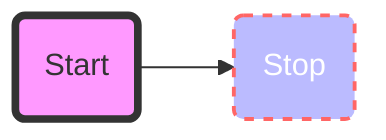
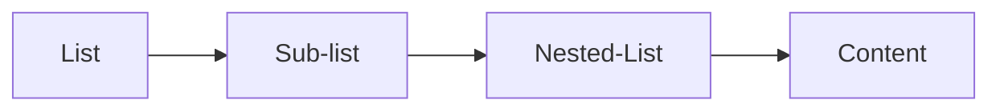
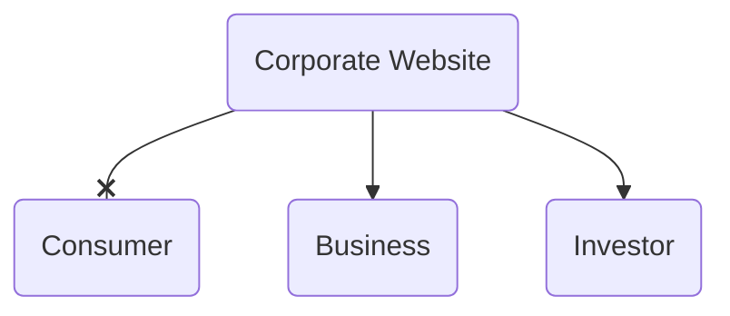
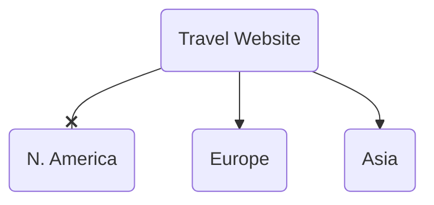

# Resume RedUX

This is a resume website inspired by **(forked from?)** [this mini project](https://github.com/israelias/ci-uc-resume) as part of my coursework at [Code Institute](https://codeinstitute.net). Taking it a step further through extensive developer research. Synergistically, I approached the design challenge as both owner and user to fundamentally capitalize on the owner's (my) unique candidacy in the dev community.

The result is a web resume that is:
1. Custom designed and built by the owner, contrary to the trend in the industry of using static dashboard templates for stats/efficiency
2. Isn't supplying content that overplays the owner's limited experience in the industry; but instead allows data to speak for itself by showcasing the owner's "activity" in opportune moments
   - "Add styling to revised navbar for home.html" -Joem. Last commit 29 hours ago. See this project in progess" (GitHub actions)
   - "Soon to come" (Placeholder for forthcoming milestone project)
3. Integrates the owner's nuanced stack as a designer and the nuanced workflow that this comes with. (Software/prototype integration UX to dev hand off; owner as developer's "super user")
4. Still meets the criteria for what constitutes a modern web resume as seen in these examples
5. Simple and responsive (learning from previous) creating a "card" template for more interactive features in later releases; with a clear idea of its moonshot design and realistic feasibility through high-fi UX prototypes (playing up to owner's strengths)
6. A website that is an honest snapshot of the owner's progress; new "feed" for returning visitors
7. A clear indicator of the owner's online reach and footprint along with links/clouds of owner's frontier.

[View the live website here.](https://israelias.github.io/resume-redux/) A work in progress.

<!--[TOC levels=1-3 bullet formatted hierarchy]-->

## Contents
- [Resume RedUX](#resume-redux)
  - [Contents](#contents)
  - [UX](#ux)
    - [The Five Planes of UX](#the-five-planes-of-ux)
      - [1.0 Strategy Plane](#10-strategy-plane)
        - [1.1 Research](#11-research)
        - [1.2 Planning](#12-planning)
        - [1.3 User Expectations](#13-user-expectations)
        - [1.4 Strategy table](#14-strategy-table)
      - [2.0 Scope Plane](#20-scope-plane)
        - [2.1 Requirements and functional specifications](#21-requirements-and-functional-specifications)
        - [2.2 Content requirements](#22-content-requirements)
        - [2.3 Releases](#23-releases)
      - [3.0 Structure Plane](#30-structure-plane)
        - [3.1 Organisation of Functionality and Content](#31-organisation-of-functionality-and-content)
        - [3.2 Interaction Design (IXD)](#32-interaction-design-ixd)
        - [3.3 Information Architecture (IA)](#33-information-architecture-ia)
        - [3.4 Principles of Organisation](#34-principles-of-organisation)
      - [4.0 Skeleton Plane](#40-skeleton-plane)
        - [4.1 Features and Usefulness](#41-features-and-usefulness)
        - [4.2 Navigation Design](#42-navigation-design)
        - [4.3 Information Design](#43-information-design)
        - [4.4 Interface Design](#44-interface-design)
      - [5.0 Surface Plane](#50-surface-plane)
        - [Visual Language](#visual-language)
        - [Good UX smells like value.](#good-ux-smells-like-value)
    - [Design](#design)
  - [Badges](#badges)
  - [Features](#features)
    - [Existing Features](#existing-features)
    - [Features Left to Implement](#features-left-to-implement)
  - [Technologies Used](#technologies-used)
  - [Frameworks and Libraries](#frameworks-and-libraries)
  - [Testing](#testing)
    - [Miscellaneous](#miscellaneous)
    - [Known Bugs](#known-bugs)
  - [Deployment](#deployment)
  - [Credits](#credits)
    - [Content](#content)
    - [Media](#media)
    - [Acknowledgements](#acknowledgements)

## UX

Use this section to provide insight into your UX process, focusing on who this website is for, what it is that they want to achieve and how your project is the best way to help them achieve these things.

In particular, as part of this section we recommend that you provide a list of User Stories, with the following general structure:
- As a user type, I want to perform an action, so that I can achieve a goal.

This section is also where you would share links to any wireframes, mockups, diagrams etc. that you created as part of the design process. These files should themselves either be included as a pdf file in the project itself (in an separate directory), or just hosted elsewhere online and can be in any format that is viewable inside the browser.

Project Process and Development Guidelines following

### The Five Planes of UX

> ###### Distribute content and feature development across five activity planes
>
> ###### Methodology for taking product from conception to release

  
Strategy

## 1.0 Strategy Plane

> ###### What we are trying to achieve
>
> ###### For whom we are trying to achieve it

- The main goals of the site are:
  - To establish a personal brand for the owner and avatar for the owner's online presence
  - Attract and retain a following in the developer community
  - Attract recruiter reader software and analytics
  - Be up to a standard that is competitve with UX designed responsive web resumes
  - Stand out to [Code Institute](https://codeinstitute.org/)'s qualification partners and potential employers
- The website is built for:
  - A young professional designer and architect (buildings) presently breaking into the tech industry

- Their goals and needs are:
  - In addition to above (as the site is the owner is the business is the consumer), the ultimate goal is to transform a CV into an interactive, attractive and customisable experience that reflects the candidate's proficiency in the manner in which the content itself is presented.

### 1.1 Research

- Who else is building this?

  - Not all Software Developers care about UX. Equally, not all UX designers care about developers. They are more like consultants to each other, wher one "hands off" the design prototype to the developer for "developing." I learned this after using much of the software for UX designers. Wireframing for UX Designers does not start at low-resolution. Components designed on Adobe UX are directly exported as local _.svg_ files, ready to be animated. In the realm of UXD, points go to customization. Developers, on the other hand, just need bare bones of function when establishing wireframes.
  - Nonetheless, everyone who knows how to write code has built some form of a custom resume.
  - The key difference is the degree to which one is branded or specific as opposed to *not* branded or generic.

- How are they doing it?

  - Most of them are generic (if the content is thorough) *or* designed (if the content is minimal).
  - Some are templates purchased from web designers. And those are the most impressive ones.

- What are the pros and cons of what they are doing?

  - Some of the pros of either fully or personally branded web resumes are the completeness of its graphic design and content availability. The cons, on te other hand, are the sacrifice of common "Laws of UX."  Things are not where you expect them to be. It is not easy to "find your way back." And its responsive features are for design, less for function. The ones that *are* mobile-first, otherwise tend to be straight out of Bootstrap and don't stand out as a thorough representation of professional brand unique to one's personality.

- What are they missing?

  - At either end of the spectrum, what most of them are missing is a graphic narrative. And an honest voice. There is no belief system that resonates, or speaks to a niche market. In other words, they're not aiming at a specific company; they're aiming at anyone at all who will hire them. And relying on their impressive GitHub profile to do much of the heavy lifting (and successfully so.)

  - In one article outlining [what companies really look for in your GitHub profile](https://www.builtinchicago.org/2018/05/08/what-companies-look-for-on-github), it's clear that companies value personality and shared values over one's GitHub "brand." That being said, they do look for something else in you GitHub -- an *influencer*

    > Engineers with a lot of activity on their profiles show me how involved they are as developers. I’m also interested to see how many followers they have, because a surplus is often a good indication of their role as a thought leader.
    >
    > [Source](Engineers with a lot of activity on their profiles show me how involved they are as developers. I'm also interested to see how many followers they have, because a surplus is often a good indication of their role as a thought leader.)

- What could they do better?

  - "Designed" resumes for web developers can benefit from using principles of UX and using the language speak for the content. Having the content be fold back in the way it is being told. So that it demonstrates thinking that is algorithmic, parametric. So that the the website itself showcases the very skill highligted in list of skills.
  - They can also benefit from demonstrating interpersonal artistry. Activity in the feed, so to speak.
  - A lot of them are missing skills that others don't already have. They are not capitalizing on what it is about them that stands out: *narrative*. And capitalizing on how their non-dev background  might  position them uniquely by virtue of being *different*.
  - In terms of providing an "application package," none of them have a page template for a cover letter. This would be for the event that the owner send the website link directly as an application.

a programmer should understand better than most how important muscle memory and shortcuts are to productivit

MO it's not just about "values of architects". They're a population that does cognitively demanding work (so polished UX is of fundamental importance) that tends to have more of a fine arts background than a software background (so right-to-modify does nothing for them).

FOSS is just ... a bad deal for them. They want someone they can call and yell at when they're on a deadline and the software isn't working, and they want tools that get out of their way.

UX design is done by designers and product managers. Developer just implemented ability to assign hot key X to function Y. How this ability used was not his/her concern.

### 1.2 Planning

- What relevant content should we deliver that fits our demographic?
- How can we make the content easily tracked and catalogued in an intuitive way?
- Is the technology appropriate? What are the tech considerations?

### 1.3 User Expectations

> #### What does the visitor expect? Consider that the visitor is asking themselves these questions when they come to the site for the first time:

- What is this? Is it what I expected to see?
- Does it look credible and trustworthy?
- Does it offer what I want?
- Does it look valuable enough for me to stay and return?
- What actions can I take now?
- How do I learn more?
- How do I contact someone?

#### Key Takeaways From Research

- Increase "activity" or evidence of activity
- Progress bars do not give the user anything. Instead, show evidence of experience. Show integrity.
- Give clear understanding of owner's nuanced stack expertise
- Evidence of dev community activity in social media (dev.to, Twitter, etc.)
- Reduce number clicks to arrive at goal

#### Why is this website special? Why would a visitor desire this (experience)?

- User Stories
  - Senior Developer (Back End)
    - As a leader in the industry, I won't spend much time here. What is it about this candidate/service/product that stands out and that I haven't already seen in others?
      1. I want to *see* that without having to *find* that. Whatever that is.
      2. Now I recognize the need for someone with your background, which migt have been a problem I didn't even know I had.
  - Recruiter (External)
    - As a stakeholder in the hiring process, if you win, I win. I've already seen your LinkedIn. I landed here from the job-hunt database in our server which means you were already recommended by someone. Why would you choose us?
      1. I'd like to know where you are and give you a call.
      2. My goal is to schedule you at your convenience, learn enough about you to engage you and share you with my team.
  - Owner
    - As an evolving candidate in an evolving industry, I want to be be able to control and customize features and pages.
      1. I want to be able to customize the website for a specific company when I send an application.
      2. The goal is to further expand my candidacy in the form of a cover letter page -- a custom link -- that reroutes to the main page after being read.

|     |     |     |     |
| --- | --- | --- | --- |
| Name | **Jacob Grobin** | **Tracy Letts** | **Joem Sanez** |
| Job Title | **Senior Developer** | **Recruiter** | **Owner** |
| Background |     |     |     |
| Quote | As a leader in the industry, I won't spend much time here. What is it about this candidate/service/product that stands out and that I haven't already seen in others?I want to *see* that without having to *find* that. Whatever that is. | As a stakeholder in the hiring process, if you win, I win. I've already seen your LinkedIn. I landed here from the job-hunt database in our server which means you were already recommended by someone. Why would you choose us? I'd like to know where you are and give you a call. | As an evolving candidate in an evolving industry, I want to be be able to control and customize features and pages. I want to be able to customize the website for a specific company when I send an application. |
| Goals | I want to *see* that without having to *find* that. Whatever that is. | I want to *see* that without having to *find* that. Whatever that is. | I want to *see* that without having to *find* that. Whatever that is. |

###### Note: All additions and improvements to the plan should always count towards the goals of the user and/or the business.

### 1.4 Strategy table

When using the strategy table there is always a trade-off between importance and viability. Can we build a solution given the limited time and resources available?

#### Importance is driven by business goals and user needs.

| id    | Opportunity / Problem / Feature             | Importance | Viability |
| ----- | ------------------------------------------- | ---------- | --------- |
| A     | Create online presence for owner            |            |           |
| B     | Increase GitHub followers for owner         |            |           |
| C     | Showcase samples of owner's work            |            |           |
| D     | Feature recommendations written about owner |            |           |
| E     | Increase recruiter interaction              |            |           |
| F     | Showcase owner's contribution footprint     |            |           |
| G     | Showcase owner's awards and recognitions    |            |           |
| H     | Dashboard functionality                     |            |           |
| I     | Custom landing page cover letter            |            |           |
| J     | Tech stack represented as data from Github  |            |           |
| K     | GitHub activity represented as live stats   |            |           |
| L     | Project activity represented as "last commit message"  |            |           |
| M     | Experience shown as direct data from owner's OS footprint (No fooling anyone)   |            |           |
| Total |                                             |            |           |

If importance and viability are equal, then we are in a position to do it all. Draw out your own version of the graph below to work out what features you should drop.

### 

  
Scope

## 2.0 Scope Plane

> ###### Features based on information gathered from Strategy to include in design
> 
> ###### Itemizes what's on the table for a production release and what isn't

- Which features, based on info from strategy plane, do we want to include in the site?

- What is included in production release and what is not (for now)?

- Keep goals in line with strategy goals.

- User **SPRINT** goals to keep on track. Don't allow scope-creep to happen (additional features not agreed on in strategy)

- Pack in MVP features up front, unfold new experiences over time.

### 2.1 Requirements and functional specifications

- What users say they need.
- What they actually need.
- What they don't know they need.

There is a difference between how you imagine something will be used and how it is actually used.

- [ ] Brainstorm and mind map on what things people might not know they need. 

- [ ] Research and discussion on needs of the demographic.

### 2.2 Content requirements

- What mixed content/media do we need to meet the needs of the user?

#### Requirement types:

- Objective – what does the user want to accomplish?
- Functional – What does the user need to reach their objective?
- Non-functional – What constrains does the site or app have to perform within?
- Business Rules – What dynamic constrains do we have to meet? (calculations, definitions, legal etc)

### 2.3 Releases

What will be included in each release?

#### Release 1

#### Release 2

#### Release 3

  
Structure

## 3.0 Structure Plane

> ###### How the information is structured
> 
> ###### How information is logically grouped

- How is the information on the site structured?

- How the information is logically grouped?

- Consistency of elements and relationships

- Is it learnable and intuitive?

- Can the user understand and easily navigate through the system when using it for the first time?

### 3.1 Organisation of Functionality and Content

How will the user navigate in an intuitive way through content and features?

- How do we get to a location?

- Where do we go from there?

- Categories of information

- Way the information is presented

- Intuitive interaction

- How is the information organised?

- What kind of structure will we use? 
  
  - Complex
  - Simple
  - Linear narrative - Discernible but restrictive
  - Non-linear/Hyperlinked - Flexible but possibly confusing
  
  > ##### Which fits the demographic and goals best?

### 3.2 Interaction Design (IXD)

###### The Visual Vocabulary

- How will we __define structure and behaviour of interactive elements__?

- How will we __create meaningful relationships between elements, content and information__?

- How will we __communicate functionality and interactivity__?

- How will we reveal workflows?

- How to reduce risk of user error?

- How can we make users aware of state changes in the system?

#### Consistent

> People develop an expectation of conventions

- Follow conventions – navbar, buttons etc located and behave the way users expect.
- Colouring and themes consistent.
- Scenario
  - Any transitions, rollovers, tooltips act consistently
  - Leverage the visitor's prior experience here and elsewhere
- Voice
  - Labels and terms used should match throughout
  - Imagery consistent style
- 

> Only be different when it makes something better

#### Predictable

- All elements should be easy to find and use.
- Include things like content hinting.

#### Visible/Discoverable

- No luck involved
- All elements should be easy to find and use.
- Include things like content hinting
  - Partially reveal elements of your page just above the fold

> Make sure content is visible wherever possible

#### Learnable

> Intuitivie = Single-trial learning

- Provide a strong sense of place (pageation, indication of which page you are on in the navbar)
- Set correct expectations (sub-menus, sub-navigation)
- Make it possible for people to accurately predict the outcome of their interactions

#### Feedback

- System provides feedback to let users know something is happening (change of state) 
  - Color change after button is clicked
  - Makes them feel assured
- Provides feedback in case of an error
  - i.e. 404 Error
- Provide link that will take them back to safety

### 3.3 Information Architecture (IA)

###### Information Architecture

> **Creation and organisation of navigational schemas**
> 
> __Allows users to:__
> 
> > Efficiently move through content
> > 
> > Be easily educated and informed
> 
> __Allows oweners to:__
> 
> > Accommodate growth and change

__*Which IA  type suits our users needs?*__

#### Hierarchical Tree Structure

> Home
> 
> > About
> > 
> > > Feature 1
> > > 
> > > Feature  2
> > 
> > Portfolio
> > 
> > > CV
> > > 
> > > Download
> > 
> > Contact
> > 
> > > Form

- Standard structure, not complex.

- Problematic on mobiles (navbars helpful here)

- Navigation collapsed into a single "Burger icon" 

> Anything over three clicks is cognitive overload

#### Nested List (Linked List)

- Linear path to detail
- Good for mobiles
- Prevents exploring

#### Hub and Spoke

| Spoke     |             | Spoke     |
|:---------:|:-----------:|:---------:|
|           | ****Hub**** |           |
| **Spoke** |             | **Spoke** |

- Popular on mobiles
- Central home with links to spokes containing sub-sections of information
- Works for multi-feature apps
- Cant navigate between spokes

#### Dashboard

| Detail1     |                                                                                                  | Detail2     |
| ----------- | ------------------------------------------------------------------------------------------------ | ----------- |
|             | <u>**Dashboard**</u>   <u>Summary1</u> <u>Summary2</u>   <u>Summary3</u> <u>Summary4</u> |             |
| **Detail3** |                                                                                                  | **Detail4** |

- Great for at-a-glance key info
- Detail views of related content
- More suited to <u>desktops</u>

### 3.4 Principles of Organisation

> Audience is the organizing principle

> Geography is the organizing principle

- Organisational principles used at the **highest levels** of the site should be the most closely tied to **user needs** and **business objectives**.

- Those used at lower levels are usually influenced by **feature specifications** and **content requirements**.

- Every collection of information has a **built-in conceptual structure**. In most cases more than one.

- <mark>Find the right structure for the objectives and user needs</mark>

  
Skeleton

## 4.0 Skeleton Plane

> ###### How information is represented
> 
> ###### How user navigates information and features
> 
> ###### Skeleton gives form to the functions established in Structure plane

What form will the application take? How will the information be represented? How will the user navigate to the information and features?

- Rapidly establish value in the users mind

- Lead user towards continuing the experience

- Introduce specific content at the most relevant and appropriate points in the experience

- Add immediate value with each click

- Add positivity to the overall experience

> ###### For most users, the UI is the system

Good UI Design:

- Allows *immediate* interaction -- first-time learning

- Audience appropriate

- Perfectly meets the needs of its intended audience

### 4.1 Features and Usefulness

> Give people what they need when and where they need it 
> 
> Provide it in a visual format that they can and what to access

- Usability improves when similar parts are expressed in similar ways
- No surprises for user. Content may differ, but general shape and perception remains consistent

#### Progressive Disclosure

- Reveal information over time and across space

#### Grouping, Order and Hierarchy

- Visually group elements in order of importance

- Priority one established at Stategy level becomes the first information to appear

- Navigation elements and menu items *move from left to right in order of priority* of information and features

> The more features on the screen, the less user-friendly the screen is.
> 
> As features inrease in number and complexity, usability decreases.
> 
> As features decrease, usability increases.

- Give the user easy decisions, do not overcomplicate things

> The more choices you present you users with, the longer it will take them to reach a decision
> 
> -Hick-Hyman Law

### 4.2 Navigation Design

Intuitive Navigation and Completion of Tasks

- Placement, Order, Hierarchy, Priorities

###### How do you find what you want?

1. **Browsing** via a navigation system
   
   1. Clear categories

2. **Searching** via keywords and phrases
   
   1. Keywords in search

3. Using **filters** to narrow large lists and sets of information

4. Using **pagination** controls to provide:
   
   1. Information architecture
   
   2. Sense of depth/breadth
      
      Breaks info into smaller chunks so user is not overwhelmed
      
      Use progress bars with pagination
- Keep ordering of navigation simple

#### Representational Icons

- Clear meaning

- Familiar objects

#### Reduce Cognitive Friction

- Ensure avigation elements are visible and easily findable

- Ensure they don't require time to decode

- Differentiate between navigational elements with **colour, icons and text**

#### Consistent

- Same interactions and behaviors

- Don't rearrange the order

- Don't move expected elements to a different location

#### Metaphors

Good Design is:

| Literal                        | Metaphor       |
| ------------------------------ | -------------- |
| Innovative                     | light bulb     |
| Make a Product Useful          | wrench         |
| Aesthetic                      | paint brush    |
| Makes a product understandable | speech bubbles |
| Unobtrusive                    | sun            |
| Honest                         | book           |
| Long Lasting                   | house          |
| Thorough                       | list           |
| Environmentally Friendly       | earth          |
| As little design as possible   | dot            |

#### Visual Metaphors

- Provide shortcuts for use

- Are intuitive and obvious

- Are taken from everyday life

### 4.3 Information Design

Arrangement of the elements that contain the information

> Information deisng should be invisible

- Easy to complete **forms**

- Strong **instructions**

- Strong **educational materials**

- Strongly represented **scientific data**

- No dangerous manufacturing Uis

- Everything is **relevant**

> Too much information is worse than no information at all.

#### Context and Order Matter

- Use **categorical ordering** when information is similar and clustered
  
  - Courses
  
  - Blog

- Usee **alphabetical ordering** when information is referential
  
  - Contacts List
  
  - Dictionary

- Use **location ordering** when waydinding and orientation is needed
  
  - Sports, Geography site

- Use **time ordering** when comparing fixed duration events
  
  - Timeline
  
  - Work History

Which icons will we use? Which are best to represent our needs?

### 4.4 Interface Design

The best arrangement and visual presentation of the elements

- Prototyping and wireframes

- Mockups using Balsamic

#### Wireframes

2D model of the product that provides 

- form 

- information

- arrangement volume

Just a starting point (no colours, images or effects referred to).

- See how each screen fits into the whole site

- Determine which links and content is required to meet the needs of the user

- See how balanced elements are & how they relate to each other

- What gets included

- How it is organised

- What gets priority

- Where are elements located?

- Has anything been left out?

- Is the top priority content noticed first?

- Revisit strategy and goals – are we on track?

- Do the relationships work?

- Paper first, then Balsamic or Marvel app.

  
Surface

## 5.0 Surface Plane

> ###### What the product will look like
> 
> ###### What colors, typography, and design elements are used

- What can the user do?
- How will the user interact with the site?
- What effects will be on the site?
- What can the user click on?
- Where can the user go?
- What is the final version of the info appearing on the screen?

### Visual Language

Provides information and context

- color

- layout

- fonts

- images

- order/sequence

- identity

#### Economy

The most important elements are easily recognized

#### Readability

> Legible
> 
> Font contrast
> 
> Consistent patterns

#### Fonts and Typography

- Should be visually distinct

- Indicate diferent information

- Should be consistent

> ### Good UX smells like value.

### Design

- Color Scheme

- Typography

- Imagery

## Badges

Current Status etc.

## Features

In this section, you should go over the different parts of your project, and describe each in a sentence or so.

### Existing Features
- Feature 1 - allows users X to achieve Y, by having them fill out Z
- ...

For some/all of your features, you may choose to reference the specific project files that implement them, although this is entirely optional.

In addition, you may also use this section to discuss plans for additional features to be implemented in the future:

### Features Left to Implement
- Another feature idea

## Technologies Used

In this section, you should mention all of the languages, frameworks, libraries, and any other tools that you have used to construct this project. For each, provide its name, a link to its official site and a short sentence of why it was used.

- [JQuery](https://jquery.com)
    - The project uses **JQuery** to simplify DOM manipulation.

## Frameworks and Libraries

1. [Bootstrap 4.5.2:](https://getbootstrap.com/docs/4.5/getting-started/introduction/)
    - Bootstrap 4.5.2 Starter Template
2. [Hover.css:](https://ianlunn.github.io/Hover/)
    - xx
3. [jQuery:](https://jquery.com/)
   - xx
4. [Adobe Fonts:](https://fonts.adobe.com/)
    - xx

## Testing

In this section, you need to convince the assessor that you have conducted enough testing to legitimately believe that the site works well. Essentially, in this part you will want to go over all of your user stories from the UX section and ensure that they all work as intended, with the project providing an easy and straightforward way for the users to achieve their goals.

Whenever it is feasible, prefer to automate your tests, and if you've done so, provide a brief explanation of your approach, link to the test file(s) and explain how to run them.

For any scenarios that have not been automated, test the user stories manually and provide as much detail as is relevant. A particularly useful form for describing your testing process is via scenarios, such as:

1. Contact form:
    1. Go to the "Contact Us" page
    2. Try to submit the empty form and verify that an error message about the required fields appears
    3. Try to submit the form with an invalid email address and verify that a relevant error message appears
    4. Try to submit the form with all inputs valid and verify that a success message appears.

In addition, you should mention in this section how your project looks and works on different browsers and screen sizes.

You should also mention in this section any interesting bugs or problems you discovered during your testing, even if you haven't addressed them yet.

If this section grows too long, you may want to split it off into a separate file and link to it from here.

### Miscellaneous

- Tested of x Browser
- Viewed on x Devices
- User Testing

### Known Bugs

- xxx
- xxx
- xxx

## Deployment

This section should describe the process you went through to deploy the project to a hosting platform (e.g. GitHub Pages or Heroku).

In particular, you should provide all details of the differences between the deployed version and the development version, if any, including:
- Different values for environment variables (Heroku Config Vars)?
- Different configuration files?
- Separate git branch?

In addition, if it is not obvious, you should also describe how to run your code locally.

## Credits

### Content
- The text for section Y was copied from the [Wikipedia article Z](https://en.wikipedia.org/wiki/Z)

### Media
- The photos used in this site were obtained from ...

### Acknowledgements

- I received inspiration for this project from X
