# Resume RedUX


[](https://resume-redux.readthedocs.io/en/latest/?badge=latest)
[](https://bestpractices.coreinfrastructure.org/projects/4204)

<sub>The project is in early stages of UX design; currently wrapping up user research; developing high-fidelity wireframes using Adobe XD.</sub>

<!---->

CV-JS is a comprehensive and systematic means for navigating and featuring content in a curriculum vitae.  
The project is for Milestone 1 User-centric Front-end Devlopment as part of my coursework at [Code Institute](https://codeinstitute.net).  
This documentation includes UX research, which was approached and is approached as
Taking it a step further through extensive developer research. Synergistically, I approached the design challenge as both owner and user to fundamentally capitalize on the owner's (my) unique candidacy in the dev community.

The result is a web resume that is:
1. Custom designed and built by the owner, contrary to the trend in the industry of using static dashboard templates for stats/efficiency
2. Isn't supplying content that overplays the owner's experience in the tech industry; but instead allows data to speak for itself by showcasing the owner's "activity" in opportune moments
   - "Add styling to revised navbar for home.html" -Joem. Last commit 29 hours ago. See this project in progess" (GitHub actions)
   - "Soon to come" (Placeholder for forthcoming milestone project)
3. Integrates the owner's nuanced stack as a designer and the nuanced workflow that this comes with. (Software/prototype integration UX to dev hand off; owner as developer's "super user")
4. Still meets the criteria for what constitutes a modern web resume as seen in these examples
5. Simple and responsive (learning from previous) creating a "card" template for more interactive features in later releases; with a clear idea of its moonshot design and realistic feasibility through high-fi UX prototypes (playing up to owner's strengths)
6. A website that is an honest snapshot of the owner's progress; new "feed" for returning visitors
7. A clear indicator of the owner's online reach and footprint along with links/clouds of owner's frontier.

[View the live website here.](https://israelias.github.io/resume-redux/) A work in progress.

[TOC levels=1-3]: # "# Table of Contents"

# Contents
- [Resume RedUX](#resume-redux)
- [UX](#ux)
  - [1.0 Strategy](#10-strategy)
    - [1.1 Research](#11-research)
    - [1.2 User Expectations](#12-user-expectations)
    - [1.3 User Stories](#13-user-stories)
    - [1.4 High-Level Paradigms](#14-high-level-paradigms)
    - [1.5 Strategy table](#15-strategy-table)
  - [2.0 Scope](#20-scope)
    - [2.1 Requirements and Functional Specifications](#21-requirements-and-functional-specifications)
    - [2.2 Functional Requirements](#22-functional-requirements)
    - [2.3 Content Requirements](#23-content-requirements)
    - [2.2 What's On The Table?](#22-whats-on-the-table)
  - [3.0 Structure](#30-structure)
    - [3.1 Organisation of Functionality and Content](#31-organisation-of-functionality-and-content)
    - [3.2 Interaction Design (IXD)](#32-interaction-design-ixd)
    - [3.3 Information Architecture (IA)](#33-information-architecture-ia)
    - [3.4 Principles of Organisation](#34-principles-of-organisation)
  - [4.0 Skeleton](#40-skeleton)
    - [4.1 Features and Usefulness](#41-features-and-usefulness)
    - [4.2 Navigation Design](#42-navigation-design)
    - [4.3 Information Design](#43-information-design)
    - [4.4 Interface Design](#44-interface-design)
  - [5.0 Surface](#50-surface)
    - [Visual Language](#visual-language)
    - [Good UX smells like value.](#good-ux-smells-like-value)
    - [Design](#design)
- [Features](#features)
  - [Existing Features](#existing-features)
  - [Features Left to Implement](#features-left-to-implement)
- [Technologies](#technologies)
  - [Languages](#languages)
  - [Frameworks and Libraries](#frameworks-and-libraries)
  - [Programs, Software and Plugins](#programs-software-and-plugins)
- [Testing](#testing)
  - [Code Testing](#code-testing)
  - [User Testing](#user-testing)
  - [Miscellaneous](#miscellaneous)
  - [Known Bugs](#known-bugs)
- [Deployment](#deployment)
- [Credits](#credits)
  - [Content](#content)
  - [Media](#media)
  - [Acknowledgements](#acknowledgements)

# UX

<!--Use this section to provide insight into your UX process, focusing on who this website is for, what it is that they want to achieve and how your project is the best way to help them achieve these things.-->

<!--In particular, as part of this section we recommend that you provide a list of User Stories, with the following general structure:-->
<!--- As a user type, I want to perform an action, so that I can achieve a goal.-->

<!--This section is also where you would share links to any wireframes, mockups, diagrams etc. that you created as part of the design process. These files should themselves either be included as a pdf file in the project itself (in an separate directory), or just hosted elsewhere online and can be in any format that is viewable inside the browser.-->

 This project's process and development carefully follows Jesse James Garrett's *Five Planes of UX* to distribute content and feature development across five activity planes, and to document a methodology for taking a product from conception to release.

 Here we go!

<!--<details>-->
<!--  <summary>Strategy</summary>-->

## 1.0 Strategy

> ###### What I am trying to achieve.
> ###### For whom I am trying to achieve it.

- The main goals of the site are:
  - To establish a personal brand for the owner and avatar for the owner's online presence
  - Attract and retain a following in the developer community
  - Attract recruiter reader software and analytics
  - Be up to a standard that is competitve with UX designed responsive web resumes
  - Stand out to [Code Institute](https://codeinstitute.org/)'s qualification partners and potential employers
- The website is built for:
  - A young professional designer and architect (buildings) presently breaking into the tech industry

- Their goals and needs are:
  - In addition to above (as the site is the owner is the business is the consumer), the ultimate goal is to transform a CV into an interactive, attractive and customisable experience that reflects the candidate's proficiency in the manner in which the content itself is presented.

### 1.1 Research

#### Stakeholder Research (Self)

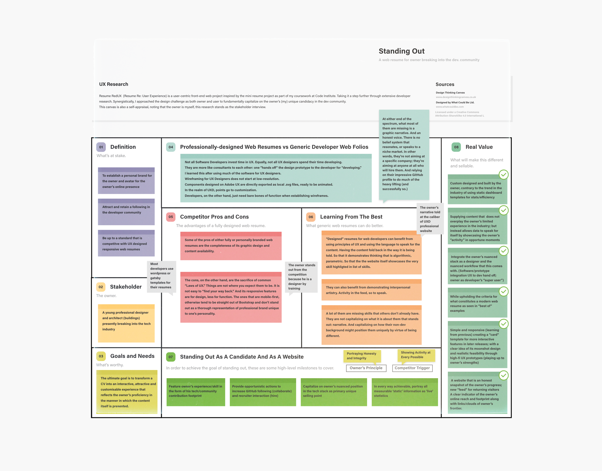

<!--- Business objectives-->
<!--- What do I want that will give me value for having this out in the world?-->

<!--|  | Owner <br/>                                                                                                                                                                                                                                                                                                                                                                                                                                                                                                                                                                                                                              |-->
<!--| ---------------------------------------------------------------------------------------------------------------- | --------------------------------------------------------------------------------------------------------------------------------------------------------------------------------------------------------------------------------------------------------------------------------------------------------------------------------------------------------------------------------------------------------------------------------------------------------------------------------------------------------------------------------------------------------------------------------------------------------------------------------------------------- |-->
<!--| <sub>Name</sub>                                                                                                  | **Joem Elias Sanez**                                                                                                                                                                                                                                                                                                                                                                                                                                                                                                                                                                                                                                    |-->
<!--| <sub>Job Title</sub>                                                                                             | **Full Stack Developer, Diploma Candidate at Code Institute** <br/>Manila, Philippines                                                                                                                                                                                                                                                                                                                                                                                                                                                                                                                                                                              |-->
<!--| <sub>Background</sub>                                                                                            | Master of Architecture, Bachelor of Fine Arts in Environmental Design                                                                                                                                                                                                                                                                                                                                                                                                                                                                                                                                 |-->
<!--| <sub>Loves</sub>                                                                                                 | <br/>Seeing a polyglot who shows interest in different languages.<br/><br/>Seeing code that is readable, well-formatted, well-tested, well-documented and that displays a pragmatic approach via your repo/commit history.<br/><br/>Seeing experimentation at different scales shows me you're making a conscious effort to stay up to speed with new tech.<sup>[1](#note-1)<sup><br/><br/>                                                                                                                                                                                                                                                         |-->
<!--| <sub>Loathes</sub>                                                                                               | <br/>Seeing other companies' coding challenges in your repo.<br/><br/>Seeing commits with environment variables included.<sup>[1](#note-1)<sup><br/><br/>                                                                                                                                                                                                                                                                                                                                                                                                                                                                                                |-->
<!--| <sub>Quote</sub>                                                                                                 | <br/>As a leader in the industry, I won't spend much time here. What is it about this candidate/service/product that stands out and that I haven't already seen in others?I want to *see* that without having to *find* that. Whatever that is.<br/><br/>                                                                                                                                                                                                                                                                                                                                                                                           |-->
<!--| <sub>Goals</sub>                                                                                                 | <br/>1. As a leader in the industry, I want to have a good understanding of who you are and what you are all about within a few seconds.<br/><br/>2. As a leader in the industry, I want to be led seamlessly through the site to arrive at valuable content with the minimum amount of clicks.<br/><br/>3. As a leader in the industry, I want to see evidence of your credibility and capability as a professional. I want to see what others have said about you or how they have reacted to you. I also want to locate sources of your credibility to see that they are legitimate and to have an idea of your influence on the industry. <br/><br/> |-->


#### Competitor Review

- Who else is building this?

  - Not all Software Developers invest time in UX. Equally, not all UX designers spend their time developing. They are more like consultants to each other, where one "hands off" the design prototype to the developer for "developing." I learned this after using much of the software for UX designers. Wireframing for UX Designers does not start at low-resolution. Components designed on Adobe UX are directly exported as local _.svg_ files, ready to be animated. In the realm of UXD, points go to customization. Developers, on the other hand, just need bare bones of function when establishing wireframes.
  - Nonetheless, everyone who knows how to write code has built some form of a custom resume.
  - The key difference is the degree to which one is branded or specific as opposed to *not* branded or generic.

- How are they doing it?

  - Most of them are generic (if the content is thorough) *or* designed (if the content is minimal).
  - Some are templates purchased from web designers. And those are the most impressive ones.

- What are the pros and cons of what they are doing?

  - Some of the pros of either fully or personally branded web resumes are the completeness of its graphic design and content availability. The cons, on te other hand, are the sacrifice of common "Laws of UX."  Things are not where you expect them to be. It is not easy to "find your way back." And its responsive features are for design, less for function. The ones that *are* mobile-first, otherwise tend to be straight out of Bootstrap and don't stand out as a thorough representation of professional brand unique to one's personality.

- What are they missing?

  - At either end of the spectrum, what most of them are missing is a graphic narrative. And an honest voice. There is no belief system that resonates, or speaks to a niche market. In other words, they're not aiming at a specific company; they're aiming at anyone at all who will hire them. And relying on their impressive GitHub profile to do much of the heavy lifting (and successfully so.)

  - In one article outlining [what companies really look for in your GitHub profile](https://www.builtinchicago.org/2018/05/08/what-companies-look-for-on-github), it's clear that companies value personality and shared values over one's GitHub "brand." That being said, they do look for something else in you GitHub -- an *influencer*

    > Engineers with a lot of activity on their profiles show me how involved they are as developers. I’m also interested to see how many followers they have, because a surplus is often a good indication of their role as a thought leader.
    >
    > [Source](Engineers with a lot of activity on their profiles show me how involved they are as developers. I'm also interested to see how many followers they have, because a surplus is often a good indication of their role as a thought leader.)

- What could they do better?

  - "Designed" resumes for web developers can benefit from using principles of UX and using the language speak for the content. Having the content be fold back in the way it is being told. So that it demonstrates thinking that is algorithmic, parametric. So that the the website itself showcases the very skill highligted in list of skills.
  - They can also benefit from demonstrating interpersonal artistry. Activity in the feed, so to speak.
  - A lot of them are missing skills that others don't already have. They are not capitalizing on what it is about them that stands out: *narrative*. And capitalizing on how their non-dev background  might  position them uniquely by virtue of being *different*.
  - In terms of providing an "application package," none of them have a page template for a cover letter. This would be for the event that the owner send the website link directly as an application.

<!--a programmer should understand better than most how important muscle memory and shortcuts are to productivit-->

<!--MO it's not just about "values of architects". They're a population that does cognitively demanding work (so polished UX is of fundamental importance) that tends to have more of a fine arts background than a software background (so right-to-modify does nothing for them).-->

<!--FOSS is just ... a bad deal for them. They want someone they can call and yell at when they're on a deadline and the software isn't working, and they want tools that get out of their way.-->

<!--UX design is done by designers and product managers. Developer just implemented ability to assign hot key X to function Y. How this ability used was not his/her concern.-->

#### User Persona Overview

Three target user profiles were assembled from user research. Each profile represents a collection of expectations, objectives, compelling experiences, peeves and emotional triggers of a curated user group. Key attributes of each persona are sourced from articles, social media, news and comments, developer feeds and LinkedIn on the outset subject of what x user group looks for in a candidate's resume/portfolio. Further documentation on the subject data is loosely footnoted where quotations are paraphrased or directly cited. For the purpose of conducting use cases and journey maps, these personas -- following an analysis of theirs and the owner's motives -- will serve as the narratives reviewed for establishing scope upon which further development of the project is defined.

>###### Note: Names and entities have been modified/fabricated for this exercise.

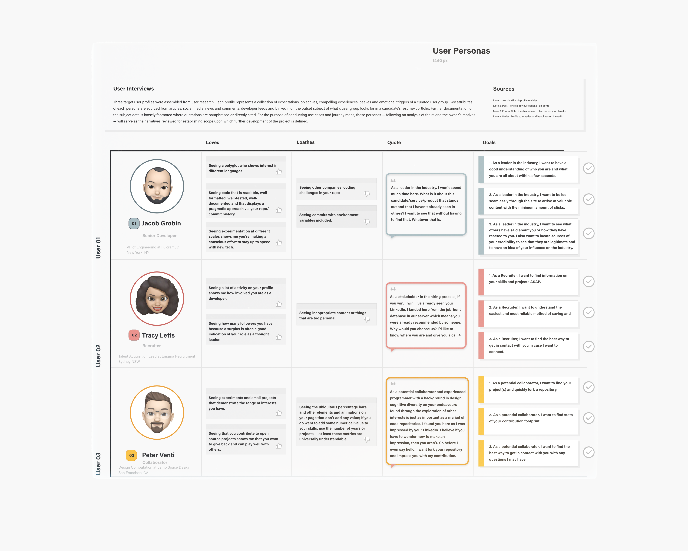

<!--|                        |                                                                                                                                                                                           |                                                                                                             |                                                                                                                                                                    |-->
<!--| ---------------------- | ---------------------------------------------------------------------------------------------------------------------------------------------------------------------------------------------------------------------------------------------------------- | ---------------------------------------------------------------------------------------------------------------------------------------------------------------------------- | ----------------------------------------------------------------------------------------------------------------------------------------------------------------------------------------------------------------------------------- |-->
<!--| <sub>Name</sub>        | **Jacob Grobin**                                                                                                                                                                                                                                           | **Tracy Letts**                                                                                                                                                              | **Peter Venti**                                                                                                                                                                                                                     |-->
<!--| <sub>Designation</sub> | **Senior Developer**                                                                                                                                                                                                                                       | **Recruiter**                                                                                                                                                                | **Collaborator**                                                                                                                                                                                                                    |-->
<!--| <sub>Headline</sub>    | VP of Engineering at Fulcram3D <br/>New York, NY                                                                                                                                                                                                           | Talent Acquisition Lead at Enigma Recruitment<br/> Sydney NSW                                                                                                                | Design Computation at Lamb Space Design<br/>San Francisco, CA                                                                                                                                                                       |-->
<!--| <sub>Loves</sub>       | <br/>Seeing a polyglot who shows interest in different languages.<br/>                                                                                                                                                                                     | <br/>Seeing a lot of activity on your profile shows me how involved you are as a developer.<br/>                                                                             | <br/>Seeing that you contribute to open source projects shows me that you want to give back and can play well with others.<sup>[1](#note-1)<sup><br/>                                                                               |-->
<!--| <sub>Loathes</sub>     | <br/>Seeing other companies' coding challenges in your repo.<sup>[1](#note-1)<sup><br/>                                                                                                                                                                    | <br/>Seeing inappropriate content or things that are too personal.<sup>[1](#note-1)<sup><br/>                                                                                | <br/>Seeing ubiquitous progress bars that don't add real value.<sup>[2](#note-2)<sup><br/>                                                                                                                                          |-->
<!--| <sub>Quote</sub>       | <br/>As a leader in the industry, I won't spend much time here. What is it about you that stands out and that I haven't already seen in others? I want to *see* that without having to *find* that. Whatever that is.<br/><br/>                            | <br/>As a stakeholder in the hiring process, if you win, I win. Why would you choose us? I'd like to know where you are and give you a call.<sup>[4](#note-4)<sup><br/><br/> | <br/>As a collaborator with a background in design, cognitive diversity on your endeavours found through the exploration of other interests is just as important as a myriad of code repositories.<sup>[1](#note-1)<sup> <br/><br/> |-->


### 1.2 User Expectations

> ###### What the visitor expects.
> ###### These apply to all user profiles and personas.
> ###### Given considerations to the novelty of the first encounter.
- What is this? Is it what I expected to see?
- Does it look credible and trustworthy?
- Does it offer what I want?
- Does it look valuable enough for me to stay and return?
- What actions can I take now?
- How do I learn more?
- How do I contact someone?

#### Why is this website special? Why would a visitor desire this (experience)?


All additions and improvements to the plan should always count towards the goals of the user and/or the business.

#### Key Takeaways From Research

- Increase "activity" or evidence of activity
- Progress bars do not give the user anything. Instead, show evidence of experience. Show integrity.
- Give clear understanding of owner's nuanced stack expertise
- Evidence of dev community activity in social media (dev.to, Twitter, etc.)
- Reduce number clicks to arrive at goal

### 1.3 User Stories

##### User Persona 1: Senior Developer

| | Senior Developer <br/>                                                                                                                                                                                                                                                                                                                                                                                                                                                                                                                                                                                                                              |
| ---------------------------------------------------------------------------------------------------------------- | --------------------------------------------------------------------------------------------------------------------------------------------------------------------------------------------------------------------------------------------------------------------------------------------------------------------------------------------------------------------------------------------------------------------------------------------------------------------------------------------------------------------------------------------------------------------------------------------------------------------------------------------------- |
| <sub>Name</sub>                                                                                                  | **Jacob Grobin**                                                                                                                                                                                                                                                                                                                                                                                                                                                                                                                                                                                                                                    |
| <sub>Job Title</sub>                                                                                             | **Senior Developer, VP of Engineering at Fulcram3D** <br/>New York, NY                                                                                                                                                                                                                                                                                                                                                                                                                                                                                                                                                                              |
| <sub>Background</sub>                                                                                            | Engineering Doctorate,  Master of Computer Science in Machine Learning, Bachelor of Science in Actuarial Mathematics                                                                                                                                                                                                                                                                                                                                                                                                                                                                                                                                |
| <sub>Loves</sub>                                                                                                 | <br/>Seeing a polyglot who shows interest in different languages.<br/><br/>Seeing code that is readable, well-formatted, well-tested, well-documented and that displays a pragmatic approach via your repo/commit history.<br/><br/>Seeing experimentation at different scales shows me you're making a conscious effort to stay up to speed with new tech.<sup>[1](#note-1)<sup><br/><br/>                                                                                                                                                                                                                                                         |
| <sub>Loathes</sub>                                                                                               | <br/>Seeing other companies' coding challenges in your repo.<br/><br/>Seeing commits with environment variables included.<sup>[1](#note-1)<sup><br/><br/>                                                                                                                                                                                                                                                                                                                                                                                                                                                                                                |
| <sub>Quote</sub>                                                                                                 | <br/>As a leader in the industry, I won't spend much time here. What is it about this candidate/service/product that stands out and that I haven't already seen in others?I want to *see* that without having to *find* that. Whatever that is.<br/><br/>                                                                                                                                                                                                                                                                                                                                                                                           |
| <sub>Goals</sub>                                                                                                 | <br/>1. As a leader in the industry, I want to have a good understanding of who you are and what you are all about within a few seconds.<br/><br/>2. As a leader in the industry, I want to be led seamlessly through the site to arrive at valuable content with the minimum amount of clicks.<br/><br/>3. As a leader in the industry, I want to see evidence of your credibility and capability as a professional. I want to see what others have said about you or how they have reacted to you. I also want to locate sources of your credibility to see that they are legitimate and to have an idea of your influence on the industry. <br/><br/> |

##### User Persona 2: Recruiter

|  | Recruiter                                                                                                                                                                                                                                                                                                                                     |
| ---------------------------------------------------------------------------------------------------------------- | --------------------------------------------------------------------------------------------------------------------------------------------------------------------------------------------------------------------------------------------------------------------------------------------------------------------------------------------- |
| <sub>Name</sub>                                                                                                  | **Tracy Letts**                                                                                                                                                                                                                                                                                                                               |
| <sub>Job Title</sub>                                                                                             | **Senior Talent Acquisition Lead at Enigma Recruitment**<br/> Sydney NSW                                                                                                                                                                                                                                                                      |
| <sub>Background</sub>                                                                                            | Strategic Hiring for Tech Companies, Bachelor of Science in Psychology, Masters in Business Administration                                                                                                                                                                                                                                    |
| <sub>Loves</sub>                                                                                                 | <br/>Seeing a lot of activity on your profile shows me how involved you are as a developer.<br/><br/>Seeing how many followers you have because a surplus is often a good indication of your role as a thought leader. <sup>[1](#note-1)<sup><br/><br/>                                                                                       |
| <sub>Loathes</sub>                                                                                               | <br/>Seeing inappropriate content or things that are too personal.<sup>[1](#note-1)<sup><br/><br/>                                                                                                                                                                                                                                                 |
| <sub>Quote</sub>                                                                                                 | <br/>As a stakeholder in the hiring process, if you win, I win. I've already seen your LinkedIn. I landed here from the job-hunt database in our server which means you were already recommended by someone. Why would you choose us? I'd like to know where you are and give you a call.<sup>[4](#note-4)<sup><br/><br/>                     |
| <sub>Goals</sub>                                                                                                 | <br/>1. As a Recruiter, I want to find information on your skills and projects ASAP.<br/><br/>2. As a Recruiter, I want to understand the easiest and most reliable method of saving and sharing your profile to my team. <br/><br/>3. As a Recruiter, I want to find the best way to get in contact with you in case I want to connect.<br/><br/> |

##### User Persona 3: Collaborator

|  | Collaborator                                                                                                                                                                                                                                                                                                                                                                                                                                                                                             |
| --------------------------------------------------------------------------------------------------------------- | -------------------------------------------------------------------------------------------------------------------------------------------------------------------------------------------------------------------------------------------------------------------------------------------------------------------------------------------------------------------------------------------------------------------------------------------------------------------------------------------------------- |
| <sub>Name</sub>                                                                                                 | **Peter Venti**                                                                                                                                                                                                                                                                                                                                                                                                                                                                                          |
| <sub>Job Title</sub>                                                                                            | **Asociate Lead in Design Computation \| Associate Tech Officer at Lamb Space Design**<br/>San Francisco, CA                                                                                                                                                                                                                                                                                                                                                                                             |
| <sub>Background</sub>                                                                                           | New Venture Development, Master of Research in Virtual Environments                                                                                                                                                                                                                                                                                                                                                                                                                                      |
| <sub>Loves</sub>                                                                                                | <br/>Seeing experiments and small projects that demonstrate the range of interests you have.<br/><br/>Seeing that you contribute to open source projects shows me that you want to give back and can play well with others.<sup>[1](#note-1)<sup><br/><br/>                                                                                                                                                                                                                                              |
| <sub>Loathes</sub>                                                                                              | <br/>Seeing the ubiquitous percentage bars and other elements and animations on your page that don't add any value; If you do want to add some numerical value to your skills, use the number of years or projects -- at least these metrics are universally understandable. <sup>[2](#note-2)<sup><br/><br/>                                                                                                                                                                                                 |
| <sub>Quote</sub>                                                                                                | <br/>As a potential collaborator and experienced programmer with a background in design, cognitive diversity on your endeavours found through the exploration of other interests is just as important as a myriad of code repositories. I found you here as I was impressed by your LinkedIn. I believe if you have to wonder how to make an impression, then you aren't. So before I even say hello, I want fork your repository and impress you with my contribution.<sup>[1](#note-1)<sup> <br/><br/> |
| <sub>Goals</sub>                                                                                                | <br/>1. As a potential collaborator, I want to find your project(s) and quickly fork a repository.<br/><br/>2. As a potential collaborator, I want to find stats of your contribution footprint.<br/><br/>3. As a potential collaborator, I want to find the best way to get in contact with the organisation with any questions I may have.<br/><br/>                                                                                                                                                        |


> ###### [<sub>Note</sub> 1](https://www.builtinchicago.org/2018/05/08/what-companies-look-for-on-github)  Article. GitHub profile realities.
>
> ###### [<sub>Note</sub> 2](https://dev.to/kethmars/what-i-learned-after-reviewing-over-40-developer-portfolios-9-tips-for-a-better-portfolio-4me7) Post. Portfolio review feedback on dev.to
>
> ###### [<sub>Note</sub> 3](https://news.ycombinator.com/item?id=24034211) Forum. Role of software in architecture on ycombinator
>
> ###### <sub>Note</sub> 4 Varies. Profile summaries and headlines on LinkedIn


### 1.4 High-Level Paradigms

#### The Owner's Key Principles

- Portraying Honesty and Integrity

#### The Users' Triggers

- Showing Activity at Every Possible Opportunity

#### Standing Out

In order to achieve the goal of standing out to the three target users, the following high-level milestones must be covered:

1. Feature owner's experience/skill in the form of his tech/community contribution footprint
2. Provide opportunistic actions to increase GitHub following (collaborate) and recruiter interaction (hire)
3. Capitalize on owner's nuanced position in the tech stack as primary unique selling point
4. In every way achievable, portray all measurable 'static' information as 'live' statistics

### 1.5 Strategy table

> ##### The trade-off between importance and viability.
> ##### Can we build a solution given the limited time and resources available?
> ##### Importance is driven by owner's goals and user needs/triggers.

<!--| id    | Specific Features             | Importance | Viability | Score |-->
<!--| ----- | ------------------------------------------- |:----------:|:---------:|:---------:|-->
<!--| A     | Create a descriptive landing page about the owner to establish his online presence            |      5      |     5      |     ▶️      |-->
<!--| B     | Feature owner's scop Feature owner's scope of expertise in the tech stack and the design stack (specialization)e of expertise in the tech stack and the design stack (specialization)          |      4      |     5      |     ▶️      |-->
<!--| C     | Represent breadth of owner's proficiency in tools and technologies (asset coverage)         |      5      |      5     |     ▶️      |-->
<!--| D     | Represent depth of owner's current use of and experience with tools and technologies (verifiable badges)         |      5      |     4      |     ▶️      |-->
<!--| E     | Showcase samples of owner's projects with links to its repo (tech) and its complete portfolio (design)         |      5      |      3     |     ⬆️      |-->
<!--| F     | Represent owner's work history (career timeline)          |      5      |      5     |     ▶️      |-->
<!--| G     | Represent owner's educational background (timeline)         |      5      |     5      |     ▶️      |-->
<!--| H     | Showcase owner's existing awards and recognitions          |      3      |      4     |     ⬆️      |-->
<!--| I     | Showcase recommendations received by owner from professionals in previous experience         |      3      |      4     |     ⬆️      |-->
<!--| J     | Provide downloadable CV.pdf that is consistent with the web resume/owner's brand         |      4      |      3     |     ⬆️️      |-->
<!--| K     | Provide a contact/message form for users to directly collaborate or message/email     |      3      |      3     |     ⬆️      |-->
<!--| L     | Provide ability to directly call owner's mobile/Skype    |      4      |      4     |     ▶️      |-->
<!--| M     | Create dashboard functionality for owner                    |      2      |      1     |     ⬇️      |-->
<!--| N     | Create custom "hidden" cover letter page for owner to silently fill and distribute when applying to jobs           |      1      |      1     |     ⬇️      |-->
<!--| O     | Show owner's tech stack represented as data from GitHub  |      5      |     3      |     ⬆️      |-->
<!--| P     | Bookend each section with corresponding "last" activity and "next" action: "Last seen 2 hours ago" -> "Drop me a line"   |      5      |      3     |     ⬆️      |-->
<!--| Q     | Provide a stream of project activity retrieved from log of commit messages  |     4       |     3      |     ⬆️      |-->
<!--| Total |                                             |      68<sup> [a](#note-a) </sup>      |     61<sup> [b](#note-b) </sup>      |-->

<!--###### <sub>Note</sub> a: sum of importance-->
<!--###### <sub>Note</sub> b: Average viability `x` number of items-->
<!--###### ▶️ UX efforts must address this-->
<!--###### ⬆️ UX efforts should accommodate this-->
<!--###### ⬇️ Unwise use of time to address this-->


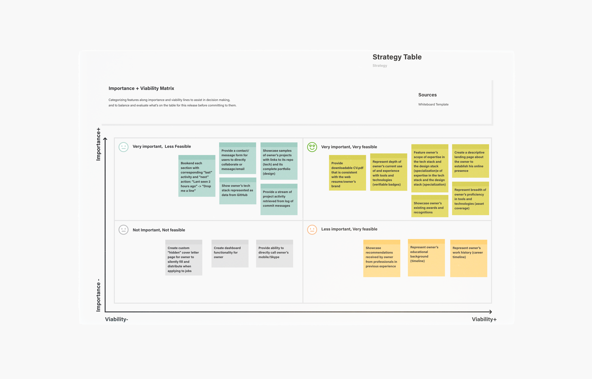


<!--If importance and viability are equal, then we are in a position to do it all. Draw out your own version of the graph below to work out what features you should drop.-->

<!--</details>-->

<!--<details>-->
<!--  <summary>Scope</summary>-->

## 2.0 Scope

> ###### Features based on information gathered from Strategy to include in design
> ###### Itemizes what's on the table for a production release and what isn't
> ###### What's on the table for initial release?

<!--- Which features, based on info from strategy plane, do we want to include in the site?-->

<!--- What is included in production release and what is not (for now)?-->

<!--- Keep goals in line with strategy goals.-->

<!--- Use **SPRINT** goals to keep on track. Don't allow scope-creep to happen (additional features not agreed on in strategy)-->

<!--- Pack in MVP features up front, unfold new experiences over time.-->

### 2.1 Requirements and Functional Specifications

<!--- What users say they need.-->
<!--- What they actually need.-->
<!--- What they don't know they need.-->

There is a difference between how one imagines something will be used and how it is actually used. Putting fresh perspectives aside for a moment, **the core problem to address is how to get more work opportunities** for the owner. To approach the scope itemization in a diligent manner, let's be realistic:

- Activity `>` Portfolio

  - [ ] An honest representation of how the owner is currently and actively building new skill-sets and real-world projects is equally valuable to the portfolio itself.
  - [ ] In favor of activity and in lieu of project experience content, establish a manner of "placeholding" that is "live" and measurable so as to attract return visitors.
  - [ ] For example:
    - Showing a timer for when the project will begin, or when the repository will drop.
    - Showing a custom in-progress "badge" that updates as a repository grows in size. See [shields.io](https://shields.io)

- Contribution Footprint `==` Content

  - [ ] Whenever there is a dearth of content, show stats.
  - [ ] As gathered from User Research, it's all about activity; so show it.
  - [ ] We all know the owner is always 'committing', posting on Slack, working towards a Milestone project, or deep in a module.
    - Find a way to represent this in the website!
  - [ ] The website should never "go to sleep" or get buried under no activity
  - [ ] Take advantage of leaving easter eggs to attract return visits.
    - Think of them like designed error messages.

### 2.2 Functional Requirements
> ###### Requirements are needs; not features.

The __bare minimum__ requirements to accommodate the needs of the owner and the target users and to release a minimal viable product (MVP).
<!--- Useful-->
<!--- Sellable-->
<!--- Buildable-->

<!--User Experience `=` Organization Goals `+` User Goals `+` User Interface `+` Interaction with Backend System-->
<!--- Objective – what does the user want to accomplish?-->
<!--- Functional – What does the user need to reach their objective?-->
<!--- Non-functional – What constrains does the site or app have to perform within?-->
<!--- Business Rules – What dynamic constrains do we have to meet? (calculations, definitions, legal etc)-->


|                                                                                                                                  | Scenario <br/>                              | Minimal Functions Required <br/>                                                                                                                                                     |
| -------------------------------------------------------------------------------------------------------------------------------- | ------------------------------------------- | ---------------------------------------------------------------------------------------------------------------------------------------------------------------------- |
| </br><sub>**Owner:** Joem</sub> | **Owner accepts company offer**  | <ol><br/>    <li>Ability to easily share application materials for employers to evaluate candidacy   <li>Ability to receive immediate notification  <br/></ol> |
| </br><sub>**Developer:** Jacob</sub> | **Senior Developer chooses to hire owner**  | <ol><br/>    <li>Ability to view skills   <li>Ability to measure standing against others <li>Ability to view accomplishments <li>Ability to view employment status <li>Ability to view contact info<br/></ol>   |
| </br><sub>**Recruiter:** Tracy</sub> | **Recruiter chooses to interview owner**    | <ol><br/>    <li>Ability to view skills    <li>Ability to measure candidacy against others    <li>Ability to view employment status <li>Ability to download CV  <li>Ability to view contact info and timezone/location<br/></ul> |
| </br><sub>**Collaborator:** Peter</sub>  | **Collaborator chooses to work with owner** | <ol><br/>    <li>Ability to view skills    <li>Ability to view project experience    <li>Ability to submit project request   <li>Ability to view contact info<br/></ul> |

<!--[https://mermaidjs.github.io/mermaid-live-editor/#/view/Z3JhcGggVEQKQVtJc3N1ZV0gLS0+fHRyaWFnZXwgQihpbnZlc3RpZ2F0ZSkKQiAtLT4gQ3tMZXQgbWUgdGhpbmt9CkMgLS0+fEF8IERbc2V2ZXJpdHkgMV0KQyAtLT58QnwgRVtzZXZlcml0eSAyXQpDIC0tPnxDfCBGW3NldmVyaXR5IDNd-->
<!--](https://mermaidjs.github.io/mermaid-live-editor/#/view/Z3JhcGggVEQKQVtJc3N1ZV0gLS0+fHRyaWFnZXwgQihpbnZlc3RpZ2F0ZSkKQiAtLT4gQ3tMZXQgbWUgdGhpbmt9CkMgLS0+fEF8IERbc2V2ZXJpdHkgMV0KQyAtLT58QnwgRVtzZXZlcml0eSAyXQpDIC0tPnxDfCBGW3NldmVyaXR5IDNd)-->

<!--Requirements are needs not features.-->
<!--it's employers evaluating my skills over needing a website-->

<!--- [ ] Brainstorm and mind map on what things people might not know they need. -->
<!--- [ ] Research and discussion on needs of the demographic.-->

### 2.3 Content Requirements

<!--- What mixed content/media do we need to meet the needs of the user?-->

<!--- Objective – what does the user want to accomplish?-->
<!--- Functional – What does the user need to reach their objective?-->
<!--- Non-functional – What constrains does the site or app have to perform within?-->
<!--- Business Rules – What dynamic constrains do we have to meet? (calculations, definitions, legal etc)-->

| Section                             | Content                                                                                                                                               | Type                    | Note |
| ----------------------------------- | ----------------------------------------------------------------------------------------------------------------------------------------------------- | ----------------------- | ---- |
| Landing                             | Introduction pitch                                                                                                                                    | text                    |      |
| About                               | Bio Summary Paragraph                                                                                                                                 | text                    |      |
| Specialization                      | <ol><li>Description of Tech Stack</li><br/><li>Description of Design Stack</li><br/><li>List of Industry Services</li></ol>                           | text, icon              |      |
| Technology <br/>Asset Coverage      | <ol><li>List of software</li><br/><li>List of languages</li><br/><li>List of soft skills</li></ol>                                                    | text, icon              |      |
| Technology<br/>Measurable Badges    | <ol><li>Percentage icon/bars of language(s) currently used</li><br/><li>Percentage icon/bars of commits in the last week</li></ol>                    | text, icon, badge, bars |      |
| Work Samples<br/>Tech               | <ol><li>Preview of repo with:<ol><li> image</li><li>size</li><li>date</li><li>languages used</li><li> status</li></ol></li></ol>                     | text, image, badge      |      |
| Work Samples <br/>Arch/Design Folio | <ol><li>Preview of design work with:<ol><li> image</li><li>description</li> <li>date</li><li>tech used</li><li> link</li></ol></li></ol>              | text, image             |      |
| Timeline<br/>Career                 | <ol><li>List of work experience with:<ol><li> position</li><li>company</li> <li>dates</li><li>description</li><li> link</li></ol></li></ol>           | text                    |      |
| Timeline<br/>Education              | <ol><li>List of education with:<ol><li> degree</li><li>school</li> <li>dates</li><li>description</li><li> link</li></ol></li></ol>                    | text                    |      |
| Awards and Recognitions             | <ol><li>List of awards with:<ol><li> name</li><li>image/icon of lnstitution</li> <li>link</li></ol></li></ol>                                         | text, icon, image       |      |
| Recommendations                     | <ol><li>Excerpts from recommendations with:<ol><li> recommender</li><li>relationship</li> <li>Excerpt</li><li>image</li><li> link</li></ol></li></ol> | text, image             |      |
| Download CV                         | PDF version of the above                                                                                                                              | text                    |      |


### 2.2 What's On The Table?

- [x] Landing Page (Voice)
<!--- [ ] <sup>________________________________________________(*cta*)</sup>-->
- [x] About Section
<!--- [ ] <sup>________________________________________________(*cta*)</sup>-->
- [x] Specialization Section (Services)
<!--- [ ] <sup>________________________________________________(*cta*)</sup>-->
- [x] Technologies Section (Proficiency)
  - [x] Asset Coverage (breadth)
  - [ ] Badge Measure (depth)
<!--- [ ] <sup>________________________________________________(*cta*)</sup>-->
- [x] Work Samples
  - [x] Tech Repo --> CTA(Fork My Repo)
  - [ ] Architecture/Design Folio --> A(Link To Folio)
<!--- [ ] <sup>________________________________________________(*cta*)</sup>-->
- [x] Timeline Section
  - [x] Career Timeline
  - [x] Educational Timeline
<!--- [ ] <sup>________________________________________________(*cta*)</sup>-->
- [ ] Awards Section (thirteen relevant)
<!--- [ ] <sup>________________________________________________(*cta*)</sup>-->
- [ ] Recommendations Section (four from LinkedIn)
<!--- [ ] <sup>________________________________________________(*cta*)</sup>-->
- [x] Drop Me A Line Section
<!--- [ ] <sup>________________________________________________(*cta*)</sup>-->
- [x] Download My CV Section
<!--- [ ] <sup>________________________________________________(*cta*)</sup>-->

<!--#### Release 1-->

<!--#### Release 2-->

<!--#### Release 3-->

<!--</details>-->

<!--<details>-->
<!--  <summary>Structure</summary>-->

## 3.0 Structure

> ###### How the information is structured
> ###### How information is logically grouped
> ###### Provide structure to the scope

<!--- How is the information on the site structured?-->
<!--- How the information is logically grouped?-->
<!--- Consistency of elements and relationships-->
<!--- Is it learnable and intuitive?-->
<!--- Can the user understand and easily navigate through the system when using it for the first time?-->

### 3.1 Organisation of Functionality and Content

#### Defining Structure and Behavior

- A user will navigate the content and features intuitively via a visible accordion "hub" with collapsible "spokes" containing sub-sections of information.
- A user finds a location from a central home where all sections are visible "stacked"
- A user goes to the next section upon arrival at the "tail" of a current section.

#### Creating Meaningful Relationships Between Elements, Content and Information

- Sub-sections are paired and nested within a parent category
- Parent categories are presented as individual tabs stacked within a central hub
- Dual sub-sections are presented as collapsible content between stacks from the central hub's parent tabs

#### Communicating Functionality and Interactivity

- Information is organized in a linear sequence at the hub stack
- The order sequence is a direct response to the user research implemented at strategy plane

### 3.2 Interaction Design (IXD)

#### Consistency and Predictability
> Capitalize on a user's expectation of conventions

- Conventions
  - The site follows the navbar/header conventions and its collapsible hamburger icon for screens less than 700px .
  - Floating social links acting as a side navbar are conventionally positioned to accommodate user behavior as well.
- Colors and Themes
	- Colors are carefully selected to be low saturated primary colors in rotation around the accordion stack.
	- The flat candle wax matte filter was achieved by mimicing the minimal spectrum of hues found in the owner’s design work
- Transitions
	- The primary transitional element is the collapsible accordion functioning as both a main navigation, pagination, and content display container
    - Scenario rollovers play out invariably by virtue of the the hub & spoke model
- Labels and Terminology
	- Nomenclature and terminology are hierarchically built and defined to reflect the content of each (2) child sections under each (1) parent node tab.
- Consistent Imagery
	- Variable imagery exists in the portfolio section where consistency is achieved by size and position of the media container. This is the same method used throughout the “fluid” right-card sub section of the website
- Non-Conventional `==` High Value (The Experiment)
	- The key difference in the website is the use of the accordion as a main content container as opposed to a side navigational/supplemental information addendum.
	- This stray from convention added value to the website by offering an interactivity that is at once learnable, familiar, and unique.
	- The main index.html is structured so content can be easily toggled to display as a static version of the website with all subsections shown (not collapsed), relinquishing the non-conventional use of the collapsible accordion.
	- The design of each parent section and child sections have been carefully formatted to look equally “ready” for a “static” rendering

#### Visibility
> Make sure content is visible wherever possible

- Wayfinding
	- The use of the accordion offered a unique opportunity to achieve the rule of proximity: having elements easy to find and use as all parent node tabs are visible at any given time.
	- Linking or `href`ing key words, noting sources, arrowing to the appropriate CTA and/or link to existing content within the page
- Discoverability
    - When necessary at `overflow` of material, content hinting is implemented by always having either a scroll bar visible, or having a previous content end to include a glimpse of the next content.

#### Learnability
> Intuitive = Single-trial learning

- A Strong Sense of Place
	- The main accordion functions as a high-level pagination that indicates the current live page the website is showing. At the same time, the ability to see all other head sections at once makes the use of the accordion more intuitive (once you open one, you know how to open the rest)
- Setting Correct Expectations
	- As the landing page is an open (non collapsed) head section, the expectation that immediate sections beneath  functions in the same manner. The site does not waver from this presentation format; thus cementing a unified expectation
	- As such, the outcome of a user’s interactions are not just easy for them to predict; the design enforces accuracy of their prediction.
	- The accordion enforces users to accurately predict the outcome of their interaction by nature of the design

#### Feedback
> Making users aware of state changes in the system

- Users Know Exactly What Has Happened, Is Happening and Will Happen
	- Feedback is achieved by animation at both hover and click for appropriate CTAs.
	- Feedback is also achieved in the accordion stack but always fading out or fading in the head section currently on display.
	- The nature of the accordion stack itself is a large scale version of the system providing feedback to let users know exactly what is happening
- Designed Errors
	- A disclaimer about the back button?
	- The accordion stack is designed so that additional stacks can be added in the future, with a possible infinite scroll feature.
	- In this scenario, a “blank” section could offer a “404 Error” page that is designed in the same way as all sections
- Home == Safety

### 3.3 Information Architecture (IA)

#### Navigational Schemas

- Desktop: The Hub and Spoke Experience
  - The site visually functions on the front end desktop as hub-and-spoke model, with the accordion stack being the hub, and its immediate co-dependent child cards (card left, card right) being direct spokes.
- Mobile: The Nested List Expanded
  - The spokes are rendered in expanded mode on a mobile, visually un-nesting content in favor of a linear path with a logical conclusion

#### Efficiently Moving Through Content

<!--- The-->

#### Be Easily Educated and Informed

<!--- The-->

#### Accommodating Growth and Change

- Nodes, Conceptually
  - I began to think of the hub (stack) as a linked list of nodes, where each node-section stores the data value of two nested sub-sections and has a link or pointer to the next node-section.
  - The linked list currently has six nodes: the landing page at head, the contact section at tail.
- Linked List Data Structure
  - The notion of traversing a linear data structure with stored values helped me section both the front and back end of the website with a high-level structure to follow.
  - Keenly aware that while I might understand and visualize the site as such, it does not actually function as linked nodes.
  - In accomodating growth and change, the site can conceivably evolve to truly adopt a nodal data structure.
  - As such, I have given myself an opportunity to revisit this project with a larger arsenal of tools and knowledge of complex data structure in the foreseeable future
  - At the very least, the stack is designed to accommodate additional section "nodes" which offer the immediate opportunity to grow and modify the stack to the extent that I understand this structure
  - Thus the architecture not only accommodates change; it encourages a didactic approach to the notion of refactoring for a smarter data structure.

#### Hub & Spoke + Nested List (Linked List)

- Top-Down Main Section Linked List
  - Linear Narrative to Site Conclusion
  - Top-down stack rendered as central **"hub"**

    ```mermaid
    TD
        tab_0(head) --> tab_1 --> tab_2 --> tab_3 --> tab_4 --> tab_5 --> tab_6(tail)
    ```


- Left-Right Section Content Nested List
  - Linear Path to Detail
  - Right of stack rendered as **"spoke"**

    ```mermaid
    LR
        stack --> stack[tab_0] --> stack[tab_0[card_left] --> stack[tab_0[card_right]
    ```


- Combined Top-Down Hub List and Left-Right Nested Path To Spoke
  - Complete pseudo boiler plate of static content

    ```mermaid
                       TD 
                     HUB STACK
    LR    stack --> stack[tab_0] --> stack[tab_0[card_left] --> stack[tab_0[card_right]
    HUB TO SPOKE        |      
                    stack[tab_1] --> stack[tab_0[card_left] --> stack[tab_0[card_right]
                        |
                    stack[tab_2] --> stack[tab_0[card_left] --> stack[tab_0[card_right]
                        |      
                    stack[tab_3] --> stack[tab_0[card_left] --> stack[tab_0[card_right]
                        |
                    stack[tab_4] --> stack[tab_0[card_left] --> stack[tab_0[card_right]
                        |
                    stack[tab_5] --> stack[tab_0[card_left] --> stack[tab_0[card_right]
                        |      
                    stack[tab_6] --> stack[tab_0[card_left] --> stack[tab_0[card_right]
    ```


- Desktop: Hub & Spoke Experience
   - Toggling collapsible content at main hub

      ```mermaid
       TOGGLE              
                     
      COLLAPSE        stack[tab_0] 
                          |
      COLLAPSE        stack[tab_0]
                          |
      COLLAPSE        stack[tab_0]
                          |      
      SHOW!           stack[tab_3] --> stack[tab_0[card_left] --> stack[tab_0[card_right]
                          |
      COLLAPSE        stack[tab_0]
                          |
      COLLAPSE        stack[tab_0]
                          |      
      COLLAPSE        stack[tab_0]
      ```

- Mobile: Nested Spokes Expanded
   - Tabs rendered as variable `sticky` elements at a micro scale that stick to (and stack at) the top and bottom of screen while contend moves fluidly beyond, functioning as pagination and wayfinding
  - Card-left and -right content fully expanded

      ```mermaid
                      stack     
                          |
      STICKY T/B      stack[tab_0] 
                          |
                      stack[tab_0[card_left]
                          |
                      stack[tab_0[card_right]
                          |      
      STICKY T/B      stack[tab_1] 
                          |
                      stack[tab_1[card_left]
                          |
                      stack[tab_1[card_right]
                          |
      STICKY T/B      stack[tab_2] 
                          |
                      stack[tab_2[card_left]
                          |
                      stack[tab_2[card_right]
                          |      
      STICKY T/B      stack[tab_3] 
                          |
                      stack[tab_3[card_left]
                          |
                      stack[tab_3[card_right]
                          |      
      STICKY T/B      stack[tab_4] 
                          |
                      stack[tab_4[card_left]
                          |
                      stack[tab_4[card_right]
                          |      
      STICKY T/B      stack[tab_5] 
                          |
                      stack[tab_5[card_left]
                          |
                      stack[tab_5[card_right]
                          |
      STICKY T/B      stack[tab_6] 
                          |
                      stack[tab_6[card_left]
                          |
                      stack[tab_6[card_right]
      
      ```
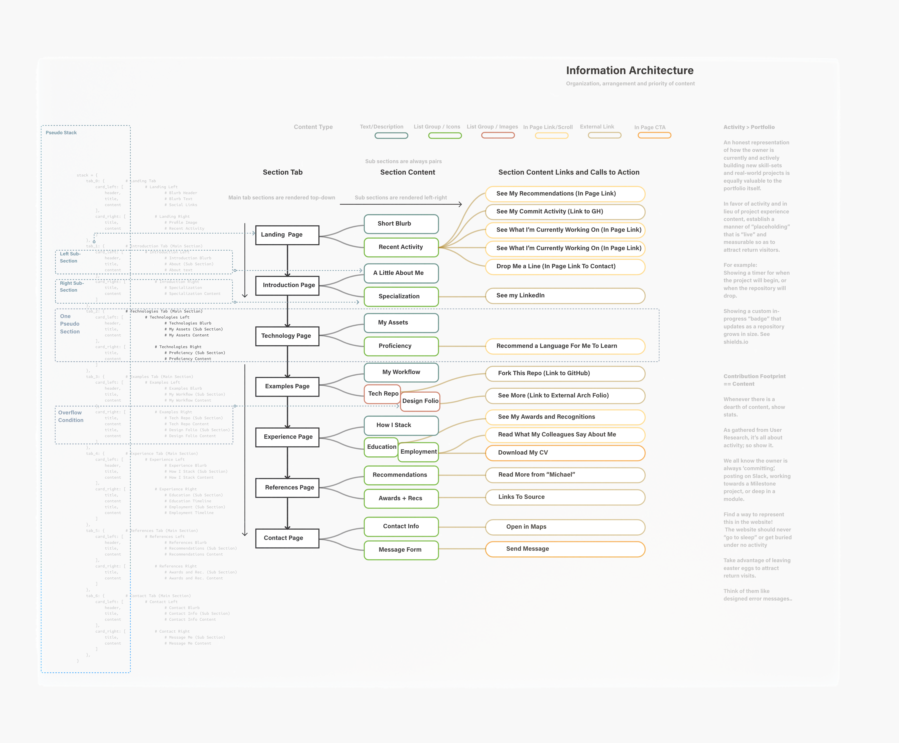

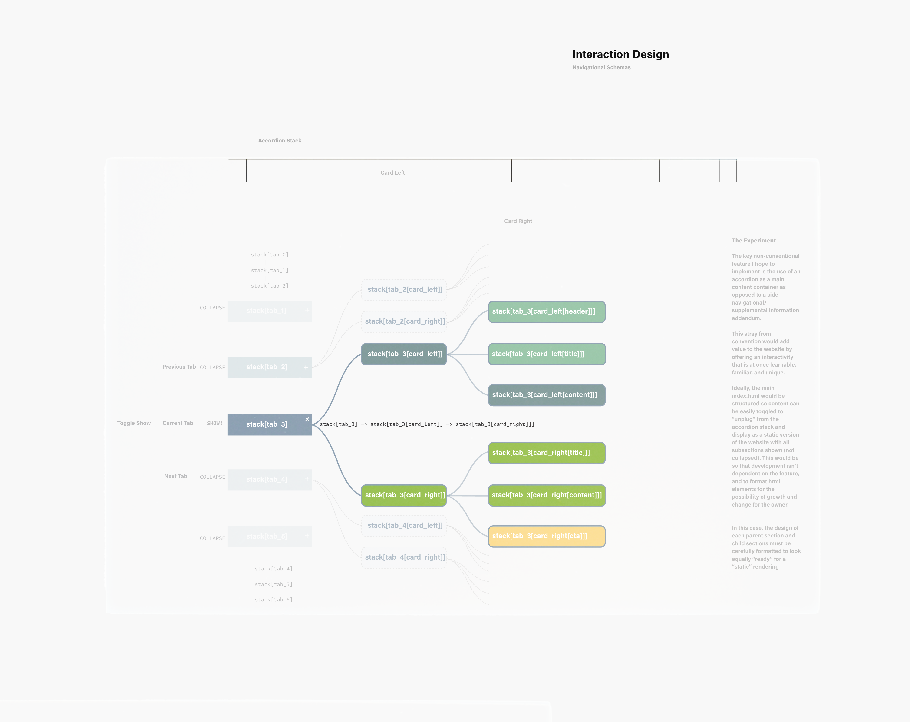

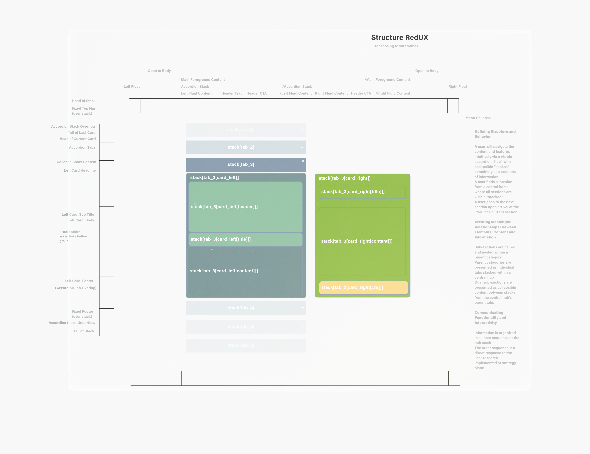

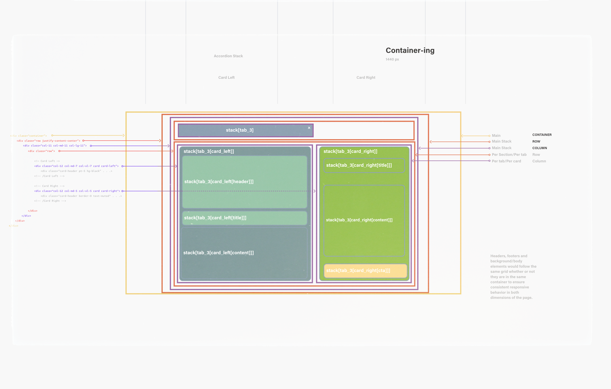

### 3.4 Principles of Organisation

<!--- Organisational principles used at the **highest levels** of the site should be the most closely tied to **user needs** and **business objectives**.-->
<!--- Those used at lower levels are usually influenced by **feature specifications** and **content requirements**.-->
<!--- Every collection of information has a **built-in conceptual structure**. In most cases more than one.-->
<!--- <mark>Find the right structure for the objectives and user needs</mark>-->

#### Reciprocity

- Content Reciprocity as an Organizing Principle
- Card Duality
Dictionary list (unordered, get by key name)

- Stacking Pairs
    ```python
    stack = {
        tab_0: [
            card_left, 
            card_right
        ],
        tab_1: [
            card_left, 
            card_right
        ],
        tab_2: [
            card_left, 
            card_right
        ],
        tab_3: [
            card_left,
            card_right
        ],
        tab_4: [
            card_left, 
            card_right
        ],
        tab_5: [
            card_left, 
            card_right
        ],
        tab_6: [
            card_left, 
            card_right
        ]
    }
    ```

- Single Stack Format

    ```python
    stack = {
        tab_0: [			# Single Collapse Section
            card_left, 			
            card_right
        ]
    }
    ```

- Typical Tab

    ```python
    stack[tab_0] = {
        card_left: [		# Left Sub Section
            header,
            title,
            content
        ],
        card_right: [		# Right Sub Section
            title,
            content
        ]
    }
    ```

- Typical Card Left

    ```python
    stack[tab_0[card_left]] = {
        header,             # Main Section Blurb
        title,              # Sub Section Title 
        content             # Sub Section Content
    }
    ```

- Typical Card Right

    ```python
    stack[tab_0[card_right]] = {
        title,              # Sub Section Title
        content             # Sub Section Content
    }
    ```


- Full Pseudo Stack

    ```python
    stack = {			
        tab_0: {			# Landing Tab
            card_left: [			# Landing Left
                header,					# Blurb Header
                title,					# Blurb Text
                content					# Social Links
            ],
            card_right: [			# Landing Right
                title,					# Profile Image
                content					# Recent Activity
            ]
        },
        tab_1: {			# Introduction Tab (Main Section)
            card_left: [			# Introduction Left
                header,					# Introduction Blurb
                title,					# About (Sub Section)
                content					# About text
            ],
            card_right: [			# Inroduction Right
                title,					# Specialization
                content					# Specialization Content
            ]
        },
        tab_2: {			# Technologies Tab (Main Section)
            card_left: [			# Technologies Left
                header,					# Technologies Blurb
                title,					# Skills (Sub Section)
                content					# Skills Content
            ],
            card_right: [			# Technologies Right
                title,					# Proficiency (Sub Section)
                content					# Proficiency Content
            ]
        },
        tab_3: {			# Examples Tab (Main Section)
            card_left: [			# Examples Left
                header,					# Examples Blurb
                title,					# Design Folio (Sub Section)
                content					# Design Folio Content
            ],
            card_right: [			# Examples Right
                title,					# Tech Repo (Sub Section)
                content					# Tech Repo Content
            ]
        },
        tab_4: {			# Experience Tab (Main Section)
            card_left: [			# Experience Left
                header,					# Experience Blurb
                title,					# Education (Sub Section)
                content					# Education Timeline
            ],
            card_right: [			# Experience Right
                title,					# Employment (Sub Section)
                content					# Employment Timeline
            ]
        },
        tab_5: {			# References Tab (Main Section)
            card_left: [			# References Left
                header,					# References Blurb
                title,					# Recommendations (Sub Section)
                content					# Recommendations Content
            ],
            card_right: [			# References Right
                title,					# Awards and Rec. (Sub Section)
                content					# Awards and Rec. Content
            ]
        },
        tab_6: {			# Contact Tab (Main Section)
            card_left: [			# Contact Left
                header,					# Contact Blurb
                title,					# Message Me (Sub Section)
                content					# Message Me Form
            ],
            card_right: [			# Contact Right
                title,					# Information (Sub Section)
                content					# Information Content
            ]
        },
    }
    ```


<!--</details>-->

<!--<details>-->
<!--  <summary>Skeleton</summary>-->

## 4.0 Skeleton

> ###### How information is represented
> ###### How user navigates information and features
> ###### Skeleton gives form to the functions established in Structure plane

What form will the application take? How will the information be represented? How will the user navigate to the information and features?

- Rapidly establish value in the users mind
- Lead user towards continuing the experience
- Introduce specific content at the most relevant and appropriate points in the experience
- Add immediate value with each click
- Add positivity to the overall experience


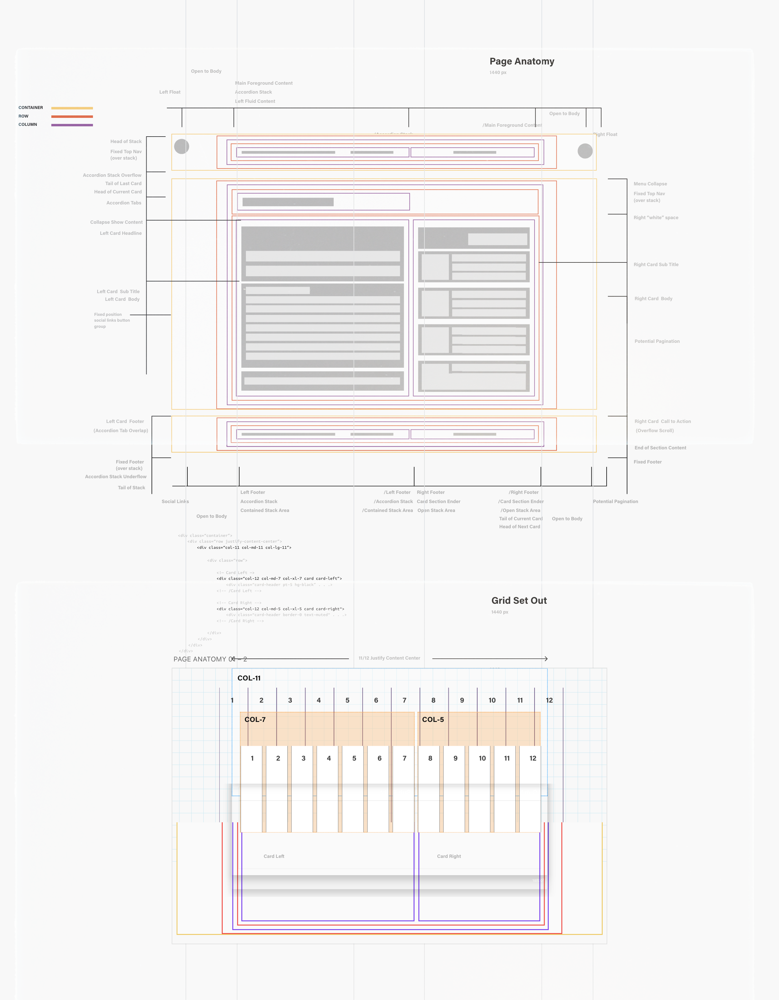


<!--Good UI Design:-->

<!--- Allows *immediate* interaction -- first-time learning-->
<!--- Audience appropriate-->
<!--- Perfectly meets the needs of its intended audience-->

### 4.1 Features and Usefulness

#### Form Follows Function

- The tabs as literal tabs and the stack as a literal stack
- This gives people what they want and where they want it
- It is offered in a visual format that users can (and want to) access)
- Usability improves when similar parts are expressed in similar ways
- No surprises for user. Content may differ, but general shape and perception remains consistent

#### Progressive Disclosure

- Information is revealed over time and across space within the delimited region of a consistent page type

#### Grouping, Order and Hierarchy

- Section tabs and sub-section contents are grouped in order of importance and in order of adjacency elements
- Priority one established at Stategy level is the first information to appear
- Navigation elements *move from top to bottom in order of priority* while content moves from left to right in order of information and features

#### Less Features `==` User Friendly

- The singular feature that makes it user friendly
- simple in it complexity
- Usability increases as it is a repetitive motion
- Gives the user easy decisions that do not over-complicate things
- Choices are reduced to what is available on the stack

### 4.2 Navigation Design

#### The Accordion Stack

- Intuitive Navigation and Completion of Tasks
  - x
- Placement, Order, Hierarchy, Priorities
  - x
- Navigational Benefits
  - The rendering of the accordion hub as **pagination** controls offers clear visibility of the Information Architecture
  - It also offers a thorough sense of depth and breadth without ever losing sight of the start, middle and end.

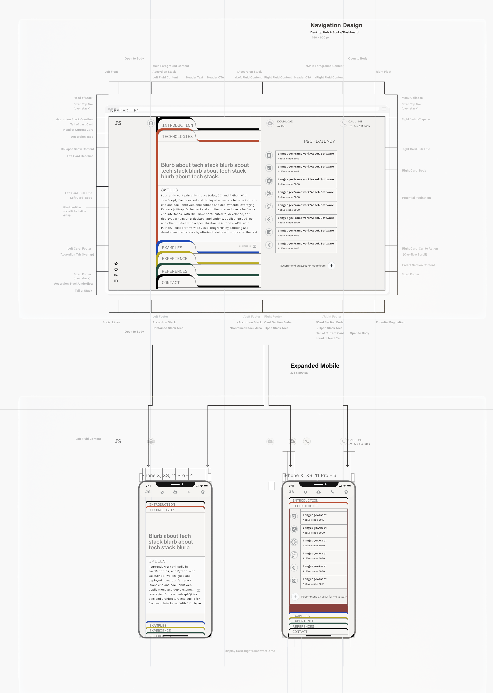


#### Representational Icons

- Clear meaning
- Familiar objects

#### Reduce Cognitive Friction

- Ensure navigation elements are visible and easily findable
- Ensure they don't require time to decode
- Differentiate between navigational elements with **colour, icons and text**

#### Consistent

- Same interactions and behaviors
- Don't rearrange the order
- Don't move expected elements to a different location

<!--#### Metaphors-->

<!--Good Design is:-->

<!--| Literal                        | Metaphor       |-->
<!--| ------------------------------ | -------------- |-->
<!--| Innovative                     | light bulb     |-->
<!--| Make a Product Useful          | wrench         |-->
<!--| Aesthetic                      | paint brush    |-->
<!--| Makes a product understandable | speech bubbles |-->
<!--| Unobtrusive                    | sun            |-->
<!--| Honest                         | book           |-->
<!--| Long Lasting                   | house          |-->
<!--| Thorough                       | list           |-->
<!--| Environmentally Friendly       | earth          |-->
<!--| As little design as possible   | dot            |-->

#### Visual Metaphors

- Provide shortcuts for use
- Are intuitive and obvious
- Are taken from everyday life

### 4.3 Information Design

>###### Arrangement of the elements that contain the information
Good Info design should be invisible...
- Easy to complete **forms**
- Strong **instructions**
- Strong **educational materials**
- Strongly represented **scientific data**
- No dangerous manufacturing Uis
- Everything is **relevant**

> Too much information is worse than no information at all.


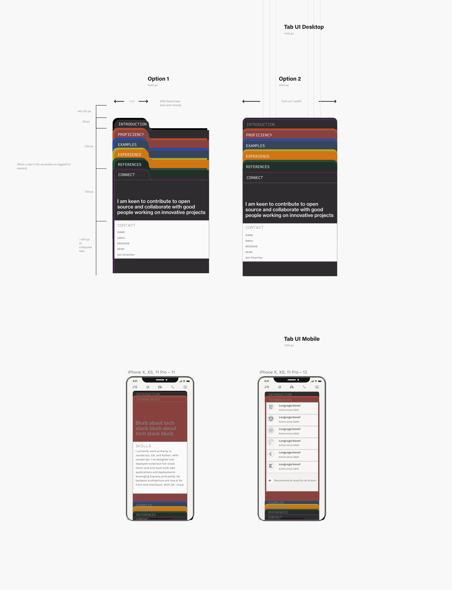


<!--#### Context and Order Matter-->

<!--- Use **categorical ordering** when information is similar and clustered-->
<!--  - Courses-->
<!--  - Blog-->

<!--- Use **alphabetical ordering** when information is referential-->
<!--  - Contacts List-->
<!--  - Dictionary-->

<!--- Use **location ordering** when waydinding and orientation is needed-->
<!--  - Sports, Geography site-->

<!--- Use **time ordering** when comparing fixed duration events-->
<!--  - Timeline-->
<!--  - Work History-->

<!--Which icons will we use? Which are best to represent our needs?-->

### 4.4 Interface Design

<!--The best arrangement and visual presentation of the elements-->

<!--- Prototyping and wireframes-->
<!--- Mockups using Balsamic-->

#### Wireframes: Schematic

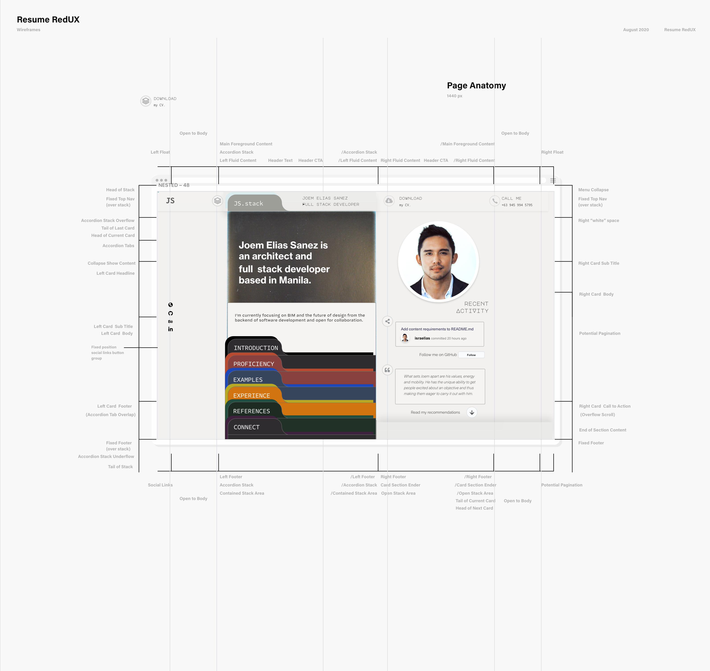

<!--- Page Anatomy-->
<!--- Element Stack-->
<!--- Grid Set Out-->
<!--- Mobile Stack-->

___
- Hub & Spoke Desktop
- Expanded Nest Mobile


#### Wireframes: Development

- Landing
  - [Web]()
  - Mobile A
  - Mobile B
- Introduction
  - Web
  - Mobile A
  - Mobile B
- Technologies
  - Web
  - Mobile A
  - Mobile B
- Examples
  - Web
  - Mobile A
  - Mobile B
- Experience
  - Web
  - Mobile A
  - Mobile B
- References
  - Web
  - Mobile A
  - Mobile B
- Contact
  - Web
  - Mobile A
  - Mobile B

___

- Alternates

<!--2D model of the product that provides-->

<!--- form-->
<!--- information-->
<!--- arrangement volume-->

<!--Just a starting point (no colours, images or effects referred to).-->

<!--- See how each screen fits into the whole site-->
<!--- Determine which links and content is required to meet the needs of the user-->
<!--- See how balanced elements are & how they relate to each other-->
<!--- What gets included-->
<!--- How it is organised-->
<!--- What gets priority-->
<!--- Where are elements located?-->
<!--- Has anything been left out?-->
<!--- Is the top priority content noticed first?-->
<!--- Revisit strategy and goals – are we on track?-->
<!--- Do the relationships work?-->
<!--- Paper first, then Balsamic or Marvel app.-->

<!--</details>-->

<!--<details>-->
<!--  <summary>Surface</summary>-->

## 5.0 Surface

> ###### What the product will look like
>
> ###### What colors, typography, and design elements are used

- What can the user do?
- How will the user interact with the site?
- What effects will be on the site?
- What can the user click on?
- Where can the user go?
- What is the final version of the info appearing on the screen?

### Visual Language

Provides information and context

- color
- layout
- fonts
- images
- order/sequence
- identity

#### Economy

The most important elements are easily recognized

#### Readability

> Legible
>
> Font contrast
>
> Consistent patterns

#### Fonts and Typography

- Should be visually distinct
- Indicate diferent information
- Should be consistent

> ### Good UX smells like value.

<!--</details>-->

### Design

- Color Scheme
- Typography
- Imagery

# Features

In this section, you should go over the different parts of your project, and describe each in a sentence or so.

## Existing Features
- Feature 1 - allows users X to achieve Y, by having them fill out Z
- ...

For some/all of your features, you may choose to reference the specific project files that implement them, although this is entirely optional.

In addition, you may also use this section to discuss plans for additional features to be implemented in the future:

## Features Left to Implement
- Another feature idea

# Technologies

## Languages

1.   [HTML5](https://en.wikipedia.org/wiki/HTML5)
1.   [CSS3](https://en.wikipedia.org/wiki/Cascading_Style_Sheets)

## Frameworks and Libraries

1. [MDBootstrap 5.8.2:](https://mdbootstrap.com/docs/standard/getting-started/installation/)
    - MDBootstrap's free kit is the primary front-end framework used to do much of the heavy lifting with consideration to the plugins/components. MDBootstrap is a version of Bootstrap with optional addition components that build off of Bootstrap's framework. The compiled CSS ([mdb.min.css](https://github.com/mdbootstrap/mdb-ui-kit/blob/master/css/mdb.min.css)) link tag and JS ([mdb.min.js](https://github.com/mdbootstrap/mdb-ui-kit/blob/master/js/mdb.min.js)) script tag of MDB5's free version is currently referenced via [cdnjs](https://cdnjs.com/libraries/mdb-ui-kit).
   - The website will operate as designed, with 100% intended functionality on any framework that extends [Bootstrap](https://v5.getbootstrap.com/)'s core bundle configurations with only minor style differentials -- particularly text lineheights on lists with [nav components](https://v5.getbootstrap.com/docs/5.0/components/navs/) that utilize the [Scrollspy](https://v5.getbootstrap.com/docs/5.0/components/scrollspy/) plugin's and '.active' states; and default buttons ':hover' states. Alternate frameworks that originate and/or extend Bootstrap's core configurations which have been tested on this site include:
     - [Bootstrap](https://getbootstrap.com/docs/4.5/getting-started/introduction/) version 4 and up (popper not reqiured).
     - [Material Design for Bootstrap](https://mdbootstrap.github.io/bootstrap-material-design/) version 4 and up (different from MDB).
     - [MDB](https://mdbootstrap.com/docs/standard/) version 4 and up.
   - [MDB5](https://mdbootstrap.com/docs/standard/) was ultimately chosen for how it handles Bootstrap nav components' font sizes and text line heights, as mentioned above.
   - The reason for the rather slim differential between different frameworks is that most components and elements have been highly customized in style.css.
   - MDB5's CSS with regard to button reboots were also preferred as their rulesets tended to be more closely aligned with the desired and finished result.
   - MDB5 utilizes the latest [Bootstrap 5 Alpha 2](https://v5.getbootstrap.com/) which has fewer dependencies, and [no longer depends on jQuery](https://blog.getbootstrap.com/2020/06/16/bootstrap-5-alpha/). With clear understanding of the components the website does and does not require, the decision to ride an alpha release was a conscious effort to stay up to speed with and learn from the latest tech.
   - Outside of Bootstrap's [grid layout](https://v5.getbootstrap.com/docs/5.0/layout/grid/) and [flex utilities](https://v5.getbootstrap.com/docs/5.0/utilities/flex/) in [bootstrap-grid.scss](https://github.com/twbs/bootstrap/blob/main/scss/bootstrap-grid.scss); essential baselining of elements via [reboot.scss](https://github.com/twbs/bootstrap/blob/main/scss/bootstrap-reboot.scss); and box model essentials in [utilities.scss](https://github.com/twbs/bootstrap/blob/main/scss/bootstrap-utilities.scss); the project's synergistic appeal is resolved by the careful management of classes in [__transitions.scss](https://github.com/twbs/bootstrap/blob/main/scss/_transitions.scss) reeturned by the [collapse plugin](#plugins).
2. [ionicons 5.2.3:](https://ionicons.com/)
    - A curated selection of [ionicons](https://ionicons.com/)'s premium designed icons are attached to index.html via JS script tag ([unpkg.com](https://unpkg.com/browse/ionicons@5.2.3/dist/)) and are featured in main navigational button icons.
3. [FontAwesome 5.8.2:](https://fontawesome.com/)
   - Secondary and/or supporting icons, mostly for brand logos are referenced from FontAwesome's vast library of responsive, easily-adjustable icons.
   - FontAwesome icons are inserted in `<i>` elements when used as support imagery for existing text; and inserted in `<span>` elements when used as an independent feature.
4. [Adobe Fonts:](https://fonts.adobe.com/)
    - [Viktor Nübel](https://viktornuebel.medium.com/how-scripts-helped-to-design-a-typeface-for-coding-9af5f28d742a)'s [FF Attribute](https://www.fontshop.com/superfamilies/ff-attribute) font family is the stylistic feature font of the project's main body, including [FF Attribute Mono](https://www.fontshop.com/families/ff-attribute-mono) and [FF Attribute Text](https://www.fontshop.com/families/ff-attribute-text); while [Vasily Biryukov](http://luc.devroye.org/fonts-51517.html)'s opinionated take on the classic [FF DIN](https://en.wikipedia.org/wiki/FF_DIN) family with [DIN 2014](https://fonts.adobe.com/fonts/din-2014) is featured in section headlines. Both families are hosted from [Adobe Fonts ](https://fonts.adobe.com/) via an `@import` url to [typekit](https://blog.typekit.com/) in style.css.

## Plugins

1. [collapse.js](https://github.com/twbs/bootstrap/blob/main/js/src/collapse.js)
   - The project takes advantage of this Bootstrap interactive component by essentially "listening" and selecting elements with classes returned by the collapse plugin. Rulesets in style.css are programmed to set and carefully animate over the transition classes in [__transitions.scss](https://github.com/twbs/bootstrap/blob/main/scss/_transitions.scss) returned before, during and after plug-in events.
2. [button.js](https://github.com/twbs/bootstrap/blob/main/js/src/button.js)
   - The collapse plugin is dependent on the `data-toggle` attribute within the button component family along with the event handlers that come with this key Bootstrap control element.
3. [scrollspy.js](https://github.com/twbs/bootstrap/blob/main/js/src/scrollspy.js)
   - The nav-outline feature is, in itself, a project with its own canvas outside of `<main>`, interactive features independent of the main content. Setting unique styles to list items assigned the `.active` class by the ScrollSpy component provides both a navigational tool and a custom pagination feature via pseudo elements.

## Programs and Software

1. [WebStorm:](https://www.jetbrains.com/webstorm/)
    - WebStorm 2020.2 by [JetBrains](https://www.jetbrains.com/) is the web development IDE used to locally construct the project -- helpful for its seamless tool integration, coding assistance, and ecosystem of plugins; namely: [Bootstrap 4,​ Font awesome 4,​ Font Awesome 5 Free & Pro live templates/snippets](https://github.com/1tontech/bootstrap4-snippets/tree/master/intellij) for snippet library and live template assistance; [Emmet Everywhere](https://plugins.jetbrains.com/plugin/7450-emmet-everywhere/) for enhanced HTML/CSS workflow via syntax abbreviation; [Grazie](https://www.jetbrains.com/help/idea/proofreading.html?_ga=2.76862805.1956684954.1597564176-1624949513.1586079173) as an all-in-one grammar and spell checker; [Prettier](https://prettier.io/) for reliable code formatting and styling; [JetBrains W3C Validators](https://plugins.jetbrains.com/plugin/11541-w3c-validators) built in as code quality tools; [Yet another emoji support](https://plugins.jetbrains.com/plugin/12512-yet-another-emoji-support/) for (the obvious) and; [Markdown Navigator Enhanced](https://plugins.jetbrains.com/plugin/7896-markdown-navigator-enhanced/) for its advanced support of [GFM](https://github.github.com/gfm/) in local editors.
2. [Git:](https://git-scm.com/)
    - Git is used as the version control system and is utilized via the WebStorm terminal to `commit` to Git and `push` to GitHub.
4. [GitHub:](https://github.com/)
    - GitHub is used to store the project's code and directory upon concurrent `push`es via Git.
5. [Adobe XD:](https://www.adobe.com/sea/products/xd.html)
   - Adobe XD is the user experience design tool and workspace used to mock up the project from low fidelity wireframes to high fidelity prototypes. XD's templates along with its plugin [Whiteboard](https://xd.adobe.com/ideas/perspectives/leadership-insights/new-whiteboard-plugin-adobe-xd/) were used for diagramming mind maps, user journeys and site maps.

# Testing

## Code Testing

The W3C Markup Validator (Nu Html Checker) and W3C CSS Validator Services continue to be used to validate the single html page (index.html) and the css URI of the project (/assets/style.css) to ensure no errors, alerts or flags pertaining to html and css syntax.

-   [W3C Markup Validator](https://jigsaw.w3.org/css-validator/#validate_by_input) - [Results](https://validator.w3.org/nu/?doc=https%3A%2F%2Fisraelias.github.io%2Fresume-redux%2Findex.html)
-   [W3C CSS Validator](https://jigsaw.w3.org/css-validator/#validate_by_input) - [Results](http://jigsaw.w3.org/css-validator/validator?uri=https%3A%2F%2Fisraelias.github.io%2Fresume-redux%2Fassets%2Fcss%2Fstyle.css&profile=css3svg&usermedium=all&warning=1&vextwarning=)


## User Testing

In this section, you need to convince the assessor that you have conducted enough testing to legitimately believe that the site works well. Essentially, in this part you will want to go over all of your user stories from the UX section and ensure that they all work as intended, with the project providing an easy and straightforward way for the users to achieve their goals.

Whenever it is feasible, prefer to automate your tests, and if you've done so, provide a brief explanation of your approach, link to the test file(s) and explain how to run them.

For any scenarios that have not been automated, test the user stories manually and provide as much detail as is relevant. A particularly useful form for describing your testing process is via scenarios, such as:

1. Contact form:
   1. Go to the "Contact Us" page
   2. Try to submit the empty form and verify that an error message about the required fields appears
   3. Try to submit the form with an invalid email address and verify that a relevant error message appears
   4. Try to submit the form with all inputs valid and verify that a success message appears.

1. Relative positioning as a boolean tool:
   1. Go to the "Contact Us" page
   2. Try to submit the empty form and verify that an error message about the required fields appears
   3. Try to submit the form with an invalid email address and verify that a relevant error message appears
   4. Try to submit the form with all inputs valid and verify that a success message appears.

1. Hacking the .collapse.show event:
    1. Go to the "Contact Us" page
    2. Try to submit the empty form and verify that an error message about the required fields appears
    3. Try to submit the form with an invalid email address and verify that a relevant error message appears
    4. Try to submit the form with all inputs valid and verify that a success message appears.

1. Scrolling to top:
   1. Go to the "Contact Us" page
   2. Try to submit the empty form and verify that an error message about the required fields appears
   3. Try to submit the form with an invalid email address and verify that a relevant error message appears
   4. Try to submit the form with all inputs valid and verify that a success message appears.

1. Clip-path on Safari:
    1. Go to the "Contact Us" page
    2. Try to submit the empty form and verify that an error message about the required fields appears
    3. Try to submit the form with an invalid email address and verify that a relevant error message appears
    4. Try to submit the form with all inputs valid and verify that a success message appears.

1. Scrolling to top:
   1. Go to the "Contact Us" page
   2. Try to submit the empty form and verify that an error message about the required fields appears
   3. Try to submit the form with an invalid email address and verify that a relevant error message appears
   4. Try to submit the form with all inputs valid and verify that a success message appears.

1. Margin-left on safari:
   1. Go to the "Contact Us" page
   2. Try to submit the empty form and verify that an error message about the required fields appears
   3. Try to submit the form with an invalid email address and verify that a relevant error message appears
   4. Try to submit the form with all inputs valid and verify that a success message appears.

In addition, you should mention in this section how your project looks and works on different browsers and screen sizes.

You should also mention in this section any interesting bugs or problems you discovered during your testing, even if you haven't addressed them yet.

If this section grows too long, you may want to split it off into a separate file and link to it from here.

## Miscellaneous

- Throughout its development, the project is continuously tested for consistency on the following browsers:
  - Chrome Version: 83
  - Firefox 82
  - Opera 72
  - Safari 14
- Throughout its development, the project is continuously tested for consistency on the following devices:
  - iPhone 11 Pro
  - MacBook Pro 15"
  - iPad Pro 12.9"
- User Testing

## Known Bugs

- xxx
- xxx
- xxx

# Deployment

This section should describe the process you went through to deploy the project to a hosting platform (e.g. GitHub Pages or Heroku).

In particular, you should provide all details of the differences between the deployed version and the development version, if any, including:
- Different values for environment variables (Heroku Config Vars)?
- Different configuration files?
- Separate git branch?

In addition, if it is not obvious, you should also describe how to run your code locally.


# Credits

## Documentation
- The CSS rulesets and comments strictly follow Nicolas Gallagher's [Principles of writing consistent, idiomatic CSS](https://github.com/necolas/idiomatic-css). <!--(@necolas)-->

## Content
- The text for section Y was copied from the [Wikipedia article Z](https://en.wikipedia.org/wiki/Z)

## Media
- The photos used in this site were obtained from ...

## Acknowledgements

- I received inspiration for this project from X
