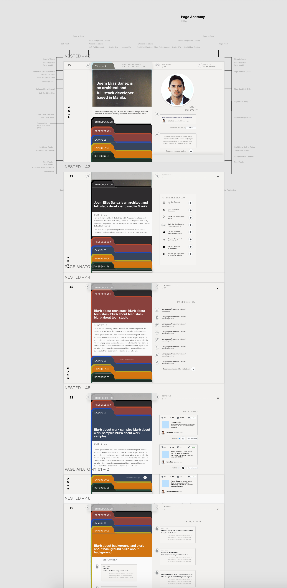

# Resume RedUX

<!---->

CV-JS is a comprehensive and systematic means for navigating and featuring content in a curriculum vitae.  
The project is for Milestone 1 User-centric Front-end Devlopment as part of my coursework at [Code Institute](https://codeinstitute.net).  
This documentation includes UX research, which was approached and is approached as
Taking it a step further through extensive developer research. Synergistically, I approached the design challenge as both owner and user to fundamentally capitalize on the owner's (my) unique candidacy in the dev community.

The result is a web resume that is:
1. Custom designed and built by the owner, contrary to the trend in the industry of using static dashboard templates for stats/efficiency
2. Isn't supplying content that overplays the owner's experience in the tech industry; but instead allows data to speak for itself by showcasing the owner's "activity" in opportune moments
   - "Add styling to revised navbar for home.html" -Joem. Last commit 29 hours ago. See this project in progess" (GitHub actions)
   - "Soon to come" (Placeholder for forthcoming milestone project)
3. Integrates the owner's nuanced stack as a designer and the nuanced workflow that this comes with. (Software/prototype integration UX to dev hand off; owner as developer's "super user")
4. Still meets the criteria for what constitutes a modern web resume as seen in these examples
5. Simple and responsive (learning from previous) creating a "card" template for more interactive features in later releases; with a clear idea of its moonshot design and realistic feasibility through high-fi UX prototypes (playing up to owner's strengths)
6. A website that is an honest snapshot of the owner's progress; new "feed" for returning visitors
7. A clear indicator of the owner's online reach and footprint along with links/clouds of owner's frontier.

[View the live website here.](https://israelias.github.io/resume-redux/) A work in progress.

[TOC levels=1-3]: # "# Table of Contents"

# Contents
- [Resume RedUX](#resume-redux)
- [UX](#ux)
  - [1.0 Strategy](#10-strategy)
  - [2.0 Scope](#20-scope)
  - [3.0 Structure](#30-structure)
  - [4.0 Skeleton](#40-skeleton)
  - [5.0 Surface](#50-surface)
- [Features](#features)
  - [Existing Features](#existing-features)
  - [Features Left to Implement](#features-left-to-implement)
- [Technologies](#technologies)
  - [Languages](#languages)
  - [Frameworks and Libraries](#frameworks-and-libraries)
  - [Programs, Software and Plugins](#programs-software-and-plugins)
- [Testing](#testing)
  - [Code Testing](#code-testing)
  - [User Testing](#user-testing)
  - [Miscellaneous](#miscellaneous)
  - [Known Bugs](#known-bugs)
- [Deployment](#deployment)
- [Credits](#credits)
  - [Content](#content)
  - [Media](#media)
  - [Acknowledgements](#acknowledgements)

# UX

 This project's process and development carefully follows Jesse James Garrett's *Five Planes of UX* to distribute content and feature development across five activity planes, and to document a methodology for taking a product from conception to release.

## 1.0 Strategy

- The main goals of the site are:
  - To establish a personal and professional brand for the owner
  - Attract and retain a following in the developer community
  - Attract recruiter reader software and analytics
  - Be up to a standard that is competitve with UX designed responsive web resumes
  - Stand out to [Code Institute](https://codeinstitute.org/)'s qualification partners and potential employers
- The website is built for:
  - A young professional designer and architect (buildings) presently breaking into the tech industry

- Their goals and needs are:
	- In addition to above (as the site is the owner is the business is the consumer), the ultimate goal is to transform a CV into an interactive, attractive and customisable experience that reflects the candidate's proficiency in the manner in which the content itself is presented.

### 1.1 Research

#### Stakeholder Research (Self)

#### Competitor Review

- Who else is building this?

  - Software developers have a standard representation of a CV and/or portfolio that is web-specific. These tend to be maintained via content management systems like Wordpress, that utilize its standard plugins or adopts templates developed by UX designers. The highly customized CVs by UX designers is where the distinct difference lies between the generic and the specific. Some highly customized, developed and maintained websites take on entirely bespoke features from icons to components, and showcase those designs in the website itself (wireframes, documentation as portfolio pieces). On the other hand, the very generic web CVs will have basic functionality to navigate excellent content that speak for themselves. The criteria with which one stands out over the other is in the awareness of intent -- which tends to be quite apparent on the get go.

- How are they doing it?

  - Most of them are generic (if the content is thorough) *or* designed (if the content is minimal).
  - Some are templates purchased from web designers. And those are the most impressive ones.

- What are the pros and cons of what they are doing?

  - Some of the pros of either fully or personally branded web resumes are the completeness of its graphic design and content availability. The cons, on the other hand, are the sacrifice of some fundamental laws of UX, typical B2C/B2B fundamentals we've come to expect *and* uphold. Things tend not to be where you expect them to be. Responsive features tend to be more a design effort, a little less of the user in mind. The ones that *are* mobile-first and effective at every encounter, otherwise tend to be straight out of Bootstrap and don't stand out as a thorough representation of a professional brand unique to one's voice.

- What are they missing?

  - At a high level, what tends to be "missing" is a nuanced argument or thesis to which a graphic narrative is set forth. At a lower level, data representation of open-source contribution tends to be missing if not directly featured as a GitHub profile. In one article outlining [what companies really look for in your GitHub profile](https://www.builtinchicago.org/2018/05/08/what-companies-look-for-on-github), it's clear that companies value personality and shared values over just one's open-source footprint. Unanimously, it's found that *activity* and any signifier of an *active* profile/portfolio is the hallmark of a desirable candidate.

    > Engineers with a lot of activity on their profiles show me how involved they are as developers. I’m also interested to see how many followers they have, because a surplus is often a good indication of their role as a thought leader.
    >
    > [Source](https://www.builtinchicago.org/2018/05/08/what-companies-look-for-on-github)

- What could they do better?

  - "Designed" resumes for web developers can benefit from using principles of UX, structuring content around a user's impulses in order to achieve specific goals. Content that is featured in such a way that reflects the very architecture behind it is a hallmark of effective meta-contemporary storytelling; and is paradigm worth rehearsing in this project's development. This would also work to benefit the notion that the website itself should showcase the very skill upon which one's candidacy relies.
  - They can also benefit from demonstrating interpersonal artistry, as opposed to only featuring technical skills.

#### User Persona Overview

Three target user profiles have been assembled from user research. Each profile represents a collection of expectations, objectives, compelling experiences, peeves and emotional triggers of a curated user group. Key attributes of each persona are sourced from articles, social media, news and comments, developer feeds and LinkedIn on the outset subject of what x user group looks for in a candidate's resume/portfolio. Further documentation on the subject data is loosely footnoted where quotations are paraphrased or directly cited. For the purpose of conducting use cases and journey maps, these personas -- following an analysis of theirs and the owner's motives -- will serve as the narratives reviewed for establishing scope upon which further development of the project is defined.

- [User Persona Board](https://raw.githubusercontent.com/israelias/resume-redux/master/documentation/RedUX_200901_1621.png)

    

 User Persona Table 

    >|                        |                                                                                                                                                                                           |                                                                                                             |                                                                                                                                                                    |
    >| ---------------------- | ---------------------------------------------------------------------------------------------------------------------------------------------------------------------------------------------------------------------------------------------------------- | ---------------------------------------------------------------------------------------------------------------------------------------------------------------------------- | ----------------------------------------------------------------------------------------------------------------------------------------------------------------------------------------------------------------------------------- |
    >| Name        | **Jacob Grobin**                                                                                                                                                                                                                                           | **Tracy Letts**                                                                                                                                                              | **Peter Venti**                                                                                                                                                                                                                     |
    >| Designation | **Senior Developer**                                                                                                                                                                                                                                       | **Recruiter**                                                                                                                                                                | **Collaborator**                                                                                                                                                                                                                    |
    >| Headline    | VP of Engineering at Fulcram3D  New York, NY                                                                                                                                                                                                           | Talent Acquisition Lead at Enigma Recruitment  Sydney NSW                                                                                                                | Design Computation at Lamb Space Design San Francisco, CA                                                                                                                                                                       |
    >| Loves       |  Seeing a polyglot who shows interest in different languages.                                                                                                                                                                                      |  Seeing a lot of activity on your profile shows me how involved you are as a developer.                                                                              |  Seeing that you contribute to open source projects shows me that you want to give back and can play well with others.[1](#note-1)                                                                                |
    >| Loathes     |  Seeing other companies' coding challenges in your repo.[1](#note-1)                                                                                                                                                                     |  Seeing inappropriate content or things that are too personal.[1](#note-1)                                                                                 |  Seeing ubiquitous progress bars that don't add real value.[2](#note-2)                                                                                                                                           |
    >| Quote       |  As a leader in the industry, I won't spend much time here. What is it about you that stands out and that I haven't already seen in others? I want to *see* that without having to *find* that. Whatever that is.                              |  As a stakeholder in the hiring process, if you win, I win. Why would you choose us? I'd like to know where you are and give you a call.[4](#note-4)   |  As a collaborator with a background in design, cognitive diversity on your endeavours found through the exploration of other interests is just as important as a myriad of code repositories.[1](#note-1)    |

    *Note: Names and entities have been modified/fabricated for this exercise.*

    

### 1.2 User Expectations

#### Key Takeaways From Research

- Increase "activity" or evidence of activity
- Progress bars do not give the user anything. Instead, show evidence of experience. Show integrity.
- Stats or progress bars should be relative to something measurable.
- Give clear understanding of owner's nuanced tech stack.
- Evidence of dev community activity in social media (dev.to, Twitter, etc.)
- Avoid scenarios where a user may get lost.
- No more than two clicks until user sees what they're looking.

### 1.3 User Stories

##### User Persona 1: Senior Developer

>| | Senior Developer                                                                                                                                                                                                                                                                                                                                                                                                                                                                                                                                                                                                                                |
>| ---------------------------------------------------------------------------------------------------------------- | --------------------------------------------------------------------------------------------------------------------------------------------------------------------------------------------------------------------------------------------------------------------------------------------------------------------------------------------------------------------------------------------------------------------------------------------------------------------------------------------------------------------------------------------------------------------------------------------------------------------------------------------------- |
>| Name                                                                                                  | **Jacob Grobin**                                                                                                                                                                                                                                                                                                                                                                                                                                                                                                                                                                                                                                    |
>| Job Title                                                                                             | **Senior Developer, VP of Engineering at Fulcram3D**  New York, NY                                                                                                                                                                                                                                                                                                                                                                                                                                                                                                                                                                              |
>| Background                                                                                            | Engineering Doctorate,  Master of Computer Science in Machine Learning, Bachelor of Science in Actuarial Mathematics                                                                                                                                                                                                                                                                                                                                                                                                                                                                                                                                |
>| Loves                                                                                                 |  Seeing a polyglot who shows interest in different languages.  Seeing code that is readable, well-formatted, well-tested, well-documented and that displays a pragmatic approach via your repo/commit history.  Seeing experimentation at different scales shows me you're making a conscious effort to stay up to speed with new tech.[1](#note-1)                                                                                                                                                                                                                                                           |
>| Loathes                                                                                               |  Seeing other companies' coding challenges in your repo.  Seeing commits with environment variables included.[1](#note-1)                                                                                                                                                                                                                                                                                                                                                                                                                                                                                                  |
>| Quote                                                                                                 |  As a leader in the industry, I won't spend much time here. What is it about this candidate/service/product that stands out and that I haven't already seen in others?I want to *see* that without having to *find* that. Whatever that is.                                                                                                                                                                                                                                                                                                                                                                                             |
>| Goals                                                                                                 |  1. As a leader in the industry, I want to have a good understanding of who you are and what you are all about within a few seconds.  2. As a leader in the industry, I want to be led seamlessly through the site to arrive at valuable content with the minimum amount of clicks.  3. As a leader in the industry, I want to see evidence of your credibility and capability as a professional. I want to see what others have said about you or how they have reacted to you. I also want to locate sources of your credibility to see that they are legitimate and to have an idea of your influence on the industry.    |

##### User Persona 2: Recruiter

>|  | Recruiter                                                                                                                                                                                                                                                                                                                                     |
>| ---------------------------------------------------------------------------------------------------------------- | --------------------------------------------------------------------------------------------------------------------------------------------------------------------------------------------------------------------------------------------------------------------------------------------------------------------------------------------- |
>| Name                                                                                                  | **Tracy Letts**                                                                                                                                                                                                                                                                                                                               |
>| Job Title                                                                                             | **Senior Talent Acquisition Lead at Enigma Recruitment**  Sydney NSW                                                                                                                                                                                                                                                                      |
>| Background                                                                                            | Strategic Hiring for Tech Companies, Bachelor of Science in Psychology, Masters in Business Administration                                                                                                                                                                                                                                    |
>| Loves                                                                                                 |  Seeing a lot of activity on your profile shows me how involved you are as a developer.  Seeing how many followers you have because a surplus is often a good indication of your role as a thought leader. [1](#note-1)                                                                                         |
>| Loathes                                                                                               |  Seeing inappropriate content or things that are too personal.[1](#note-1)                                                                                                                                                                                                                                                   |
>| Quote                                                                                                 |  As a stakeholder in the hiring process, if you win, I win. I've already seen your LinkedIn. I landed here from the job-hunt database in our server which means you were already recommended by someone. Why would you choose us? I'd like to know where you are and give you a call.[4](#note-4)                       |
>| Goals                                                                                                 |  1. As a Recruiter, I want to find information on your skills and projects ASAP.  2. As a Recruiter, I want to understand the easiest and most reliable method of saving and sharing your profile to my team.   3. As a Recruiter, I want to find the best way to get in contact with you in case I want to connect.   |

##### User Persona 3: Collaborator

>|  | Collaborator                                                                                                                                                                                                                                                                                                                                                                                                                                                                                             |
>| --------------------------------------------------------------------------------------------------------------- | -------------------------------------------------------------------------------------------------------------------------------------------------------------------------------------------------------------------------------------------------------------------------------------------------------------------------------------------------------------------------------------------------------------------------------------------------------------------------------------------------------- |
>| Name                                                                                                 | **Peter Venti**                                                                                                                                                                                                                                                                                                                                                                                                                                                                                          |
>| Job Title                                                                                            | **Asociate Lead in Design Computation \| Associate Tech Officer at Lamb Space Design** San Francisco, CA                                                                                                                                                                                                                                                                                                                                                                                             |
>| Background                                                                                           | New Venture Development, Master of Research in Virtual Environments                                                                                                                                                                                                                                                                                                                                                                                                                                      |
>| Loves                                                                                                |  Seeing experiments and small projects that demonstrate the range of interests you have.  Seeing that you contribute to open source projects shows me that you want to give back and can play well with others.[1](#note-1)                                                                                                                                                                                                                                                |
>| Loathes                                                                                              |  Seeing the ubiquitous percentage bars and other elements and animations on your page that don't add any value; If you do want to add some numerical value to your skills, use the number of years or projects -- at least these metrics are universally understandable. [2](#note-2)                                                                                                                                                                                                   |
>| Quote                                                                                                |  As a potential collaborator and experienced programmer with a background in design, cognitive diversity on your endeavours found through the exploration of other interests is just as important as a myriad of code repositories. I found you here as I was impressed by your LinkedIn. I believe if you have to wonder how to make an impression, then you aren't. So before I even say hello, I want fork your repository and impress you with my contribution.[1](#note-1)    |
>| Goals                                                                                                |  1. As a potential collaborator, I want to find your project(s) and quickly fork a repository.  2. As a potential collaborator, I want to find stats of your contribution footprint.  3. As a potential collaborator, I want to find the best way to get in contact with the organisation with any questions I may have.                                                                                                                                                          |

> ###### [Note 1](https://www.builtinchicago.org/2018/05/08/what-companies-look-for-on-github)  Article. GitHub profile realities.
> ###### [Note 2](https://dev.to/kethmars/what-i-learned-after-reviewing-over-40-developer-portfolios-9-tips-for-a-better-portfolio-4me7) Post. Portfolio review feedback on dev.to
> ###### [Note 3](https://news.ycombinator.com/item?id=24034211) Forum. Role of software in architecture on ycombinator
> ###### Note 4 Varies. Profile summaries and headlines on LinkedIn

### 1.4 High Level Paradigms

#### The Owner's Key Principles

- Portraying Honesty and Integrity

#### The Users' Triggers

- Showing Activity at Every Possible Opportunity

#### Standing Out

In order to achieve the goal of standing out to the three target users, the following high-level milestones must be covered:

1. Feature owner's experience/skill in the form of his tech/community contribution footprint
2. Provide opportunistic actions to increase GitHub following (collaborate) and recruiter interaction (hire)
3. Capitalize on owner's nuanced position in the tech stack as primary unique selling point
4. In every way achievable, portray all measurable 'static' information as 'live' statistics

### 1.5 Strategy Table

- [Strategy Board](https://raw.githubusercontent.com/israelias/resume-redux/master/documentation/RedUX_200901_1622.png)

    

 Strategy Table 

    >| id    | Specific Features             | Importance | Viability | Score |
    >| ----- | ------------------------------------------- |:----------:|:---------:|:---------:|
    >| A     | Create a descriptive landing page about the owner to establish his online presence            |      5      |     5      |     ▶️      |
    >| B     | Feature owner's scop Feature owner's scope of expertise in the tech stack and the design stack (specialization)e of expertise in the tech stack and the design stack (specialization)          |      4      |     5      |     ▶️      |
    >| C     | Represent breadth of owner's proficiency in tools and technologies (asset coverage)         |      5      |      5     |     ▶️      |
    >| D     | Represent depth of owner's current use of and experience with tools and technologies (verifiable badges)         |      5      |     4      |     ▶️      |
    >| E     | Showcase samples of owner's projects with links to its repo (tech) and its complete portfolio (design)         |      5      |      3     |     ⬆️      |
    >| F     | Represent owner's work history (career timeline)          |      5      |      5     |     ▶️      |
    >| G     | Represent owner's educational background (timeline)         |      5      |     5      |     ▶️      |
    >| H     | Showcase owner's existing awards and recognitions          |      3      |      4     |     ⬆️      |
    >| I     | Showcase recommendations received by owner from professionals in previous experience         |      3      |      4     |     ⬆️      |
    >| J     | Provide downloadable CV.pdf that is consistent with the web resume/owner's brand         |      4      |      3     |     ⬆️️      |
    >| K     | Provide a contact/message form for users to directly collaborate or message/email     |      3      |      3     |     ⬆️      |
    >| L     | Provide ability to directly call owner's mobile/Skype    |      4      |      4     |     ▶️      |
    >| M     | Create dashboard functionality for owner                    |      2      |      1     |     ⬇️      |
    >| N     | Create custom "hidden" cover letter page for owner to silently fill and distribute when applying to jobs           |      1      |      1     |     ⬇️      |
    >| O     | Show owner's tech stack represented as data from GitHub  |      5      |     3      |     ⬆️      |
    >| P     | Bookend each section with corresponding "last" activity and "next" action: "Last seen 2 hours ago" -> "Drop me a line"   |      5      |      3     |     ⬆️      |
    >| Q     | Provide a stream of project activity retrieved from log of commit messages  |     4       |     3      |     ⬆️      |
    >| Total |                                             |      68 [a](#note-a)       |     61 [b](#note-b)       |

    >###### Note a: sum of importance
    >###### Note b: Average viability `x` number of items
    >###### ▶️ UX efforts must address this
    >###### ⬆️ UX efforts should accommodate this
    >###### ⬇️ Unwise use of time to address this

    

## 2.0 Scope 

The minimum requirements for an MVP are...  
New experiences over time are...
The mvp up front that are in line with strategy goals are..

### 2.1 Requirements and Specifications

There is a difference between how one imagines something will be used and how it is actually used. Putting fresh perspectives aside for a moment, **the core problem to address is how to get more work opportunities** for the owner. To approach the scope itemization effectively, content and features are considered based on:

- Activity `>` Portfolio

  - [ ] An honest representation of how the owner is currently and actively building new skill-sets and real-world projects is equally valuable to the portfolio itself.
  - [ ] In favor of activity and in lieu of project experience content, establish a manner of "placeholding" that is "live" and measurable so as to attract return visitors.
  - [ ] For example:
    - Showing a timer for when the project will begin, or when the repository will drop.
    - Showing a custom in-progress "badge" that updates as a repository grows in size. See [shields.io](https://shields.io)

- Contribution Footprint `==` Content

  - [ ] Whenever there is a dearth of content, show stats.
  - [ ] As gathered from User Research, it's all about activity; so show it.
  - [ ] We all know the owner is always 'committing', posting on Slack, working towards a Milestone project, or deep in a module.
    - Find a way to represent this in the website!
  - [ ] The website should never "go to sleep" or get buried under no activity
  - [ ] Take advantage of leaving easter eggs to attract return visits.
    - Think of them like designed error messages.

### 2.2 Functional Requirements

The __bare minimum__ requirements to accommodate the needs of the owner and the target users and to release a minimal viable product (MVP). __These are needs, *not* features__.

 MVP Functional Requirements Table 

>|                                                                                                                                  | Scenario                                | Minimal Functions Required                                                                                                                                                       |
>| -------------------------------------------------------------------------------------------------------------------------------- | ------------------------------------------- | ---------------------------------------------------------------------------------------------------------------------------------------------------------------------- |
>|  **Owner:** Joem | **Owner accepts company offer**  | <ol>     <li>Ability to easily share application materials for employers to evaluate candidacy   <li>Ability to receive immediate notification   </ol> |
>|  **Developer:** Jacob | **Senior Developer chooses to hire owner**  | <ol>     <li>Ability to view skills   <li>Ability to measure standing against others <li>Ability to view accomplishments <li>Ability to view employment status <li>Ability to view contact info </ol>   |
>|  **Recruiter:** Tracy | **Recruiter chooses to interview owner**    | <ol>     <li>Ability to view skills    <li>Ability to measure candidacy against others    <li>Ability to view employment status <li>Ability to download CV  <li>Ability to view contact info and timezone/location </ul> |
>|  **Collaborator:** Peter  | **Collaborator chooses to work with owner** | <ol>     <li>Ability to view skills    <li>Ability to view project experience    <li>Ability to submit project request   <li>Ability to view contact info </ul> |

### 2.3 Content Requirements

The variety of content/media required to meet the needs of the user and the owner's objectives.

 MVP Content Requirements Table 

>| Section                             | Content                                                                                                                                               | Type                    | Note |
>| ----------------------------------- | ----------------------------------------------------------------------------------------------------------------------------------------------------- | ----------------------- | ---- |
>| Landing                             | Introduction pitch                                                                                                                                    | text                    |      |
>| About                               | Bio Summary Paragraph                                                                                                                                 | text                    |      |
>| Specialization                      | <ol><li>Description of Tech Stack</li> <li>Description of Design Stack</li> <li>List of Industry Services</li></ol>                           | text, icon              |      |
>| Technology  Asset Coverage      | <ol><li>List of software</li> <li>List of languages</li> <li>List of soft skills</li></ol>                                                    | text, icon              |      |
>| Technology Measurable Badges    | <ol><li>Percentage icon/bars of language(s) currently used</li> <li>Percentage icon/bars of commits in the last week</li></ol>                    | text, icon, badge, bars |      |
>| Work Samples Tech               | <ol><li>Preview of repo with:<ol><li> image</li><li>size</li><li>date</li><li>languages used</li><li> status</li></ol></li></ol>                     | text, image, badge      |      |
>| Work Samples  Arch/Design Folio | <ol><li>Preview of design work with:<ol><li> image</li><li>description</li> <li>date</li><li>tech used</li><li> link</li></ol></li></ol>              | text, image             |      |
>| Timeline Career                 | <ol><li>List of work experience with:<ol><li> position</li><li>company</li> <li>dates</li><li>description</li><li> link</li></ol></li></ol>           | text                    |      |
>| Timeline Education              | <ol><li>List of education with:<ol><li> degree</li><li>school</li> <li>dates</li><li>description</li><li> link</li></ol></li></ol>                    | text                    |      |
>| Awards and Recognitions             | <ol><li>List of awards with:<ol><li> name</li><li>image/icon of lnstitution</li> <li>link</li></ol></li></ol>                                         | text, icon, image       |      |
>| Recommendations                     | <ol><li>Excerpts from recommendations with:<ol><li> recommender</li><li>relationship</li> <li>Excerpt</li><li>image</li><li> link</li></ol></li></ol> | text, image             |      |
>| Download CV                         | PDF version of the above                                                                                                                              | text                    |      |

## 3.0 Structure

Providing structure to the scope, information is organized along a parent category which contain two discrete sub-categories to feature: 1) text-based content and  2) image-based content.
The site info is structured....
The elements consistently...
learnable and intuitive......
in order for the user to understand easily how to navigate the site for the very first time..

### 3.1 Organization of Functionality and Content

#### Defining Structure and Behavior

- A user will navigate the content and features intuitively via a visible stack ("hub") of collapsed elements ("spokes") containing sub-sections of information.
- A user finds a location from a central home where all sections are visible "stacked."
- A user goes to the next section upon arrival at the "tail" of a current section.

#### Creating Meaningful Relationships Between Elements, Content and Information

- Sub-sections are paired and nested within a parent category.
- Parent categories are presented as individual tabs stacked within a central hub.
- Dual sub-sections are presented as collapsible content between stacks from the central hub's parent tabs.

#### Communicating Functionality and Interactivity

- Information is organized in a linear sequence at the hub stack.
- The order sequence is a direct response to the user research implemented at strategy plane.

### 3.2 Interaction Design

- [IA - Organization, Priority](https://raw.githubusercontent.com/israelias/resume-redux/master/documentation/RedUX_200901_1623.png)
- [IxD - Navigational Schemas](https://raw.githubusercontent.com/israelias/resume-redux/master/documentation/RedUX_200901_1625.png)
- [Structure Board - Behavior, Relationships, Interactivity, ](https://raw.githubusercontent.com/israelias/resume-redux/master/documentation/RedUX_200901_1626.png)
- [Structure Board -  Container Stack](https://raw.githubusercontent.com/israelias/resume-redux/master/documentation/RedUX_200901_1627.png)
- [Skeleton Board -  Page Anatomy, Grid Set Out](https://raw.githubusercontent.com/israelias/resume-redux/master/documentation/RedUX_200901_1630.png)

#### Consistency and Predictability

- Non-Conventional Conventions
    - The site applies the collapse function to the main content as opposed to its conventional application in side navigational/supplemental material.
    - This stray from convention added value to the website by offering an interactivity that is at once learnable, familiar, and unique.
    - The project's index.html is structured so content can be easily toggled to display [a static version]() of the website with all sections shown, offering added flexibility.
    - These articles are designed to accomplish the same functionality with the same appearance in interactive and static modes.

- Colors and Themes
    - The stylistic rendering of element containers immediately establish a language through which learnability, state changes and sectional differentials are communicated.
    - Toggling from the website's interactive theme to its static theme as well as its landscape theme feature detail-level adjustments to convey system-wide changes, namely [adjusting the shadow blur](). This small but specific adjustment adds value to the website by utilizing nuances of its identity to make contact with the user and further reinforce its brand expectations, parameters and outcomes.

- Transitions
    - Highly customized and systematic animation transitions are conceived to be the website's global touchpoint. The singularity and ubiquity of this application is to reinforce idiosyncratic conventions by way of the convention itself, engendering an enhanced feature out of a user's familiarity to a known function.

- Labels and Terminology
    - Nomenclature and terminology are hierarchically built and defined to reflect the content of each (2) child sections under each (1) parent node tab. The site's opinionated primary section titles are selected to adequately represent its content and explicitly convey the owner's awareness of narrative.

- Consistent Imagery
    - Variable per-section [media content]() (in which list-groups of CV-related activities are contignatuained), per-section i [con-animation]() , and per-section [CTAs]() achieve consistency by application of a singular CSS ruleset. These container styles only offer specificity to sections by application of [signature colors]() .

#### Visibility
<!--Make sure content is visible wherever possible-->

- Wayfinding
  - The website's navigation is simultaneously its content frame, which uniquely takes advantage of an effective rule of proximity: having elements easily accessible (as all parent categories are visible at any given time) and having important elements such as CTAs appear at the same place at any given time.
  - The site's side menu pagination feature toggles on when in [static mode](), which, with opportunistic custom rulesets attached to [Scrollspy]()'s activated elements, ensures that users always know where they are.
  - Given the portrait-centric nature of the website's section frames, which are controlled by a height property, particular attention is given to its landscape orientation. Viewing the site on a screen with a width greater than its height will automatically render the site in static mode and open the side menu.

- Discoverability
  - Overflow is one of the website's most controlled properties, as it affords content-hinting as tool to trigger a user's impulse to discover. As the site applies global rules to section boundaries, invariable glimpses of *previous* and *next* content work to further elicit learned behavior from a user.

#### Learnability

- Strengthening a Sense of Place
    - The main accordion functions as a high-level pagination that indicates the current live page the website is showing. At the same time, the ability to see all other head sections at once makes the use of the accordion more intuitive (once you open one, you know how to open the rest)

- Setting Correct Expectations
    - As all header elements of collapsed sections adopt the same button appearance, the expectation is that immediate sections following should function in the same manner. The site's format does not waver from delivering this expectation; and progressively takes advantage of user opportunities afforded by a reliable outcome.

#### Feedback

The website offers micro changes to afford users the knowledge of what has previously happened, is happening and will happen. The website also adopts system-wide rules that respond to both user-controlled and automatic state changes.

- Micro State Changes
  - Variable color changes attributed to a section's [signature color.]()
  - CTA button hover and active states
  - Side menu pseudo element hover and active states

- Macro State Changes
  - Default Interactive Mode
    - All collapsible elements have a dedicated open and close icon to indicate distinct section states.
  - Static Mode
    - In addition to the understanding that collapsed elements are no longer hidden, the website adjusts the blur for all shadow properties to establish the rules for when static mode is automatically applied.
  - Landscape Mode
    - Static mode is triggered when the width of the browser is greater than its height to ensure content is, at the very least, *visible* no matter the browser or device settings. The small container style adjustment established for Static Mode further communicates this system-wide change to the user.

### 3.3 Information Architecture

- [IA Board](https://raw.githubusercontent.com/israelias/resume-redux/master/documentation/RedUX_200901_1623.png)

#### Navigational Schemas

- Default Interactive Mode: The Hub and Spoke Experience
  - The site visually functions on the front end as [hub-and-spoke model]() , with the stack of articles being the hub, and its collapsed child sections being direct spokes. Herein, the stack is understood as a central home as one cannot navigate between spokes.

- Optional Static Mode: The Nested List Expanded
  - The spokes are rendered to expand mode when static mode is toggled, visually un-nesting content in favor of a linear path with a logical conclusion. The ability to navigate with a side menu is made evident by this mode.

- Landscape Orientation: The Dashboard Experience
  - The vertical challenge given by landscape orientation (or any screen with a width greater than its height) exposes a unique opportunity to have the side menu and the fully expanded content work to render a dashboard configuration with now horizontally-inclined content. Herein, the side menu functions as a document outline with at-a-glance info and data visualization enabled by Scrollspy events occurring in the adjacent body.

<!--#### Efficiently Moving Through Content-->

<!--- The-->

<!--#### Be Easily Educated and Informed-->

<!--- The-->

#### Accommodating Growth and Change

- Nodes, Conceptually
  - With consideration to the stack as a linked list of nodes, where each node-section stores the data value of two nested sub-sections and has a link or pointer to the next node-section; the opportunity to build the back-end with more complex data structures in the future forced me to attach a component-based approach to the HTML outline and the CSS rulesets.
- Linked List Data Structure
  - The notion of traversing a linear data structure with stored values helped to section both the front and back end of the website with a high-level structure to follow.
  - In accomodating growth and change, the site can conceivably evolve to truly adopt a nodal data structure. (I am aware that it does not actually function this way)
  - As such, the project is programmed with an ambition to be revisited with a larger arsenal of tools and knowledge of complex data structure in the foreseeable future.
  - At the very least, the resume stack is designed to accommodate additional article "nodes" which offer the immediate opportunity to grow and modify the stack to the extent that new sections are required.
  - The project's information architecture is thus conceived to accommodate change; ensuring interchangeability of content to an HTML document outline that utilizes equally semantic elements.

### 3.4 Principles of Organization

#### Headings Map

- The headings map of index.html, originated from a sectioning exercise, serves the key element that became:
  - a guiding principle for semantic HTML;
  - a direct reflection of the experienced hierarchy and order of content;
  - a represented feature of the side menu and serves as the interactive dashboard for landscape mode.

    > ###### H1 The Curriculum Vitae of Joem Elias Sanez
    >> ###### H2 (developed for the web)
    > > > ###### H3 Section Title
    > > > > ###### H4 Section Introductory Statement
    > > > > > ###### H5 Sub Section Title
    > > > > > > ###### H6 CV-related List Item Title

    

 Headings Map to the fifth level  

    > ###### H1 The Curriculum Vitae of Joem Elias Sanez
    > > ###### H2 (developed for the web)
    > > > ###### H3 Introduction
    > > > > ###### H4 "Joem Elias Sanez is..."
    > > > > > ###### H5 Currently
    > > > > > ###### H5 Recent Activity
    > > > ###### H3 Specialization
    > > > > ###### H4 All-rounder
    > > > > > ###### H5 Expertise
    > > > > > ###### H6 Expertise
    > > > ###### H3 Proficiency
    > > > > ###### H4 "Building and bridging skills"
    > > > > > ###### H5 Adaptability
    > > > > > ###### H5 Coverage
    > > > ###### H3 Experience
    > > > > ###### H4 "The modern work environment"
    > > > > > ###### H5 Mobility
    > > > > > ###### H5 History
    > > > ###### H3 Examples
    > > > > ###### H4 "Innovating effectively..."
    > > > > > ###### H5 Documentation Style
    > > > > > ###### H5 Tech Repo
     > > > ###### H3 References
    > > > > ###### H4 "Lauded for completeness..."
    > > > > > ###### H5 Recommendations
    > > > > > ###### H5 Accomplishments
    > > > ###### H3 Connect
    > > > > ###### H4 "Always eager to connect..."
    > > > > > ##### H5 Contact Info
    > > > > > ##### H5 Message Form

    

#### Semantic Sectioning Elements

> main
> > section
> > > article
> > > > header
> > > > section
> > > article
> > > > header
> > > > section

## 4.0 Skeleton

<!--Giving form to the functions established in structure...-->
<!--Information is represented as pairs of written content and media content, both supporting a section in the category.  -->
<!--A user navigates information from the parent stack and arrives at features from the hub.-->

<!--- Allows *immediate* interaction -- first-time learning-->
<!--- Rapidly establish value in the users mind-->
<!--- Lead user towards continuing the experience-->
<!--- Introduce specific content at the most relevant and appropriate points in the experience-->
<!--- Add immediate value with each click-->
<!--- Add positivity to the overall experience-->

### 4.1 Features and Usefulness

#### Progressive Disclosure

- Information is revealed over time and across space within the delimited region of a consistent page type.

#### Narrative Grouping, Order and Hierarchy

- Parent categories and child-section sub-categories establish a grouping, order and hierarchy to synergistically support the narrative objective of the owner and the task-oriented desires of the user.
  - Section tabs and sub-section content are grouped in order of importance and in order of relevant adjacent elements.
  - High priority items established at [stategy level](#10-strategy) are the first batch of information and CTAs to appear in both the *top-down* and the *left-right* sequence.
  - Navigation elements *move from top to bottom in order of priority* while content moves from left to right in order of per-section call-to-action.

#### Singularity of Feature

- The all-encompassing and singular nature of the navigation design is to support a user-friendly interaction that is simultaneously unified and delimited.
  - Simple in its complexity.
  - Repetitive motion to promote increase in usability.
  - Gives the user easy decisions that do not over-complicate things.
  - Choices are reduced to what is available in the current order of the stack.

### 4.2 Navigation Design

- [UI - Navigation Design](https://raw.githubusercontent.com/israelias/resume-redux/master/documentation/RedUX_200901_1634.png)

#### The Resume Stack

- Intuitive Navigation and Completion of Tasks
    - x
- Placement, Order, Hierarchy, Priorities
    - x
- Navigational Benefits
    - The rendering of the accordion hub as **pagination** controls offers clear visibility of the Information Architecture
    - It also offers a thorough sense of depth and breadth without ever losing sight of the start, middle and end.
- The tabs as literal tabs and the stack as a literal stack
- This gives people what they want and where they want it
- It is offered in a visual format that users can (and want to) access)
- Usability improves when similar parts are expressed in similar ways
- No surprises for user. Content may differ, but general shape and perception remains consistent

#### Pagination Document Outline

#### Representational Icons

- Clear meaning
- Familiar objects

#### Reduce Cognitive Friction

- Ensure navigation elements are visible and easily findable
- Ensure they don't require time to decode
- Differentiate between navigational elements with **colour, icons and text**

#### Consistent

- Same interactions and behaviors
- Don't rearrange the order
- Don't move expected elements to a different location

#### Metaphors

- Visual metaphors are utilized to provide shortcuts for users on variable devices as well as reinforce desirable associations with regard to the owner's candidacy.

- The nav outline sections titles collapse to icons on mobile screens.
- The following relationships are reinforced throughout the project as icons and written text.

>| Literal                        | Metaphor       |
>| ------------------------------ | -------------- |
>| Introduction                     | "i" symbol     |
>| Specialization          | light bulb         |
>| Proficiency                      | meteor   |
>| Experience a product understandable | astronaut |
>| Examples                    | rocket            |
>| References                         | star           |
>| Connect                   | satellite          |
>| Thorough                       | list           |
>| Environmentally Friendly       | earth          |
>| As little design as possible   | dot            |

### 4.3 Information Design

- [ID - Schematic](https://raw.githubusercontent.com/israelias/resume-redux/master/documentation/RedUX_200901_1637.png)

>###### Arrangement of the elements that contain the information
Good Info design should be invisible...
- Easy to complete **forms**
- Strong **instructions**
- Strong **educational materials**
- Strongly represented **scientific data**
- No dangerous manufacturing Uis
- Everything is **relevant**

#### Context and Order

- The project uses **categorical ordering** typical of CVs, and selective **time ordering** when duration and sequence of events are paramount (i.e. education and employment histories).

- Parent categories follow a top-down order that supports the procedural course and narrative of the website.

  1. Introduction
  1. Specialization
  1. Proficiency
  1. Experience
  1. Examples
  1. References
  1. Connect

Which icons will we use? Which are best to represent our needs?

### 4.4 Interface Design

- [Interface Design Board - Schematic Page Anatomy](https://raw.githubusercontent.com/israelias/resume-redux/master/documentation/RedUX_200901_1639.png)
- [Interface Design Board - Schematic Page Anatomy](https://raw.githubusercontent.com/israelias/resume-redux/master/documentation/RedUX_200901_1639.png)

#### Wireframes: Schematic

- Five Planes of UX
  - [Procedural Wires](https://israelias.github.io/resume-redux/wireframes/schematic/Wireframes_Schematic_Mentor_Presentation_03SEP2020_Part_One.pdf)

- Part 1: Landing
  - [Web](https://raw.githubusercontent.com/israelias/resume-redux/master/wireframes/schematic/Web%20_01.png)
  - [Mobile A](https://raw.githubusercontent.com/israelias/resume-redux/master/wireframes/schematic/Mobile_01_a.png)
  - [Mobile B](https://raw.githubusercontent.com/israelias/resume-redux/master/wireframes/schematic/Mobile_01_b.png)
- Part 2: Introduction
  - [Web](https://raw.githubusercontent.com/israelias/resume-redux/master/wireframes/schematic/Web%20_02.png)
  - [Mobile A](https://raw.githubusercontent.com/israelias/resume-redux/master/wireframes/schematic/Mobile_02_a.png)
  - [Mobile B](https://raw.githubusercontent.com/israelias/resume-redux/master/wireframes/schematic/Mobile_02_b.png)
- Part 3: Technologies
  - [Web](https://raw.githubusercontent.com/israelias/resume-redux/master/wireframes/schematic/Web%20_03.png)
  - [Mobile A](https://raw.githubusercontent.com/israelias/resume-redux/master/wireframes/schematic/Mobile_03_a.png)
  - [Mobile B](https://raw.githubusercontent.com/israelias/resume-redux/master/wireframes/schematic/Mobile_03_b.png)
- Part 4: Examples
  - [Web](https://raw.githubusercontent.com/israelias/resume-redux/master/wireframes/schematic/Web%20_04.png)
  - [Mobile A](https://raw.githubusercontent.com/israelias/resume-redux/master/wireframes/schematic/Mobile_04_a.png)
  - [Mobile B](https://raw.githubusercontent.com/israelias/resume-redux/master/wireframes/schematic/Mobile_04_b.png)
  - [Mobile C](https://raw.githubusercontent.com/israelias/resume-redux/master/wireframes/schematic/Mobile_04_c.png)
- Part 5: Experience
  - [Web](https://raw.githubusercontent.com/israelias/resume-redux/master/wireframes/schematic/Web%20_05.png)
  - [Mobile A](https://raw.githubusercontent.com/israelias/resume-redux/master/wireframes/schematic/Mobile_05_a.png)
  - [Mobile B](https://raw.githubusercontent.com/israelias/resume-redux/master/wireframes/schematic/Mobile_05_b.png)
- Part 6: References
  - [Web](https://raw.githubusercontent.com/israelias/resume-redux/master/wireframes/schematic/Web%20_06.png)
  - [Mobile A](https://raw.githubusercontent.com/israelias/resume-redux/master/wireframes/schematic/Mobile_06_a.png)
  - [Mobile B](https://raw.githubusercontent.com/israelias/resume-redux/master/wireframes/schematic/Mobile_06_b.png)
- Part 7: Contact
  - [Web](https://raw.githubusercontent.com/israelias/resume-redux/master/wireframes/schematic/Web%20_07.png)
  - [Mobile A](https://raw.githubusercontent.com/israelias/resume-redux/master/wireframes/schematic/Mobile_07_a.png)
  - [Mobile B](https://raw.githubusercontent.com/israelias/resume-redux/master/wireframes/schematic/Mobile_07_b.png)

## 5.0 Surface

The product will look like..
T

- What can the user do?
- How will the user interact with the site?
- What effects will be on the site?
- What can the user click on?
- Where can the user go?
- What is the final version of the info appearing on the screen?

### 5.1 Visual Language

Neumorphic styles...

#### Economy

The most important elements are easily recognized

#### Readability

> Legible
>
> Font contrast
>
> Consistent patterns
>

Provides information and context

- color
- layout
- fonts
- images
- order/sequence
- identity

### 5.2 Color Scheme

Given the movement that occurs on the screen upon section transitions, the site's overall color and peripheral default color states are decidedly neutral, spanning a spectrum of off-whites; a range of neutral greys; either of which afford the project its most stylistic reading in four gradients.

- Whites
    - --white: #FAFAFA;
    - --pearl: #F4F4F4;
    - --powder: #F5F4F2;
    - --paper: #F2F1EF;
- Greys
  - --deep-1: #4f4f4f;
  - --deep-2: #707070;
  - --deep-3: #95989A;
  - --deep-4: #B0b0b0;
- Gradients
  - --gradient-1: linear-gradient(45deg, rgba(255, 255, 255, 0.2), rgba(0, 0, 0, 0.1));
  - --gradient-2: linear-gradient(-45deg, rgba(0, 0, 0, 0.1), rgba(255, 255, 255, 0.2));
  - --gradient-3: linear-gradient(145deg, rgba(100, 100, 100, 0.1), rgba(255, 255, 255, 0.2));
  - --gradient-4: linear-gradient(180deg, rgba(250, 250, 250, .7), rgba(0, 0, 0, .1));

Each section is assigned a bold accent signature color, which it carrier throughout the project in two tones: 1) a deep, rich, tone with a waxed matte finish 2) and a faded high-saturation highlight with a diffused backlit glow.

- Signature blends, in pairs:
  - --obsidian: #2E2C2E; --raisin: #3E223D;
  - --slate: #929181; --grey: #B7B1A8;
  - --ruby: #89413D; --red: #B84A30;
  - --denim: #37455C; --blue: #1D49B8;
  - --canary: #D27511; --yellow: #B8A922;
  - --moss: #213128; --green: #234D3E;

### 5.3 Typography

- Should be visually distinct
- Indicate diferent information
- Should be consistent
- Good UX smells like value.

- Typography
  - [Viktor Nübel](https://viktornuebel.medium.com/how-scripts-helped-to-design-a-typeface-for-coding-9af5f28d742a)'s [FF Attribute](https://www.fontshop.com/superfamilies/ff-attribute) font family is the stylistic feature font of the project's main body, including [FF Attribute Mono](https://www.fontshop.com/families/ff-attribute-mono) and [FF Attribute Text](https://www.fontshop.com/families/ff-attribute-text); while [Vasily Biryukov](http://luc.devroye.org/fonts-51517.html)'s opinionated take on the classic [FF DIN](https://en.wikipedia.org/wiki/FF_DIN) family with [DIN 2014](https://fonts.adobe.com/fonts/din-2014) is featured in section headlines.

# Features

## Existing Features

### Interactive collapse feature
  - The project takes advantage of transition classes handled by Bootstrap's `data-toggle` event handler framework and its `data-target` event listener to achieve an interactive navigation system that serves as a one-stop wayfinding feature and the very vessel for display of all content navigated. Designed to be an all-encompassing ticket to content, the 'stack' is programmed to clearly present and quickly deliver content to and from the immediate vicinity of the very first touchpoint. The ubiquitous nature of the transition feature is a keyframed directive for the learnable impulse and the rewards of gaining immediate shorthand with the user and their impulses.

### Collapse transitions along rails
  - In addition to customizing transitions, vertical and horizontal rails are positioned along collapsing margins in order to achieve the effect of containers sliding on vertical rails, and growing out of lines from a seemingly blank and flat page. The rails are pseudo a variety of sixteen `:before` and `:after` elements absolutely positioned relative to several parent classes of the collapse plugin's returned states. This renders the transitions to be more tactical and material, designed to marry the regularity of straight lines with the curious malleability of a decidedly two-dimensional canvas with flat shadows.

### The master switch to the static site
  -  The project features the ability to virtually turn off all functionality and visual definition attributed to the website's show and hide transition events, rendering [index.html](https://github.com/israelias/resume-redux/blob/b6bc247a4c903fc0fd56c23f2b9ac751e9af6d50/index.html) into a static single-page site discretely sectioned in seven parts. This is controlled by a checkbox `input`  element strategically placed in the DOM to be a direct sibling of the `<main>` and `<nav>` elements, each containing all content of seven sections and all list items of the side menu document outline, respectively. Traversing the general sibling selector on toggle of the input's boolean selector `:checked ~ main >  *` is the most popular and powerful selector in [style.css](https://github.com/israelias/resume-redux/blob/master/assets/css/style.css), commencing up to 30 rulesets, virtually interacting with the most elements in the DOM to showcase the project's radical flexibility and the totality of its ambition to accommodate the nuances of user experience.

### The headings map as an interactive document outline
  -  The project features a direct representation of the website's headings map, that, together with the varying permutations of returned `.show` and `:checked` classes, reels from the delightful complications of [scrollspy](https://v5.getbootstrap.com/docs/5.0/components/scrollspy/)'s fleeting `.active` class. Enabled on the `<body>`, Bootstrap's Scrollspy events are programmed in the side menu and visible only when it's useful: when 'expand all' is `:checked`.  As the side menu is a list of the website's headings, containing lists that are nested to the level of their heading hierarchy, the `.active` items invariably play a game of musical links, revealing data and returning feedback on the virtues of relative 'nestedness' and proximities.

### Pagination events along a document track
  -  The project is programmed to elicit further, more marcro, events via Scrollspy's `.active` class in the form of a scaled linear representation of the website's height, where segments are highlighted relative to 'where' the user is. This is attributed to an absolutely positioned pseudo element with a selector that traverses an `.active` sibling. The scale to which these line segments are relative to the path that its on works to afford users a sense of place in an otherwise scaleless, immeasurable window.

### Download me at arrival
  - The website features a call to action download button upon landing on the site that is styled in the same fashion as all forthcoming CTAs. The intention is twofold: 1) to provide the the shortest clickable distance between arrival and achieving the singular most valuable touchpoint 2) to establish and reinforce the visual language of the CTA container in its seven identical iterations.
- 

- 

- The input's label element contains icons that swap visibility on toggle of ':checked'.

For some/all of your features, you may choose to reference the specific project files that implement them, although this is entirely optional.

In addition, you may also use this section to discuss plans for additional features to be implemented in the future:

## Features Left to Implement
- Another feature idea

# Technologies

## Languages

1.   [HTML5](https://en.wikipedia.org/wiki/HTML5)
1.   [CSS3](https://en.wikipedia.org/wiki/Cascading_Style_Sheets)

## Frameworks and Libraries

1. [MDBootstrap 5.8.2:](https://mdbootstrap.com/docs/standard/getting-started/installation/)
    - MDBootstrap's free kit is the primary front-end framework used to do much of the heavy lifting with consideration to the plugins/components. MDBootstrap is a version of Bootstrap with optional addition components that build off of Bootstrap's framework. The compiled CSS ([mdb.min.css](https://github.com/mdbootstrap/mdb-ui-kit/blob/master/css/mdb.min.css)) link tag and JS ([mdb.min.js](https://github.com/mdbootstrap/mdb-ui-kit/blob/master/js/mdb.min.js)) script tag of MDB5's free version is currently referenced via [cdnjs](https://cdnjs.com/libraries/mdb-ui-kit).
   - The website will operate as designed, with 100% intended functionality on any framework that extends [Bootstrap](https://v5.getbootstrap.com/)'s core bundle configurations with only minor style differentials -- particularly text lineheights on lists with [nav components](https://v5.getbootstrap.com/docs/5.0/components/navs/) that utilize the [Scrollspy](https://v5.getbootstrap.com/docs/5.0/components/scrollspy/) plugin's and '.active' states; and default buttons ':hover' states. Alternate frameworks that originate and/or extend Bootstrap's core configurations which have been tested on this site include:
     - [Bootstrap](https://getbootstrap.com/docs/4.5/getting-started/introduction/) version 4 and up (popper not reqiured).
     - [Material Design for Bootstrap](https://mdbootstrap.github.io/bootstrap-material-design/) version 4 and up (different from MDB).
     - [MDB](https://mdbootstrap.com/docs/standard/) version 4 and up.
   - [MDB5](https://mdbootstrap.com/docs/standard/) was ultimately chosen for how it handles Bootstrap nav components' font sizes and text line heights, as mentioned above.
   - The reason for the rather slim differential between different frameworks is that most components and elements have been highly customized in style.css.
   - MDB5's CSS with regard to button reboots were also preferred as their rulesets tended to be more closely aligned with the desired and finished result.
   - MDB5 utilizes the latest [Bootstrap 5 Alpha 2](https://v5.getbootstrap.com/) which has fewer dependencies, and [no longer depends on jQuery](https://blog.getbootstrap.com/2020/06/16/bootstrap-5-alpha/). With clear understanding of the components the website does and does not require, the decision to ride an alpha release was a conscious effort to stay up to speed with and learn from the latest tech.
   - Outside of Bootstrap's [grid layout](https://v5.getbootstrap.com/docs/5.0/layout/grid/) and [flex utilities](https://v5.getbootstrap.com/docs/5.0/utilities/flex/) in [bootstrap-grid.scss](https://github.com/twbs/bootstrap/blob/main/scss/bootstrap-grid.scss); essential baselining of elements via [reboot.scss](https://github.com/twbs/bootstrap/blob/main/scss/bootstrap-reboot.scss); and box model essentials in [utilities.scss](https://github.com/twbs/bootstrap/blob/main/scss/bootstrap-utilities.scss); the project's synergistic appeal is resolved by the careful management of classes in [__transitions.scss](https://github.com/twbs/bootstrap/blob/main/scss/_transitions.scss) reeturned by the [collapse plugin](#plugins).
2. [ionicons 5.2.3:](https://ionicons.com/)
    - A curated selection of [ionicons](https://ionicons.com/)'s premium designed icons are attached to index.html via JS script tag ([unpkg.com](https://unpkg.com/browse/ionicons@5.2.3/dist/)) and are featured in main navigational button icons.
3. [FontAwesome 5.8.2:](https://fontawesome.com/)
   - Secondary and/or supporting icons, mostly for brand logos are referenced from FontAwesome's vast library of responsive, easily-adjustable icons.
   - FontAwesome icons are inserted in `<i>` elements when used as support imagery for existing text; and inserted in `` elements when used as an independent feature.
4. [Adobe Fonts:](https://fonts.adobe.com/)
    - [Viktor Nübel](https://viktornuebel.medium.com/how-scripts-helped-to-design-a-typeface-for-coding-9af5f28d742a)'s [FF Attribute](https://www.fontshop.com/superfamilies/ff-attribute) font family is the stylistic feature font of the project's main body, including [FF Attribute Mono](https://www.fontshop.com/families/ff-attribute-mono) and [FF Attribute Text](https://www.fontshop.com/families/ff-attribute-text); while [Vasily Biryukov](http://luc.devroye.org/fonts-51517.html)'s opinionated take on the classic [FF DIN](https://en.wikipedia.org/wiki/FF_DIN) family with [DIN 2014](https://fonts.adobe.com/fonts/din-2014) is featured in section headlines. Both families are hosted from [Adobe Fonts ](https://fonts.adobe.com/) via an `@import` url to [typekit](https://blog.typekit.com/) in style.css.

## Plugins

1. [collapse.js](https://github.com/twbs/bootstrap/blob/main/js/src/collapse.js)
   - The project takes advantage of this Bootstrap interactive component by essentially "listening" and selecting elements with classes returned by the collapse plugin. Rulesets in style.css are programmed to set and carefully animate over the transition classes in [__transitions.scss](https://github.com/twbs/bootstrap/blob/main/scss/_transitions.scss) returned before, during and after plug-in events.
2. [button.js](https://github.com/twbs/bootstrap/blob/main/js/src/button.js)
   - The collapse plugin is dependent on the `data-toggle` attribute within the button component family along with the event handlers that come with this key Bootstrap control element.
3. [scrollspy.js](https://github.com/twbs/bootstrap/blob/main/js/src/scrollspy.js)
   - The nav-outline feature is, in itself, a project with its own canvas outside of `<main>`, interactive features independent of the main content. Setting unique styles to list items assigned the `.active` class by the ScrollSpy component provides both a navigational tool and a custom pagination feature via pseudo elements.

## Programs and Software

1. [WebStorm:](https://www.jetbrains.com/webstorm/)
    - WebStorm 2020.2 by [JetBrains](https://www.jetbrains.com/) is the web development IDE used to locally construct the project -- helpful for its seamless tool integration, coding assistance, and ecosystem of plugins; namely: [Bootstrap 4,​ Font awesome 4,​ Font Awesome 5 Free & Pro live templates/snippets](https://github.com/1tontech/bootstrap4-snippets/tree/master/intellij) for snippet library and live template assistance; [Emmet Everywhere](https://plugins.jetbrains.com/plugin/7450-emmet-everywhere/) for enhanced HTML/CSS workflow via syntax abbreviation; [Grazie](https://www.jetbrains.com/help/idea/proofreading.html?_ga=2.76862805.1956684954.1597564176-1624949513.1586079173) as an all-in-one grammar and spell checker; [Prettier](https://prettier.io/) for reliable code formatting and styling; [JetBrains W3C Validators](https://plugins.jetbrains.com/plugin/11541-w3c-validators) built in as code quality tools; [Yet another emoji support](https://plugins.jetbrains.com/plugin/12512-yet-another-emoji-support/) for (the obvious) and; [Markdown Navigator Enhanced](https://plugins.jetbrains.com/plugin/7896-markdown-navigator-enhanced/) for its advanced support of [GFM](https://github.github.com/gfm/) in local editors.
2. [Git:](https://git-scm.com/)
    - Git is used as the version control system and is utilized via the WebStorm terminal to `commit` to Git and `push` to GitHub.
4. [GitHub:](https://github.com/)
    - GitHub is used to store the project's code and directory upon concurrent `push`es via Git.
5. [Adobe XD:](https://www.adobe.com/sea/products/xd.html)
   - Adobe XD is the user experience design tool and workspace used to mock up the project from low fidelity wireframes to high fidelity prototypes. XD's templates along with its plugin [Whiteboard](https://xd.adobe.com/ideas/perspectives/leadership-insights/new-whiteboard-plugin-adobe-xd/) were used for diagramming mind maps, user journeys and site maps.

# Testing

## Code Testing

The W3C Markup Validator (Nu Html Checker) and W3C CSS Validator Services continue to be used to validate the single html page (index.html) and the css URI of the project (/assets/style.css) to ensure no errors, alerts or flags pertaining to html and css syntax.

-   [W3C Markup Validator](https://jigsaw.w3.org/css-validator/#validate_by_input) - [Results](https://validator.w3.org/nu/?doc=https%3A%2F%2Fisraelias.github.io%2Fresume-redux%2Findex.html)
-   [W3C CSS Validator](https://jigsaw.w3.org/css-validator/#validate_by_input) - [Results](http://jigsaw.w3.org/css-validator/validator?uri=https%3A%2F%2Fisraelias.github.io%2Fresume-redux%2Fassets%2Fcss%2Fstyle.css&profile=css3svg&usermedium=all&warning=1&vextwarning=)

## User Testing

> >|  **Developer:** Jacob | Collaborator    *Jacob Venti**  Asociate Lead in Design Computation   Associate Tech Officer at Lamb Space Design** San Francisco, CA |
> >| --- | --- |
> >| Goals | Touchpoints |
> >|   <ol><li> As a leader in the industry, I want to have a good understanding of who you are and what you are all about within a few seconds.</li></ol>   |  <ul><li>Each of the seven excerpts of the owner's narrative  is curated to feature an assertive upheld value, existing independent of the others, contained in a headline "truism" to have a clear, equal resonance at each iteration.  The first passage was recently revised to include a short paragraph summary, and is now the only paragraph featured on mobile devices.</li></ul>   |
> >| <ol><li>As a leader in the industry, I want to be led seamlessly through the site to arrive at valuable content with the minimum amount of clicks.</li></ol> |  <ul><li>The website features an interactive collapsible navigational 'stack' programmed to clearly present and quickly deliver content to and from the immediate vicinity of the very first touchpoint. The ubiquity of this feature is aimed at capturing an immediate shorthand with the user, playing to the impulses of his/her learnablility. Additionally, the cut-to-the-chase download-my-cv CTA makes this arrival the most valuable touchpoint for both user and owner</li><ul>   |
> >|  <ol><li>As a leader in the industry, I want to see evidence of your credibility and capability as a professional. I want to see what others have said about you or how they have reacted to you. I also want to locate sources of your credibility to see that they are legitimate and to have an idea of your influence on the industry.</li></ol>   |  <ul><li>Every content type in every category of the CV is essentially and intentionally "over-cited" as the ambition is to let the many references and sources and data speak for itself, with links to every source,  embracing a manner of  "designed placeholding," with the most true content. The high-level paradigm is that activity is equal to content. For this reason, the everu corner of the website is "activity-centric", showcasing the owner's honest web footprint.</li><ul>  |

> > |  **Recruiter:** Tracy | Recruiter    *Tracy Letts**  Asociate Lead in Design Computation Associate Tech Officer at Lamb Space Design** San Francisco, CA |
> > | --- | --- |
> > | Goals | Touchpoints |
> > |   <ol><li> As a Recruiter, I want to find information on your skills and projects ASAP..</li></ol>   |  <ul><li>The website is designed to circulate across three main CTAs as one navigates from landing to finish. These three CTAs are: Download my CV, which is first, and appears twice more, 2) my LinkedIn and 3) my GitHub. There are two chapters dedicated solely to 1) the owner's areas of expertise and 2) the owner's proficiency with skills within such areas. Additionally, the download button as a landing greeting is a calculated effort to establish and reinforce the visual language of the CTA container and its seven identical iterations.</li></ul>   |
> > | <ol><li>As a Recruiter, I want to understand the easiest and most reliable method of saving and sharing your profile to my team.</li></ol> |  <ul><li>The website's per-section CTAs follows the rule of proximity, and are positioned so as to close every chapter and open the next. The website also features three sets of quick-link button groups, emerging at introduction, at side menu, and at the final connect section. These CTA button groups include the ability to save my contact info and CV,  la touchpoints for CTAs  section  on contact information and a message form.</li><ul>   |
> > |  <ol><li>As a Recruiter, I want to find the best way to get in contact with you in case I want to connect..</li></ol>   |  <ul><li>The website's per-section CTAs follows the rule of proximity, and are positioned so as to close every chapter and open the next. The website also features three sets of quick-link button groups, emerging at introduction, at side menu, and at the final connect section. These CTA button groups include the ability to save my contact info and CV,  la touchpoints for CTAs  section  on contact information and a message form.</li><ul>  |

> > |  **Recruiter:** Tracy | Collaborator    *Peter Venti**  Asociate Lead in Design Computation Associate Tech Officer at Lamb Space Design** San Francisco, CA |
> > | --- | --- |
> > | Goals | Touchpoints |
> > |   <ol><li> As a potential collaborator, I want to find your project(s) and quickly fork a repository..</li></ol>   |  <ul><li>The website dedicates a section on the owners GitHub repository, featuring snapshots of his work with data rendered as live badges, and time stamps. Not only does the project section have a CTA to fork repos, the project container itself includes various badge links to various facets of the repository.</li></ul>   |
> > | <ol><li>As a potential collaborator, I want to find stats of your contribution footprint.</li></ol> |  <ul><li>The website features stats of the owner's footprint in every measurable profesional capacity including: repo contributions, commits, commit messages, project statuses (active, current, next, forthcoming), years in practice, awards and honors. Additionally, the website can be toggled to static mode to show all collapsed sections. Wayfindingin this mode, should one require it, is featured as a proprtional linear scale that shows you where you are on the  very tall page. This is designed to ensure there is always a way to safety in case a user requires it.</li><ul>   |
> > |  <ol><li>As a potential collaborator, I want to find the best way to get in contact with the you with any questions I may have   |  <ul><li>The website is designed to feature at least three ways to get in contact with the owner, providing immediate flexibility as well as a logical progression to connecting and/or researching the owner prior to connecting. The site directly offers the owner's email address in a CTA button that will open your email in any device; a CTA that will open your phone app in case you wish to proceed with a call and/or save the owner's number; a CTA that will open google maps in case you wish to have some idea of the owner's location; along with four other links to the owner's Dev account, Github account, LinkedIn, and a dedicated in-page message form that's been pre-filled with a default message which is there to help you break the ice as well as further express the delight with which the owner welcomes new connections..</li><ul>  |

<!--In this section, you need to convince the assessor that you have conducted enough testing to legitimately believe that the site works well. Essentially, in this part you will want to go over all of your user stories from the UX section and ensure that they all work as intended, with the project providing an easy and straightforward way for the users to achieve their goals.-->

<!--Whenever it is feasible, prefer to automate your tests, and if you've done so, provide a brief explanation of your approach, link to the test file(s) and explain how to run them.-->

<!--For any scenarios that have not been automated, test the user stories manually and provide as much detail as is relevant. A particularly useful form for describing your testing process is via scenarios, such as:-->

<!-- Animation fill property -->

- root-body
  - body-header
  - body-nav
  - body-main
    - main-article
      - article-section
        - outer-body
          - left inner-body
          - right inner-body

<!--1. Contact form:-->
<!--   1. Go to the "Contact Us" page-->
<!--   2. Try to submit the empty form and verify that an error message about the required fields appears-->
<!--   3. Try to submit the form with an invalid email address and verify that a relevant error message appears-->
<!--   4. Try to submit the form with all inputs valid and verify that a success message appears.-->

<!--1. Relative positioning as a boolean tool:-->
<!--   1.  * Absolute positioning as a boolean tool.-->
<!-- *-->
<!-- * This attaches key element positioning in nav outline to the :checked selector.-->
<!-- * Scrollspy and pagination should only be enabled when the website is in static-->
<!-- * expand-all state.-->
<!-- *-->
<!-- * As the feedback states of nav outline are given to pseudo elements absolutely-->
<!-- * positioned relative to their parent elements; positioning absolute children-->
<!-- * by traversing the :checked selector results in an effective on/off hack.-->
<!-- *-->
<!-- * Absolutely position pseudo elements of list items in nav-->
<!-- * outline for pagination and scrollspy features only when #toggle-all-->
<!-- * is ':checked'.-->
<!--   2. Go to the "Contact Us" page-->
<!--   3. Try to submit the empty form and verify that an error message about the required fields appears-->
<!--   4. Try to submit the form with an invalid email address and verify that a relevant error message appears-->
<!--   5. Try to submit the form with all inputs valid and verify that a success message appears.-->

<!--1. Hacking the .collapse.show event:-->
<!--    1. Go to the "Contact Us" page-->
<!--    2. Try to submit the empty form and verify that an error message about the required fields appears-->
<!--    3. Try to submit the form with an invalid email address and verify that a relevant error message appears-->
<!--    4. Try to submit the form with all inputs valid and verify that a success message appears.-->

<!--1. Scrolling to top:-->
<!--   1. Go to the "Contact Us" page-->
<!--   2. Try to submit the empty form and verify that an error message about the required fields appears-->
<!--   3. Try to submit the form with an invalid email address and verify that a relevant error message appears-->
<!--   4. Try to submit the form with all inputs valid and verify that a success message appears.-->

<!--1. Clip-path on Safari:-->
<!--    1. Go to the "Contact Us" page-->
<!--    2. Try to submit the empty form and verify that an error message about the required fields appears-->
<!--    3. Try to submit the form with an invalid email address and verify that a relevant error message appears-->
<!--    4. Try to submit the form with all inputs valid and verify that a success message appears.-->

<!--1. Scrolling to top:-->
<!--   1. Go to the "Contact Us" page-->
<!--   2. Try to submit the empty form and verify that an error message about the required fields appears-->
<!--   3. Try to submit the form with an invalid email address and verify that a relevant error message appears-->
<!--   4. Try to submit the form with all inputs valid and verify that a success message appears.-->

<!--1. Margin-left on safari:-->
<!--   1. Go to the "Contact Us" page-->
<!--   2. Try to submit the empty form and verify that an error message about the required fields appears-->
<!--   3. Try to submit the form with an invalid email address and verify that a relevant error message appears-->
<!--   4. Try to submit the form with all inputs valid and verify that a success message appears.-->

<!--In addition, you should mention in this section how your project looks and works on different browsers and screen sizes.-->

<!--You should also mention in this section any interesting bugs or problems you discovered during your testing, even if you haven't addressed them yet.-->

<!--If this section grows too long, you may want to split it off into a separate file and link to it from here.-->

## Miscellaneous

- Throughout its development, the project is continuously tested for consistency on the following browsers:
  - Chrome Version: 83
  - Firefox 82
  - Opera 72
  - Safari 14
- Throughout its development, the project is continuously tested for consistency on the following devices:
  - iPhone 11 Pro
  - MacBook Pro 15"
  - iPad Pro 12.9"
- User Testing

## Known Bugs

- xxx
- xxx
- xxx

# Deployment

This section should describe the process you went through to deploy the project to a hosting platform (e.g. GitHub Pages or Heroku).

In particular, you should provide all details of the differences between the deployed version and the development version, if any, including:
- Different values for environment variables (Heroku Config Vars)?
- Different configuration files?
- Separate git branch?

In addition, if it is not obvious, you should also describe how to run your code locally.

# Credits

## Documentation
- The CSS rulesets and comments strictly follow Nicolas Gallagher's [Principles of writing consistent, idiomatic CSS](https://github.com/necolas/idiomatic-css). <!--(@necolas)-->
- headingsMap https://github.com/dzc34/headingsMap

## Content
- The text for section Y was copied from the [Wikipedia article Z](https://en.wikipedia.org/wiki/Z)

## Media
- The photos used in this site were obtained from ...

## Acknowledgements

- I received inspiration for this project from X
